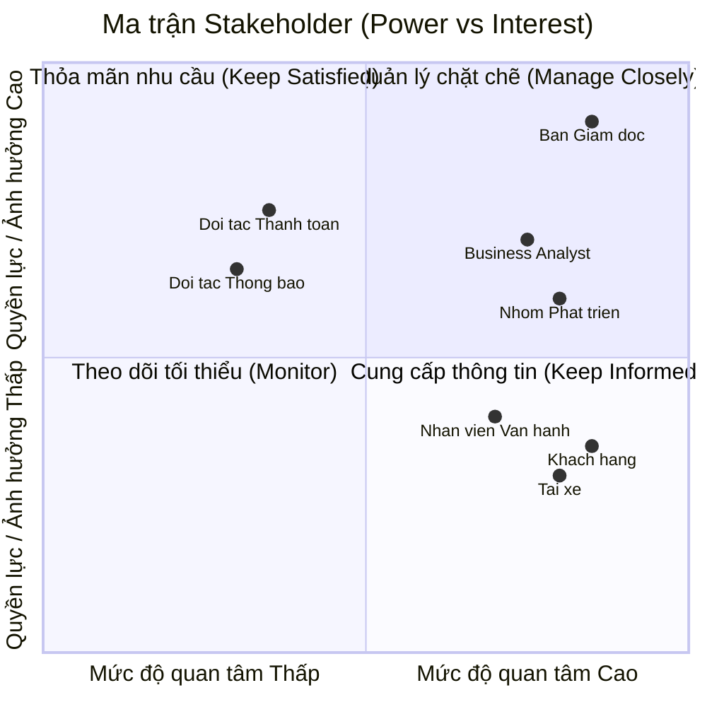

# Software Requirements Specification (SRS) - CAB System

## 1. Stakeholder List & Roles (Danh sách & Vai trò Bên liên quan)

| Stakeholder | Vai trò chính |
| :--- | :--- |
| **Ban Giám đốc** | Ra quyết định chiến lược, duyệt ngân sách và phê duyệt các quy tắc nghiệp vụ. |
| **Khách hàng** | Đặt xe, theo dõi chuyến đi, thanh toán và đánh giá chất lượng dịch vụ. |
| **Tài xế** | Bật trạng thái sẵn sàng, nhận/từ chối chuyến và cập nhật tiến trình chuyến đi. |
| **Nhân viên vận hành** | Theo dõi hệ thống, hỗ trợ xử lý sự cố chuyến đi và quản trị dữ liệu. |
| **Business Analyst (BA)** | Làm rõ yêu cầu chưa chốt và chi tiết hóa quy trình nghiệp vụ cho team. |
| **Nhóm Phát triển (Dev/QA)** | Thiết kế kiến trúc, lập trình và hoàn thiện hệ thống trong 7 tuần. |
| **Đối tác Thanh toán & Thông báo** | Tích hợp xử lý giao dịch điện tử và gửi thông báo tức thì đến người dùng. |

---

## 2. Stakeholder Matrix (Ma trận Bên liên quan)

---

## 3. Business Goals (Mục tiêu Kinh doanh)

* **BG01:** Tự động hóa quy trình phân công tài xế và tối ưu hóa vận hành nhằm giảm thiểu sự can thiệp thủ công, sẵn sàng mở rộng quy mô hệ thống phục vụ lượng lớn khách hàng và tài xế trong tương lai.
* **BG0c:** Nâng cao doanh thu, tỷ lệ hoàn thành chuyến đi và giảm tỷ lệ hủy chuyến thông qua việc tối ưu cơ chế đề xuất, ghép nối tài xế gần nhất theo thời gian thực.
* **BG03:** Tăng cường trải nghiệm và độ hài lòng của khách hàng bằng việc minh bạch hóa thông tin trạng thái chuyến đi, vị trí tài xế, thời gian dự kiến đến và đa dạng hóa phương thức thanh toán an toàn.
* **BG04:** Tăng hiệu quả hoạt động và thu nhập cho tài xế nhờ cơ chế thông báo nhận chuyến chủ động, minh bạch tiến trình chuyến đi và quy trình hỗ trợ vận hành rõ ràng.
* * **BG05:** Nâng cao năng lực quản trị, hỗ trợ và xử lý sự cố kịp thời thông qua hệ thống theo dõi trực quan, phân quyền chặt chẽ và công cụ báo cáo hoạt động chuyên sâu.
* **BG06:** Xây dựng kiến trúc nền tảng ổn định, bảo mật cao, có khả năng mở rộng độc lập và linh hoạt tích hợp/bổ sung các loại hình dịch vụ, đối tác thanh toán hay thông báo mới trong tương lai mà không ảnh hưởng tới hệ thống đang chạy.

---

## 4. Minimum Viable Product (MVP) Modules

1. **Module Quản lý Tài khoản & Định danh (Account & Auth Module):** Đăng ký, đăng nhập, quản lý hồ sơ (Khách hàng, Tài xế) và phân quyền quản trị (Nhân viên vận hành).
2. **Module Đặt xe & Phân công (Booking & Matching Module):** Tạo chuyến, định vị thời gian thực, thuật toán tự động ghép nối/tìm tài xế gần nhất và xử lý chuyển tiếp khi từ chối.
3. **Module Quản lý Tiến trình Chuyến đi (Trip Management Module):** Cập nhật/theo dõi trạng thái chuyến đi theo thời gian thực (ETA, vị trí), lịch sử chuyến và đánh giá tài xế.
4. **Module Tính cước & Thanh toán (Pricing & Payment Module):** Tính tiền tự động, hỗ trợ tiền mặt và tích hợp Payment Gateway bên ngoài xử lý thanh toán điện tử.
5. **Module Thông báo (Notification Module):** Gửi thông báo tức thì cho Khách hàng/Tài xế theo từng sự kiện của chuyến đi.
6. **Module Vận hành & Báo cáo (Admin & Analytics Module):** Giao diện quản trị theo dõi chuyến đi, hỗ trợ xử lý sự cố và xuất báo cáo doanh thu, hiệu suất cho Ban giám đốc.
   
## 5. Business Requirements – CAB System MVP
| ID       | Business Requirement                   | Mô tả                                                                                                                                                              | Module             | Priority        |
| -------- | -------------------------------------- | ------------------------------------------------------------------------------------------------------------------------------------------------------------------ | ------------------ | --------------- |
| **BR01** | Quản lý và xác thực người dùng         | Hệ thống phải cho phép khách hàng, tài xế và nhân viên vận hành đăng nhập và sử dụng các chức năng theo vai trò được cấp.                                          | Account & Auth     | **Must Have**   |
| **BR02** | Quản lý hồ sơ người dùng               | Hệ thống phải cho phép khách hàng và tài xế quản lý, cập nhật thông tin cá nhân; tài xế có thể quản lý thông tin phương tiện.                                      | Account & Auth     | **Must Have**   |
| **BR03** | Phân quyền người dùng                  | Hệ thống phải kiểm soát quyền truy cập theo vai trò, đảm bảo nhân viên không được thực hiện các thao tác vượt quá quyền hạn.                                       | Account & Auth     | **Must Have**   |
| **BR04** | Tạo yêu cầu đặt xe                     | Hệ thống phải cho phép khách hàng nhập điểm đón, điểm đến, lựa chọn loại xe và gửi yêu cầu đặt xe.                                                                 | Booking & Matching | **Must Have**   |
| **BR05** | Tìm kiếm tài xế phù hợp                | Hệ thống phải tự động xác định và ưu tiên các tài xế phù hợp dựa trên trạng thái sẵn sàng, vị trí và các tiêu chí vận hành đã được cấu hình.                       | Booking & Matching | **Must Have**   |
| **BR06** | Tự động phân công tài xế               | Hệ thống phải gửi yêu cầu đến tài xế phù hợp và tiếp tục tìm tài xế khác nếu tài xế từ chối hoặc không phản hồi trong thời gian quy định.                          | Booking & Matching | **Must Have**   |
| **BR07** | Xử lý trường hợp không tìm được tài xế | Hệ thống phải thông báo rõ ràng cho khách hàng khi không có tài xế phù hợp hoặc không có tài xế chấp nhận chuyến.                                                  | Booking & Matching | **Must Have**   |
| **BR08** | Quản lý trạng thái chuyến đi           | Hệ thống phải quản lý vòng đời chuyến đi từ khi tạo yêu cầu, tìm tài xế, nhận chuyến, đón khách, thực hiện chuyến đến hoàn thành hoặc hủy.                         | Trip Management    | **Must Have**   |
| **BR09** | Theo dõi chuyến đi                     | Hệ thống phải cho phép khách hàng và nhân viên vận hành theo dõi trạng thái chuyến đi và thông tin vị trí tài xế trong phạm vi hệ thống hỗ trợ.                    | Trip Management    | **Must Have**   |
| **BR10** | Quản lý vị trí và ETA                  | Hệ thống phải tiếp nhận thông tin vị trí tài xế để hỗ trợ tìm kiếm tài xế và cung cấp thời gian dự kiến đến cho khách hàng.                                        | Trip Management    | **Must Have**   |
| **BR11** | Tính cước chuyến đi                    | Hệ thống phải tự động xác định số tiền khách hàng phải trả dựa trên loại dịch vụ và thông tin chuyến đi theo quy tắc tính cước được doanh nghiệp phê duyệt.        | Pricing & Payment  | **Must Have**   |
| **BR12** | Thanh toán tiền mặt                    | Hệ thống phải hỗ trợ ghi nhận kết quả thanh toán bằng tiền mặt sau khi chuyến đi hoàn thành.                                                                       | Pricing & Payment  | **Must Have**   |
| **BR13** | Thanh toán điện tử                     | Hệ thống phải hỗ trợ thanh toán điện tử thông qua Payment Gateway bên ngoài và không lưu trực tiếp thông tin nhạy cảm của thẻ/tài khoản thanh toán.                | Pricing & Payment  | **Must Have**   |
| **BR14** | Xử lý thanh toán thất bại              | Hệ thống phải thông báo kết quả thanh toán và hỗ trợ xử lý lại giao dịch theo chính sách của doanh nghiệp khi thanh toán điện tử thất bại.                         | Pricing & Payment  | **Must Have**   |
| **BR15** | Gửi thông báo nghiệp vụ                | Hệ thống phải gửi thông báo cho khách hàng và tài xế khi xảy ra các sự kiện quan trọng của chuyến đi và thanh toán.                                                | Notification       | **Must Have**   |
| **BR16** | Lưu lịch sử chuyến đi                  | Hệ thống phải lưu trữ và cho phép khách hàng, nhân viên vận hành tra cứu lịch sử chuyến đi theo quyền được cấp.                                                    | Trip Management    | **Must Have**   |
| **BR17** | Đánh giá tài xế                        | Hệ thống phải cho phép khách hàng đánh giá tài xế sau khi chuyến đi hoàn thành.                                                                                    | Trip Management    | **Should Have** |
| **BR18** | Giám sát vận hành                      | Hệ thống phải cung cấp giao diện để nhân viên vận hành theo dõi các chuyến đang diễn ra, trạng thái tài xế và xử lý các trường hợp bất thường.                     | Admin & Analytics  | **Must Have**   |
| **BR19** | Tra cứu giao dịch                      | Hệ thống phải cho phép nhân viên có quyền truy cập tra cứu lịch sử giao dịch và trạng thái thanh toán.                                                             | Admin & Analytics  | **Must Have**   |
| **BR20** | Báo cáo hoạt động                      | Hệ thống phải cung cấp các báo cáo cơ bản về số lượng chuyến, doanh thu, tỷ lệ hoàn thành, tỷ lệ hủy và hiệu quả hoạt động của tài xế.                             | Admin & Analytics  | **Should Have** |
| **BR21** | Bảo mật và kiểm soát truy cập          | Hệ thống phải bảo vệ dữ liệu cá nhân, phương tiện, vị trí và giao dịch; đồng thời kiểm soát các thao tác quản trị theo quyền hạn.                                  | Account & Auth     | **Must Have**   |
| **BR22** | Ghi nhật ký hoạt động                  | Hệ thống phải lưu vết các thao tác quan trọng của người dùng và nhân viên để phục vụ kiểm tra, truy vết sự cố.                                                     | Admin & Analytics  | **Should Have** |
| **BR23** | Khả năng mở rộng                       | Hệ thống phải cho phép các thành phần như đặt xe, matching, thanh toán và thông báo có thể mở rộng độc lập khi tải tăng.                                           | System             | **Must Have**   |
| **BR24** | Khả năng tích hợp                      | Hệ thống phải hỗ trợ tích hợp với Payment Gateway, Map/GPS và Notification Provider theo kiến trúc có khả năng thay thế hoặc bổ sung nhà cung cấp trong tương lai. | System             | **Must Have**   |
| **BR25** | Tính sẵn sàng và cô lập lỗi            | Lỗi tại một thành phần như thanh toán hoặc thông báo không được làm cho toàn bộ chức năng đặt xe ngừng hoạt động.                                                  | System             | **Must Have**   |
