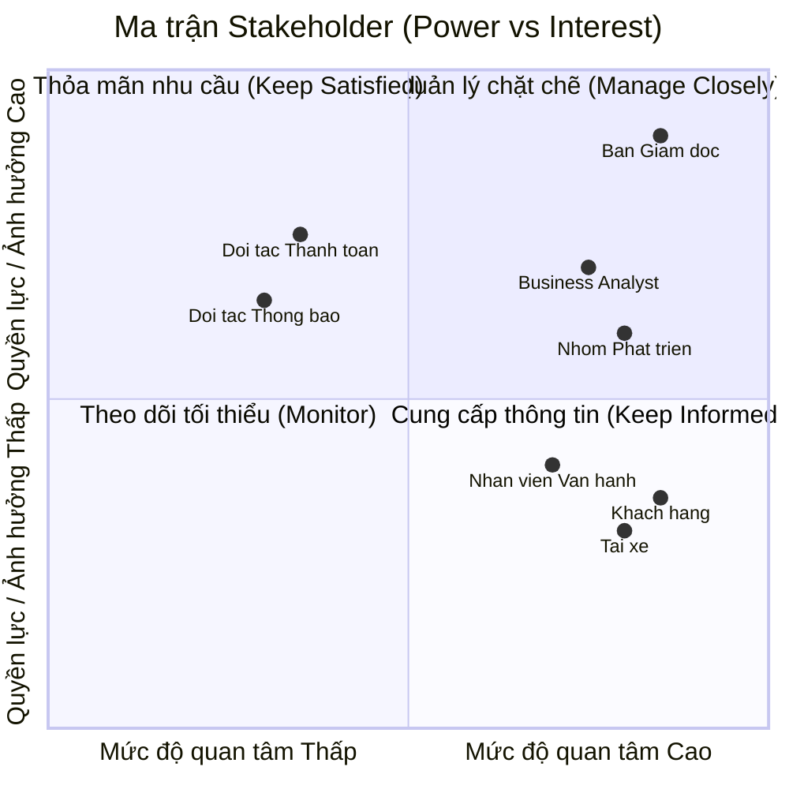

# Software Requirements Specification (SRS) - CAB System

## 1. Stakeholder List & Roles (Danh sách & Vai trò Bên liên quan)

| Stakeholder | Vai trò chính |
| :--- | :--- |
| **Ban Giám đốc** | Ra quyết định chiến lược, duyệt ngân sách và phê duyệt các quy tắc nghiệp vụ. |
| **Khách hàng** | Đặt xe, theo dõi chuyến đi, thanh toán và đánh giá chất lượng dịch vụ. |
| **Tài xế** | Bật trạng thái sẵn sàng, nhận/từ chối chuyến và cập nhật tiến trình chuyến đi. |
| **Nhân viên vận hành** | Theo dõi hệ thống, hỗ trợ xử lý sự cố chuyến đi và quản trị dữ liệu. |
| **Business Analyst (BA)** | Làm rõ yêu cầu chưa chốt và chi tiết hóa quy trình nghiệp vụ cho team. |
| **Nhóm Phát triển (Dev/QA)** | Thiết kế kiến trúc, lập trình và hoàn thiện hệ thống trong 7 tuần. |
| **Đối tác Thanh toán & Thông báo** | Tích hợp xử lý giao dịch điện tử và gửi thông báo tức thì đến người dùng. |

---

## 2. Stakeholder Matrix (Ma trận Bên liên quan)



---

## 3. Business Goals (Mục tiêu Kinh doanh)

* **BG01:** Tự động hóa quy trình phân công tài xế và tối ưu hóa vận hành nhằm giảm thiểu sự can thiệp thủ công, sẵn sàng mở rộng quy mô hệ thống phục vụ lượng lớn khách hàng và tài xế trong tương lai.
* **BG0c:** Nâng cao doanh thu, tỷ lệ hoàn thành chuyến đi và giảm tỷ lệ hủy chuyến thông qua việc tối ưu cơ chế đề xuất, ghép nối tài xế gần nhất theo thời gian thực.
* **BG03:** Tăng cường trải nghiệm và độ hài lòng của khách hàng bằng việc minh bạch hóa thông tin trạng thái chuyến đi, vị trí tài xế, thời gian dự kiến đến và đa dạng hóa phương thức thanh toán an toàn.
* **BG04:** Tăng hiệu quả hoạt động và thu nhập cho tài xế nhờ cơ chế thông báo nhận chuyến chủ động, minh bạch tiến trình chuyến đi và quy trình hỗ trợ vận hành rõ ràng.
* * **BG05:** Nâng cao năng lực quản trị, hỗ trợ và xử lý sự cố kịp thời thông qua hệ thống theo dõi trực quan, phân quyền chặt chẽ và công cụ báo cáo hoạt động chuyên sâu.
* **BG06:** Xây dựng kiến trúc nền tảng ổn định, bảo mật cao, có khả năng mở rộng độc lập và linh hoạt tích hợp/bổ sung các loại hình dịch vụ, đối tác thanh toán hay thông báo mới trong tương lai mà không ảnh hưởng tới hệ thống đang chạy.

---

## 4. Minimum Viable Product (MVP) Modules

1. **Module Quản lý Tài khoản & Định danh (Account & Auth Module):** Đăng ký, đăng nhập, quản lý hồ sơ (Khách hàng, Tài xế) và phân quyền quản trị (Nhân viên vận hành).
2. **Module Đặt xe & Phân công (Booking & Matching Module):** Tạo chuyến, định vị thời gian thực, thuật toán tự động ghép nối/tìm tài xế gần nhất và xử lý chuyển tiếp khi từ chối.
3. **Module Quản lý Tiến trình Chuyến đi (Trip Management Module):** Cập nhật/theo dõi trạng thái chuyến đi theo thời gian thực (ETA, vị trí), lịch sử chuyến và đánh giá tài xế.
4. **Module Tính cước & Thanh toán (Pricing & Payment Module):** Tính tiền tự động, hỗ trợ tiền mặt và tích hợp Payment Gateway bên ngoài xử lý thanh toán điện tử.
5. **Module Thông báo (Notification Module):** Gửi thông báo tức thì cho Khách hàng/Tài xế theo từng sự kiện của chuyến đi.
6. **Module Vận hành & Báo cáo (Admin & Analytics Module):** Giao diện quản trị theo dõi chuyến đi, hỗ trợ xử lý sự cố và xuất báo cáo doanh thu, hiệu suất cho Ban giám đốc.
   
## 5. Business Requirements – CAB System MVP (Yêu cầu nghiệp vụ)
Dưới đây là bảng **Business Requirements (BR)** chi tiết gồm 17 yêu cầu đã được chuyển sang định dạng bảng Markdown:

| ID | Tên Yêu cầu | Mô tả Chi tiết |
| --- | --- | --- |
| **BR01** | Đăng ký & Quản lý Khách hàng | Hệ thống hỗ trợ Khách hàng đăng ký tài khoản, đăng nhập, cập nhật thông tin cá nhân và xem lịch sử các chuyến đi đã thực hiện. |
| **BR02** | Đăng ký & Quản lý Tài xế | Hệ thống hỗ trợ Tài xế đăng ký tài khoản (hoặc được tạo bởi Nhân viên vận hành), cập nhật hồ sơ, thông tin phương tiện và bật/tắt trạng thái sẵn sàng làm việc.|
| **BR03** | Tạo yêu cầu Đặt xe | Hệ thống cho phép Khách hàng nhập điểm đón, điểm đến, lựa chọn loại dịch vụ/loại xe và gửi yêu cầu đặt xe.|
| **BR04** | Định vị & Đề xuất Tài xế | Hệ thống ghi nhận vị trí GPS theo thời gian thực của Tài xế để tìm kiếm và đề xuất chuyến đi dựa trên độ gần và trạng thái sẵn sàng.|
| **BR05** | Tự động Chuyển tiếp Điều phối | Hệ thống hỗ trợ chuyển tiếp tìm kiếm Tài xế tiếp theo nếu Tài xế được đề xuất ban đầu từ chối hoặc không phản hồi, đảm bảo không yêu cầu Khách hàng đặt lại chuyến.|
| **BR06** | Thông báo Không tìm thấy Tài xế | Hệ thống thông báo rõ ràng cho Khách hàng trong trường hợp không tìm được Tài xế phù hợp.|
| **BR07** | Tiếp nhận Chuyến đi | Hệ thống hỗ trợ Tài xế nhận thông báo và lựa chọn chấp nhận hoặc từ chối yêu cầu chuyến đi.|
| **BR08** | Cập nhật Tiến trình Chuyến đi | Hệ thống cho phép Tài xế cập nhật liên tục tiến trình chuyến đi (*Đã đến điểm đón*, *Đã đón khách*, *Đang di chuyển*, *Hoàn thành*).|
| **BR09** | Theo dõi Real-time & ETA | Hệ thống hiển thị thời gian dự kiến đến (ETA), vị trí Tài xế và trạng thái chuyến đi theo thời gian thực cho Khách hàng theo dõi.|
| **BR10** | Tự động Tính cước | Hệ thống tự động tính toán số tiền cước sau khi chuyến đi hoàn thành dựa trên loại dịch vụ và thông tin chuyến đi.|
| **BR11** | Tích hợp Thanh toán | Hệ thống hỗ trợ thanh toán bằng tiền mặt và tích hợp với cổng thanh toán điện tử bên ngoài (Payment Gateway), đảm bảo không lưu thông tin thẻ/tài khoản nhạy cảm trên hệ thống CAB.|
| **BR12** | Xử lý Lỗi Thanh toán | Hệ thống hỗ trợ xử lý lại giao dịch và thông báo cho Khách hàng khi thanh toán điện tử bị thất bại.|
| **BR13** | Thông báo Tức thời Đa kênh | Hệ thống tự động gửi thông báo (Push/SMS) cho Khách hàng và Tài xế tại các mốc: tiếp nhận chuyến, tài xế nhận chuyến, tài xế tới điểm đón, chuyến hoàn thành và kết quả thanh toán.|
| **BR14** | Giám sát & Hỗ trợ Vận hành | Hệ thống cung cấp giao diện quản trị cho Nhân viên vận hành để giám sát danh sách chuyến đi đang diễn ra, kiểm tra trạng thái Tài xế, tra cứu lịch sử giao dịch và can thiệp xử lý chuyến lỗi.|
| **BR15** | Phân quyền Quản trị | Hệ thống áp dụng cơ chế phân quyền truy cập chặt chẽ để hạn chế Nhân viên vận hành thông thường thực hiện các thao tác quản trị nhạy cảm.|
| **BR16** | Báo cáo Thống kê Quản trị | Hệ thống cung cấp báo cáo thống kê cho Ban Giám đốc về tổng số chuyến, doanh thu, tỷ lệ hoàn thành/hủy chuyến và hiệu quả hoạt động của Tài xế.|
| **BR17** | Đánh giá Dịch vụ | Hệ thống cho phép Khách hàng thực hiện đánh giá (rating/comment) chất lượng Tài xế sau khi hoàn thành chuyến đi.|

# 6. Mô hình hóa quy trình nghiệp vụ

## 6.1. Quy trình Tiếp nhận Yêu cầu & Phân bổ Tài xế

```mermaid
sequenceDiagram
    autonumber
    actor KH as Khách hàng
    participant HT as Hệ thống CAB
    actor TX as Tài xế

    KH->>HT: Gửi yêu cầu chuyến xe (Điểm đón, Điểm đến, Loại xe)
    HT->>HT: Kiểm tra yêu cầu & xác định vị trí
    HT->>HT: Lọc danh sách tài xế đang hoạt động phù hợp

    alt Có tài xế đáp ứng
        HT->>TX: Gửi yêu cầu nhận chuyến

        alt Tài xế đồng ý
            TX-->>HT: Xác nhận nhận chuyến
            HT-->>KH: Xác nhận đặt xe & cung cấp thông tin tài xế

        else Tài xế từ chối / Không phản hồi
            TX-->>HT: Từ chối hoặc quá thời gian phản hồi
            HT->>HT: Chuyển yêu cầu sang tài xế phù hợp tiếp theo
        end

    else Không có tài xế phù hợp
### 6.2. Quy trình Thực hiện Chuyến đi & Thanh toán
```mermaid
flowchart TD
    Transition([Bắt đầu thực hiện chuyến đi]) --> DriverArrive[Tài xế cập nhật: Đã đến điểm đón]
    DriverArrive --> NotifyArrived[Hệ thống gửi thông báo cho Khách hàng]
    
    NotifyArrived --> StartTrip[Tài xế cập nhật: Đã đón khách / Đang di chuyển]
    
    subgraph RealTimeTracking [Quá trình di chuyển]
        StartTrip --> GPSUpdate[Tài xế gửi tọa độ GPS liên tục]
        GPSUpdate --> ShowETA[Hệ thống cập nhật vị trí & ETA real-time cho Khách hàng]
    end

    ShowETA --> FinishTrip[Tài xế cập nhật: Hoàn thành chuyến đi]
    FinishTrip --> CalcFare[Hệ thống tự động tính tổng cước phí]
    CalcFare --> ShowFare[Hiển thị cước phí & Lựa chọn thanh toán]

    ShowFare --> PaymentMethod{Phương thức thanh toán?}

    PaymentMethod -- Thanh toán Điện tử --> Gateway[Gửi yêu cầu tới Cổng thanh toán]
    Gateway --> CheckPay{Thanh toán thành công?}
    CheckPay -- Có --> IssueInvoice[Hệ thống gửi hóa đơn điện tử]
    CheckPay -- Lỗi --> RetryPay[Xử lý lại / Yêu cầu chuyển sang tiền mặt]
    RetryPay --> PaymentMethod

    PaymentMethod -- Tiền mặt --> CashPay[Khách hàng trả tiền mặt cho Tài xế]
    CashPay --> ConfirmCash[Tài xế xác nhận đã nhận đủ tiền]
    ConfirmCash --> IssueInvoice

    IssueInvoice --> Rating[Khách hàng đánh giá & phản hồi chất lượng dịch vụ]
    Rating --> EndTrip([Kết thúc chuyến đi])
```
