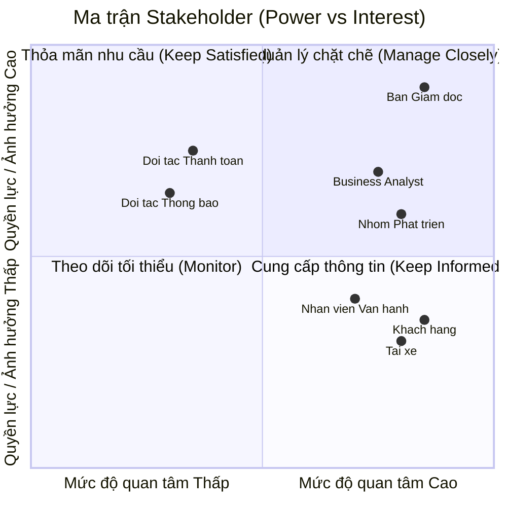
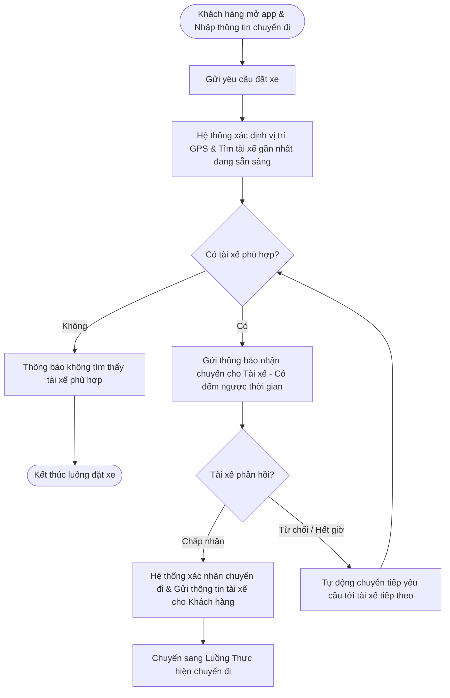
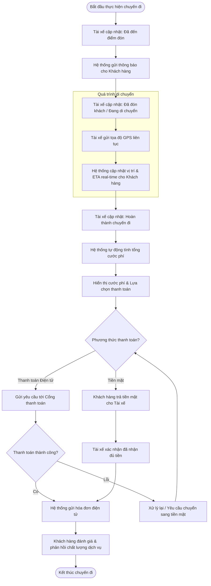

# Software Requirements Specification (SRS) - CAB System

## 1. Stakeholder List & Roles (Danh sách & Vai trò Bên liên quan)

| Stakeholder | Vai trò chính |
| :--- | :--- |
| **Ban Giám đốc** | Ra quyết định chiến lược, duyệt ngân sách và phê duyệt các quy tắc nghiệp vụ. |
| **Khách hàng** | Đặt xe, theo dõi chuyến đi, thanh toán và đánh giá chất lượng dịch vụ. |
| **Tài xế** | Bật trạng thái sẵn sàng, nhận/từ chối chuyến và cập nhật tiến trình chuyến đi. |
| **Nhân viên vận hành** | Theo dõi hệ thống, hỗ trợ xử lý sự cố chuyến đi và quản trị dữ liệu. |
| **Business Analyst (BA)** | Làm rõ yêu cầu chưa chốt và chi tiết hóa quy trình nghiệp vụ cho team. |
| **Nhóm Phát triển (Dev/QA)** | Thiết kế kiến trúc, lập trình và hoàn thiện hệ thống trong 7 tuần. |
| **Đối tác Thanh toán & Thông báo** | Tích hợp xử lý giao dịch điện tử và gửi thông báo tức thì đến người dùng. |

---

## 2. Stakeholder Matrix (Ma trận Bên liên quan)

---

## 3. Business Goals (Mục tiêu Kinh doanh)

* **BG01:** Tự động hóa quy trình phân công tài xế và tối ưu hóa vận hành nhằm giảm thiểu sự can thiệp thủ công, sẵn sàng mở rộng quy mô hệ thống phục vụ lượng lớn khách hàng và tài xế trong tương lai.
* **BG0c:** Nâng cao doanh thu, tỷ lệ hoàn thành chuyến đi và giảm tỷ lệ hủy chuyến thông qua việc tối ưu cơ chế đề xuất, ghép nối tài xế gần nhất theo thời gian thực.
* **BG03:** Tăng cường trải nghiệm và độ hài lòng của khách hàng bằng việc minh bạch hóa thông tin trạng thái chuyến đi, vị trí tài xế, thời gian dự kiến đến và đa dạng hóa phương thức thanh toán an toàn.
* **BG04:** Tăng hiệu quả hoạt động và thu nhập cho tài xế nhờ cơ chế thông báo nhận chuyến chủ động, minh bạch tiến trình chuyến đi và quy trình hỗ trợ vận hành rõ ràng.
* * **BG05:** Nâng cao năng lực quản trị, hỗ trợ và xử lý sự cố kịp thời thông qua hệ thống theo dõi trực quan, phân quyền chặt chẽ và công cụ báo cáo hoạt động chuyên sâu.
* **BG06:** Xây dựng kiến trúc nền tảng ổn định, bảo mật cao, có khả năng mở rộng độc lập và linh hoạt tích hợp/bổ sung các loại hình dịch vụ, đối tác thanh toán hay thông báo mới trong tương lai mà không ảnh hưởng tới hệ thống đang chạy.

---

## 4. Minimum Viable Product (MVP) Modules

1. **Module Quản lý Tài khoản & Định danh (Account & Auth Module):** Đăng ký, đăng nhập, quản lý hồ sơ (Khách hàng, Tài xế) và phân quyền quản trị (Nhân viên vận hành).
2. **Module Đặt xe & Phân công (Booking & Matching Module):** Tạo chuyến, định vị thời gian thực, thuật toán tự động ghép nối/tìm tài xế gần nhất và xử lý chuyển tiếp khi từ chối.
3. **Module Quản lý Tiến trình Chuyến đi (Trip Management Module):** Cập nhật/theo dõi trạng thái chuyến đi theo thời gian thực (ETA, vị trí), lịch sử chuyến và đánh giá tài xế.
4. **Module Tính cước & Thanh toán (Pricing & Payment Module):** Tính tiền tự động, hỗ trợ tiền mặt và tích hợp Payment Gateway bên ngoài xử lý thanh toán điện tử.
5. **Module Thông báo (Notification Module):** Gửi thông báo tức thì cho Khách hàng/Tài xế theo từng sự kiện của chuyến đi.
6. **Module Vận hành & Báo cáo (Admin & Analytics Module):** Giao diện quản trị theo dõi chuyến đi, hỗ trợ xử lý sự cố và xuất báo cáo doanh thu, hiệu suất cho Ban giám đốc.
   
## 5. Business Requirements – CAB System MVP (Yêu cầu nghiệp vụ)
Dưới đây là bảng **Business Requirements (BR)** chi tiết gồm 17 yêu cầu đã được chuyển sang định dạng bảng Markdown:

| ID | Tên Yêu cầu | Mô tả Chi tiết |
| --- | --- | --- |
| **BR01** | Đăng ký & Quản lý Khách hàng | Hệ thống hỗ trợ Khách hàng đăng ký tài khoản, đăng nhập, cập nhật thông tin cá nhân và xem lịch sử các chuyến đi đã thực hiện. |
| **BR02** | Đăng ký & Quản lý Tài xế | Hệ thống hỗ trợ Tài xế đăng ký tài khoản (hoặc được tạo bởi Nhân viên vận hành), cập nhật hồ sơ, thông tin phương tiện và bật/tắt trạng thái sẵn sàng làm việc.|
| **BR03** | Tạo yêu cầu Đặt xe | Hệ thống cho phép Khách hàng nhập điểm đón, điểm đến, lựa chọn loại dịch vụ/loại xe và gửi yêu cầu đặt xe.|
| **BR04** | Định vị & Đề xuất Tài xế | Hệ thống ghi nhận vị trí GPS theo thời gian thực của Tài xế để tìm kiếm và đề xuất chuyến đi dựa trên độ gần và trạng thái sẵn sàng.|
| **BR05** | Tự động Chuyển tiếp Điều phối | Hệ thống hỗ trợ chuyển tiếp tìm kiếm Tài xế tiếp theo nếu Tài xế được đề xuất ban đầu từ chối hoặc không phản hồi, đảm bảo không yêu cầu Khách hàng đặt lại chuyến.|
| **BR06** | Thông báo Không tìm thấy Tài xế | Hệ thống thông báo rõ ràng cho Khách hàng trong trường hợp không tìm được Tài xế phù hợp.|
| **BR07** | Tiếp nhận Chuyến đi | Hệ thống hỗ trợ Tài xế nhận thông báo và lựa chọn chấp nhận hoặc từ chối yêu cầu chuyến đi.|
| **BR08** | Cập nhật Tiến trình Chuyến đi | Hệ thống cho phép Tài xế cập nhật liên tục tiến trình chuyến đi (*Đã đến điểm đón*, *Đã đón khách*, *Đang di chuyển*, *Hoàn thành*).|
| **BR09** | Theo dõi Real-time & ETA | Hệ thống hiển thị thời gian dự kiến đến (ETA), vị trí Tài xế và trạng thái chuyến đi theo thời gian thực cho Khách hàng theo dõi.|
| **BR10** | Tự động Tính cước | Hệ thống tự động tính toán số tiền cước sau khi chuyến đi hoàn thành dựa trên loại dịch vụ và thông tin chuyến đi.|
| **BR11** | Tích hợp Thanh toán | Hệ thống hỗ trợ thanh toán bằng tiền mặt và tích hợp với cổng thanh toán điện tử bên ngoài (Payment Gateway), đảm bảo không lưu thông tin thẻ/tài khoản nhạy cảm trên hệ thống CAB.|
| **BR12** | Xử lý Lỗi Thanh toán | Hệ thống hỗ trợ xử lý lại giao dịch và thông báo cho Khách hàng khi thanh toán điện tử bị thất bại.|
| **BR13** | Thông báo Tức thời Đa kênh | Hệ thống tự động gửi thông báo (Push/SMS) cho Khách hàng và Tài xế tại các mốc: tiếp nhận chuyến, tài xế nhận chuyến, tài xế tới điểm đón, chuyến hoàn thành và kết quả thanh toán.|
| **BR14** | Giám sát & Hỗ trợ Vận hành | Hệ thống cung cấp giao diện quản trị cho Nhân viên vận hành để giám sát danh sách chuyến đi đang diễn ra, kiểm tra trạng thái Tài xế, tra cứu lịch sử giao dịch và can thiệp xử lý chuyến lỗi.|
| **BR15** | Phân quyền Quản trị | Hệ thống áp dụng cơ chế phân quyền truy cập chặt chẽ để hạn chế Nhân viên vận hành thông thường thực hiện các thao tác quản trị nhạy cảm.|
| **BR16** | Báo cáo Thống kê Quản trị | Hệ thống cung cấp báo cáo thống kê cho Ban Giám đốc về tổng số chuyến, doanh thu, tỷ lệ hoàn thành/hủy chuyến và hiệu quả hoạt động của Tài xế.|
| **BR17** | Đánh giá Dịch vụ | Hệ thống cho phép Khách hàng thực hiện đánh giá (rating/comment) chất lượng Tài xế sau khi hoàn thành chuyến đi.|

## 6. Business Process Modeling (Mô hình hóa Quy trình Nghiệp vụ)

### 6.1. Luồng Đặt xe & Điều phối Tự động

### 6.2. Quy trình Thực hiện Chuyến đi & Thanh toán

# 7. Functional Requirements (Yêu cầu Chức năng)

## 7.1. Module Quản lý Tài khoản & Định danh

### FR01 – Đăng ký tài khoản Khách hàng
- Hệ thống cho phép Khách hàng tạo tài khoản bằng các thông tin cần thiết.
- Hệ thống kiểm tra tính hợp lệ và tính duy nhất của thông tin đăng ký.
- Hệ thống thông báo kết quả đăng ký cho Khách hàng.

### FR02 – Đăng nhập và Đăng xuất
- Hệ thống cho phép Khách hàng, Tài xế và Nhân viên vận hành đăng nhập.
- Hệ thống xác thực thông tin đăng nhập trước khi cấp quyền truy cập.
- Hệ thống cho phép người dùng đăng xuất khỏi tài khoản.

### FR03 – Quản lý hồ sơ Khách hàng
- Khách hàng có thể xem và cập nhật thông tin cá nhân.
- Hệ thống lưu trữ thông tin hồ sơ của Khách hàng.
- Khách hàng có thể xem lịch sử các chuyến đi đã thực hiện.

### FR04 – Quản lý hồ sơ Tài xế
- Tài xế có thể xem và cập nhật thông tin cá nhân theo quyền được cấp.
- Nhân viên vận hành có thể tạo và cập nhật hồ sơ Tài xế.
- Hệ thống lưu trữ thông tin phương tiện của Tài xế.

### FR05 – Quản lý trạng thái Tài xế
- Tài xế có thể bật/tắt trạng thái sẵn sàng nhận chuyến.
- Hệ thống cập nhật trạng thái Tài xế theo thời gian thực.
- Chỉ Tài xế đang ở trạng thái sẵn sàng mới được đưa vào quá trình điều phối.

---

## 7.2. Module Đặt xe & Phân công

### FR06 – Tạo yêu cầu đặt xe
- Khách hàng nhập điểm đón và điểm đến.
- Khách hàng lựa chọn loại dịch vụ/loại xe.
- Hệ thống kiểm tra thông tin trước khi tạo yêu cầu.
- Hệ thống tạo yêu cầu đặt xe và chuyển sang quá trình tìm Tài xế.

### FR07 – Xác định vị trí Khách hàng
- Hệ thống xác định hoặc tiếp nhận vị trí điểm đón do Khách hàng cung cấp.
- Hệ thống sử dụng vị trí điểm đón để phục vụ quá trình tìm kiếm Tài xế.

### FR08 – Tìm kiếm Tài xế phù hợp
- Hệ thống tìm các Tài xế đang sẵn sàng nhận chuyến.
- Hệ thống xác định Tài xế dựa trên vị trí và các tiêu chí vận hành được cấu hình.
- Hệ thống ưu tiên Tài xế phù hợp và ở vị trí thuận lợi.

### FR09 – Gửi yêu cầu nhận chuyến
- Hệ thống gửi thông tin yêu cầu chuyến đi đến Tài xế được lựa chọn.
- Hệ thống hiển thị thời gian phản hồi cho Tài xế.
- Tài xế có thể chấp nhận hoặc từ chối yêu cầu.

### FR10 – Tự động chuyển tiếp yêu cầu
- Nếu Tài xế từ chối yêu cầu, hệ thống tìm Tài xế phù hợp tiếp theo.
- Nếu Tài xế không phản hồi trong thời gian quy định, hệ thống tự động chuyển yêu cầu.
- Khách hàng không cần tạo lại yêu cầu đặt xe.

### FR11 – Xử lý trường hợp không tìm thấy Tài xế
- Hệ thống xác định khi không còn Tài xế phù hợp.
- Hệ thống thông báo cho Khách hàng rằng chưa tìm được Tài xế.
- Hệ thống cập nhật trạng thái yêu cầu đặt xe tương ứng.

---

## 7.3. Module Quản lý Tiến trình Chuyến đi

### FR12 – Xác nhận chuyến đi
- Khi Tài xế chấp nhận yêu cầu, hệ thống xác nhận chuyến đi.
- Hệ thống cung cấp thông tin Tài xế và phương tiện cho Khách hàng.
- Hệ thống cập nhật trạng thái chuyến đi.

### FR13 – Cập nhật trạng thái chuyến đi
- Tài xế có thể cập nhật các trạng thái:
  - Đã đến điểm đón.
  - Đã đón khách.
  - Đang di chuyển.
  - Hoàn thành.
- Hệ thống kiểm tra trạng thái hiện tại trước khi cho phép chuyển trạng thái.
- Hệ thống lưu lại lịch sử thay đổi trạng thái.

### FR14 – Theo dõi vị trí Tài xế
- Tài xế gửi vị trí GPS trong quá trình thực hiện chuyến đi.
- Hệ thống cập nhật vị trí Tài xế theo thời gian thực.
- Khách hàng có thể xem vị trí hiện tại của Tài xế.

### FR15 – Tính toán và hiển thị ETA
- Hệ thống tính toán thời gian dự kiến Tài xế đến điểm đón hoặc điểm đến.
- Hệ thống cập nhật ETA khi vị trí Tài xế thay đổi.
- Khách hàng có thể theo dõi ETA trong quá trình thực hiện chuyến đi.

### FR16 – Quản lý lịch sử chuyến đi
- Hệ thống lưu thông tin các chuyến đi đã hoàn thành.
- Khách hàng có thể xem lịch sử chuyến đi của mình.
- Nhân viên vận hành có thể tra cứu thông tin chuyến đi theo quyền được cấp.

---

## 7.4. Module Tính cước & Thanh toán

### FR17 – Tính cước chuyến đi
- Hệ thống tự động tính tổng cước phí khi chuyến đi hoàn thành.
- Cước phí được xác định dựa trên loại dịch vụ và thông tin chuyến đi.
- Hệ thống hiển thị số tiền cần thanh toán cho Khách hàng.

### FR18 – Thanh toán tiền mặt
- Khách hàng có thể lựa chọn thanh toán bằng tiền mặt.
- Khách hàng thanh toán trực tiếp cho Tài xế.
- Tài xế xác nhận đã nhận tiền.
- Hệ thống ghi nhận trạng thái thanh toán.

### FR19 – Thanh toán điện tử
- Hệ thống chuyển yêu cầu thanh toán đến Cổng thanh toán bên ngoài.
- Hệ thống tiếp nhận kết quả giao dịch từ Cổng thanh toán.
- Hệ thống cập nhật trạng thái thanh toán theo kết quả giao dịch.
- Hệ thống không lưu trữ thông tin thẻ hoặc thông tin tài khoản thanh toán nhạy cảm.

### FR20 – Xử lý thanh toán thất bại
- Hệ thống thông báo cho Khách hàng khi giao dịch thanh toán thất bại.
- Hệ thống cho phép thực hiện lại giao dịch theo chính sách nghiệp vụ.
- Hệ thống ghi nhận kết quả của từng lần thanh toán.

### FR21 – Ghi nhận giao dịch
- Hệ thống lưu thông tin giao dịch và trạng thái thanh toán.
- Nhân viên vận hành có thể tra cứu lịch sử giao dịch theo quyền được cấp.
- Hệ thống liên kết giao dịch với chuyến đi tương ứng.

---

## 7.5. Module Thông báo

### FR22 – Gửi thông báo sự kiện chuyến đi
Hệ thống gửi thông báo đến Khách hàng tại các sự kiện:
- Đặt xe thành công.
- Tài xế được phân công.
- Tài xế đã đến điểm đón.
- Chuyến đi bắt đầu.
- Chuyến đi hoàn thành.

### FR23 – Gửi thông báo cho Tài xế
Hệ thống gửi thông báo đến Tài xế khi:
- Có yêu cầu chuyến đi mới.
- Yêu cầu chuyến đi bị thay đổi.
- Chuyến đi bị hủy hoặc có sự kiện liên quan.

### FR24 – Thông báo kết quả thanh toán
- Hệ thống thông báo kết quả thanh toán cho Khách hàng.
- Hệ thống thông báo khi giao dịch thành công hoặc thất bại.
- Hệ thống hỗ trợ mở rộng thêm các kênh thông báo trong tương lai.

---

## 7.6. Module Vận hành & Quản trị

### FR25 – Giám sát chuyến đi
- Nhân viên vận hành có thể xem danh sách các chuyến đang diễn ra.
- Hệ thống hiển thị trạng thái hiện tại của từng chuyến.
- Nhân viên vận hành có thể tra cứu thông tin cần thiết để hỗ trợ xử lý sự cố.

### FR26 – Theo dõi trạng thái Tài xế
- Nhân viên vận hành có thể xem trạng thái hoạt động của Tài xế.
- Hệ thống hiển thị Tài xế đang sẵn sàng, đang nhận chuyến hoặc đang thực hiện chuyến.
- Nhân viên vận hành có thể tra cứu thông tin phương tiện theo quyền được cấp.

### FR27 – Hỗ trợ xử lý chuyến lỗi
- Nhân viên vận hành có thể tra cứu các chuyến gặp sự cố.
- Hệ thống cung cấp thông tin liên quan đến chuyến đi và giao dịch.
- Nhân viên vận hành có thể thực hiện các thao tác hỗ trợ theo quyền được cấp.
- Các thao tác can thiệp phải được ghi nhận vào nhật ký hệ thống.

### FR28 – Quản lý người dùng và dữ liệu
- Nhân viên vận hành có quyền quản lý dữ liệu Khách hàng, Tài xế, phương tiện và chuyến đi theo phạm vi được phân quyền.
- Hệ thống kiểm soát quyền trước khi thực hiện các thao tác quản trị.

---

## 7.7. Module Phân quyền & Bảo mật

### FR29 – Phân quyền người dùng
- Hệ thống phân quyền theo vai trò người dùng.
- Các vai trò chính gồm:
  - Khách hàng.
  - Tài xế.
  - Nhân viên vận hành.
- Hệ thống chỉ cho phép người dùng thực hiện chức năng phù hợp với quyền được cấp.

### FR30 – Kiểm soát truy cập dữ liệu
- Hệ thống kiểm tra quyền truy cập trước khi cho phép xem hoặc chỉnh sửa dữ liệu.
- Dữ liệu cá nhân, phương tiện, vị trí và giao dịch phải được bảo vệ.
- Các thao tác quản trị nhạy cảm chỉ được thực hiện bởi người có quyền phù hợp.

### FR31 – Ghi nhật ký hoạt động
- Hệ thống ghi nhận các thao tác quan trọng của người dùng.
- Nhật ký bao gồm người thực hiện, thời điểm và hành động.
- Nhật ký được sử dụng để hỗ trợ kiểm tra và xử lý sự cố.

---

## 7.8. Module Đánh giá & Phản hồi

### FR32 – Đánh giá Tài xế
- Sau khi chuyến đi hoàn thành, Khách hàng có thể đánh giá Tài xế.
- Khách hàng có thể gửi điểm đánh giá và nhận xét.
- Hệ thống lưu đánh giá gắn với chuyến đi tương ứng.

### FR33 – Quản lý phản hồi
- Hệ thống cho phép Nhân viên vận hành tra cứu các đánh giá và phản hồi.
- Thông tin phản hồi được sử dụng để hỗ trợ đánh giá chất lượng dịch vụ.

---

## 7.9. Module Báo cáo & Thống kê

### FR34 – Báo cáo hoạt động
Hệ thống cung cấp các chỉ số:
- Tổng số chuyến đi.
- Doanh thu.
- Tỷ lệ hoàn thành chuyến.
- Tỷ lệ hủy chuyến.
- Hiệu quả hoạt động của Tài xế.

### FR35 – Tra cứu và lọc báo cáo
- Người có quyền quản trị có thể tra cứu báo cáo theo khoảng thời gian.
- Hệ thống hỗ trợ lọc dữ liệu theo các tiêu chí phù hợp.
- Kết quả báo cáo được trình bày dưới dạng dễ theo dõi.

---

## 7.10. Mapping Business Requirements và Functional Requirements

| Business Requirement | Functional Requirements |
|---|---|
| BR01 – Đăng ký & Quản lý Khách hàng | FR01, FR02, FR03 |
| BR02 – Đăng ký & Quản lý Tài xế | FR02, FR04, FR05 |
| BR03 – Tạo yêu cầu Đặt xe | FR06, FR07 |
| BR04 – Định vị & Đề xuất Tài xế | FR08, FR14 |
| BR05 – Tự động Chuyển tiếp Điều phối | FR09, FR10 |
| BR06 – Không tìm thấy Tài xế | FR11 |
| BR07 – Tiếp nhận Chuyến đi | FR09, FR12 |
| BR08 – Cập nhật Tiến trình | FR13 |
| BR09 – Theo dõi Real-time & ETA | FR14, FR15 |
| BR10 – Tự động Tính cước | FR17 |
| BR11 – Tích hợp Thanh toán | FR18, FR19 |
| BR12 – Xử lý Lỗi Thanh toán | FR20, FR21 |
| BR13 – Thông báo Tức thời | FR22, FR23, FR24 |
| BR14 – Giám sát & Hỗ trợ Vận hành | FR25, FR26, FR27 |
| BR15 – Phân quyền Quản trị | FR28, FR29, FR30 |
| BR16 – Báo cáo Thống kê | FR34, FR35 |
| BR17 – Đánh giá Dịch vụ | FR32, FR33 |
