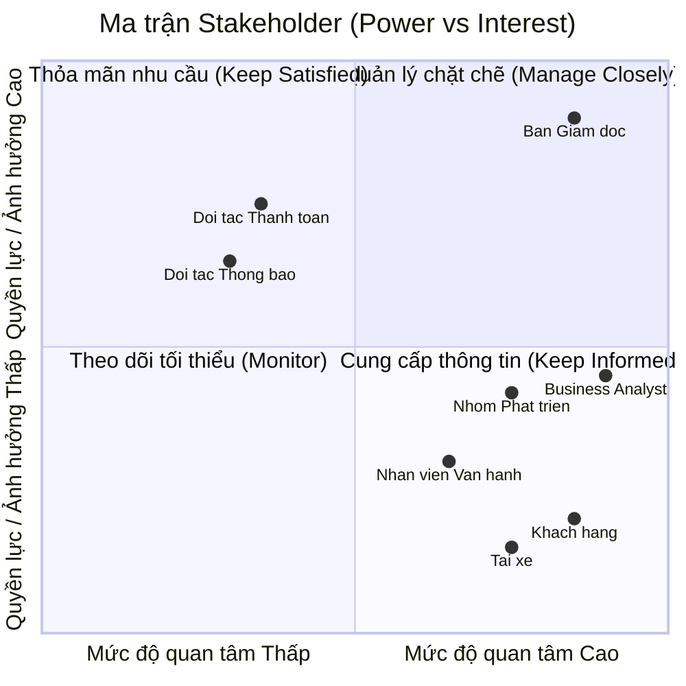
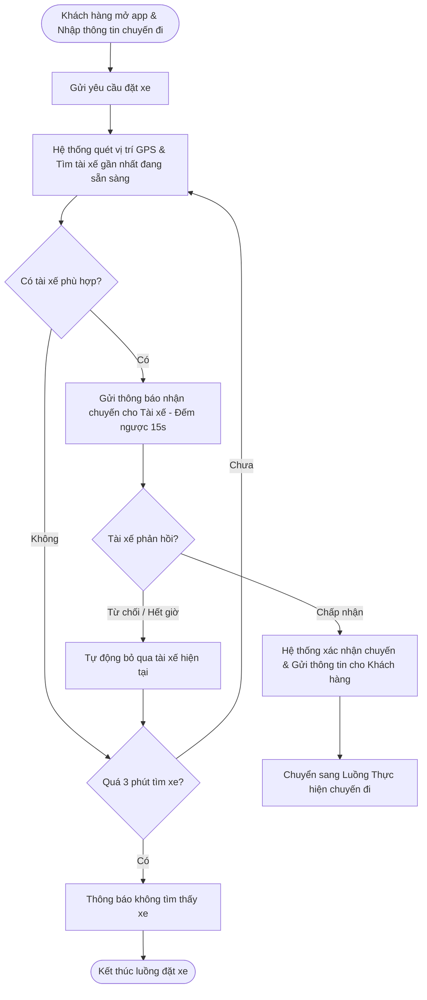
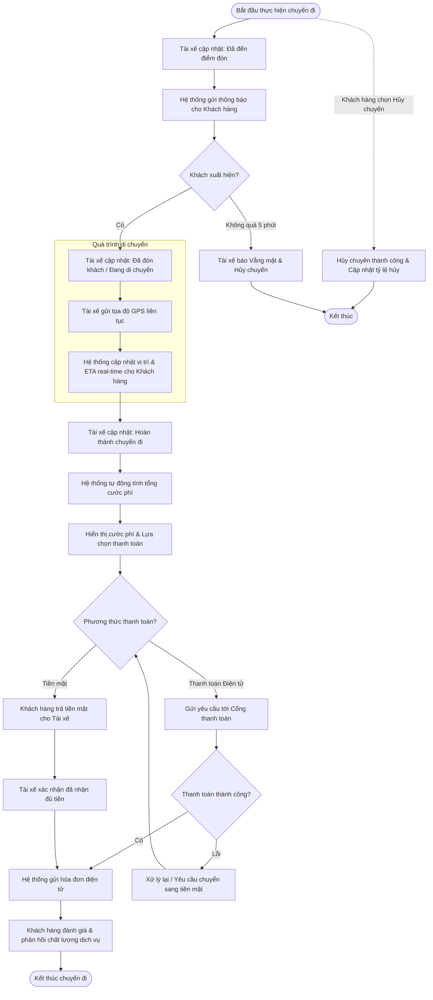
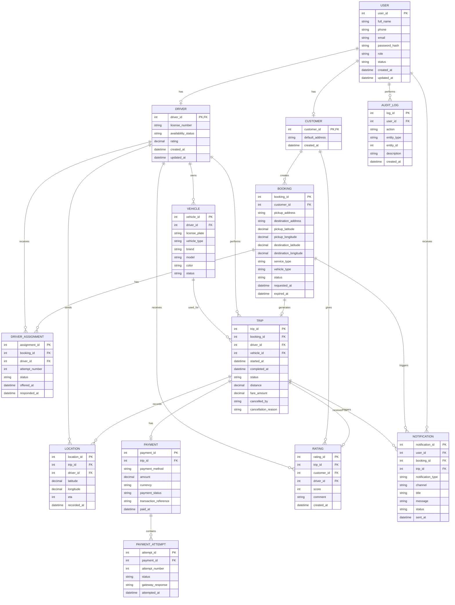
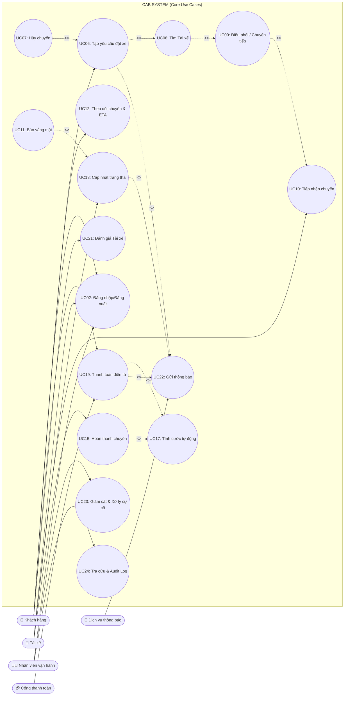

# Software Requirements Specification (SRS) - CAB System

**1. Stakeholder List & Roles (Danh sách & Vai trò Bên liên quan)**

| Phân loại | Bên liên quan (Stakeholder) | Vai trò & Trách nhiệm (Role & Responsibilities) |
| :--- | :--- | :--- |
| **Người dùng trực tiếp (End-users)** | **Khách hàng (Passenger)** | Đăng ký, đặt xe, theo dõi chuyến đi, thanh toán cước phí, nhận thông báo và đánh giá tài xế. |
| | **Tài xế (Driver)** | Quản lý trạng thái hoạt động, tiếp nhận/từ chối yêu cầu, cập nhật trạng thái hành trình thực tế và nhận thanh toán. |
| **Quản lý & Vận hành nội bộ (Internal)**| **Nhân viên vận hành (Operations Staff/Admin)** | Quản lý thông tin (tài xế, khách hàng, phương tiện), giám sát chuyến đi realtime, hỗ trợ xử lý sự cố và tra cứu giao dịch dựa trên phân quyền. |
| | **Ban lãnh đạo / Ban giám đốc (Sponsor/Management)** | Đưa ra định hướng, phê duyệt dự án và sử dụng các báo cáo thống kê (doanh thu, tỷ lệ hoàn thành/hủy, hiệu suất) để ra quyết định kinh doanh. |
| **Nhóm triển khai (Project Team)** | **Business Analyst (BA)** | Phân tích yêu cầu, xác định phạm vi, làm rõ các quy tắc nghiệp vụ/ngoại lệ chưa chốt với khách hàng và hoàn thiện tài liệu SRS. |
| | **Nhóm phát triển (Development Team)** | Thiết kế kiến trúc linh hoạt, lập trình, kiểm thử và triển khai nền tảng CAB trong thời hạn 7 tuần. |
| **Đối tác bên thứ ba (External)**| **Nhà cung cấp thanh toán (Payment Gateway)** | Xử lý giao dịch điện tử an toàn bên ngoài hệ thống CAB, trả về kết quả thanh toán để hệ thống cập nhật. |
| | **Nhà cung cấp dịch vụ thông báo (Notification Provider)**| Nền tảng trung gian hỗ trợ đẩy thông báo (Push Notification, SMS, Email) trạng thái chuyến đi và giao dịch đến người dùng. |
## 2. Stakeholder Matrix (Ma trận Bên liên quan)


---


## 3. Business Goals (Mục tiêu Kinh doanh)

* **BG01:** Tự động hóa quy trình phân công tài xế và tối ưu hóa vận hành nhằm giảm thiểu sự can thiệp thủ công, sẵn sàng mở rộng quy mô hệ thống phục vụ lượng lớn khách hàng và tài xế trong tương lai.
* **BG02:** Nâng cao doanh thu, tỷ lệ hoàn thành chuyến đi và giảm tỷ lệ hủy chuyến thông qua việc tối ưu cơ chế đề xuất, ghép nối tài xế gần nhất theo thời gian thực.
* **BG03:** Tăng cường trải nghiệm và độ hài lòng của khách hàng bằng việc minh bạch hóa thông tin trạng thái chuyến đi, vị trí tài xế, thời gian dự kiến đến và đa dạng hóa phương thức thanh toán an toàn.
* **BG04:** Tăng hiệu quả hoạt động và thu nhập cho tài xế nhờ cơ chế thông báo nhận chuyến chủ động, minh bạch tiến trình chuyến đi và quy trình hỗ trợ vận hành rõ ràng.
* **BG05:** Nâng cao năng lực quản trị, hỗ trợ và xử lý sự cố kịp thời thông qua hệ thống theo dõi trực quan, phân quyền chặt chẽ và công cụ báo cáo hoạt động chuyên sâu.
* **BG06:** Xây dựng kiến trúc nền tảng ổn định, bảo mật cao, có khả năng mở rộng độc lập và linh hoạt tích hợp/bổ sung các loại hình dịch vụ, đối tác thanh toán hay thông báo mới trong tương lai mà không ảnh hưởng tới hệ thống đang chạy.
* **BG07:** Hoàn thiện phân tích, xây dựng, kiểm thử và đưa nền tảng CAB vào vận hành thực tế trong đúng thời hạn định mức là **7 tuần** nhằm đáp ứng kỳ vọng ra mắt thị trường (Time-to-Market) của Ban giám đốc.

---

## 4. Minimum Viable Product (MVP) Modules

1. **Module Quản lý Tài khoản & Định danh (Account & Auth Module):** Đăng ký, đăng nhập, quản lý hồ sơ Khách hàng/Tài xế, **quản lý thông tin phương tiện**, xác thực bảo mật và phân quyền quản trị (RBAC) cho Nhân viên vận hành.
2. **Module Đặt xe & Phân công (Booking & Matching Module):** Tạo chuyến, định vị thời gian thực, thuật toán tự động ghép nối/tìm tài xế gần nhất. Hỗ trợ cơ chế tự động chuyển tiếp yêu cầu khi tài xế từ chối **mà không bắt khách hàng đặt lại**, và thông báo khi không tìm được xe.
3. **Module Quản lý Tiến trình Chuyến đi (Trip Management Module):** Cho phép tài xế cập nhật trạng thái chuyến, khách hàng theo dõi tiến trình (ETA, vị trí) theo thời gian thực, tra cứu lịch sử chuyến đi và đánh giá tài xế sau chuyến.
4. **Module Tính cước & Thanh toán (Pricing & Payment Module):** Tính cước phí tự động, hỗ trợ tiền mặt và tích hợp Payment Gateway bên ngoài xử lý thanh toán điện tử (không lưu thông tin thẻ). **Bao gồm cơ chế xử lý ngoại lệ khi giao dịch thất bại**.
5. **Module Thông báo (Notification Module):** Tích hợp dịch vụ bên thứ ba để gửi thông báo tức thì đa kênh (Push/SMS) cho Khách hàng và Tài xế theo từng sự kiện của chuyến đi và kết quả thanh toán.
6. **Module Vận hành & Báo cáo (Admin & Analytics Module):** Giao diện quản trị theo dõi chuyến đi trực tuyến, hỗ trợ xử lý sự cố, xuất báo cáo doanh thu/hiệu suất cho Ban giám đốc và **lưu vết hệ thống (Audit log)** các thao tác nhạy cảm.
   
## 5. Business Requirements – CAB System MVP (Yêu cầu nghiệp vụ)
| ID | Tên Yêu cầu | Mô tả Chi tiết |
| --- | --- | --- |
| **BR01** | Đăng ký & Quản lý Khách hàng | Hệ thống hỗ trợ Khách hàng đăng ký tài khoản, đăng nhập, cập nhật thông tin cá nhân và xem lịch sử các chuyến đi đã thực hiện. |
| **BR02** | Đăng ký & Quản lý Tài xế | Hệ thống hỗ trợ Tài xế đăng ký tài khoản (hoặc được tạo bởi Nhân viên vận hành), cập nhật hồ sơ, thông tin phương tiện và bật/tắt trạng thái sẵn sàng làm việc. |
| **BR03** | Tạo yêu cầu Đặt xe | Hệ thống cho phép Khách hàng nhập điểm đón, điểm đến, lựa chọn loại dịch vụ/loại xe và gửi yêu cầu đặt xe. |
| **BR04** | Định vị & Đề xuất Tài xế | Hệ thống ghi nhận vị trí GPS theo thời gian thực của Tài xế để tìm kiếm và đề xuất chuyến đi dựa trên độ gần và trạng thái sẵn sàng. |
| **BR05** | Tự động Chuyển tiếp Điều phối | Hệ thống hỗ trợ chuyển tiếp tìm kiếm Tài xế tiếp theo nếu Tài xế được đề xuất ban đầu từ chối hoặc không phản hồi, đảm bảo không yêu cầu Khách hàng đặt lại chuyến. |
| **BR06** | Thông báo Không tìm thấy Tài xế | Hệ thống thông báo rõ ràng cho Khách hàng trong trường hợp không tìm được Tài xế phù hợp. |
| **BR07** | Tiếp nhận Chuyến đi | Hệ thống hỗ trợ Tài xế nhận thông báo và lựa chọn chấp nhận hoặc từ chối yêu cầu chuyến đi. |
| **BR08** | Cập nhật Tiến trình Chuyến đi | Hệ thống cho phép Tài xế cập nhật liên tục tiến trình chuyến đi (*Đã đến điểm đón*, *Đã đón khách*, *Đang di chuyển*, *Hoàn thành*). |
| **BR09** | Theo dõi Real-time & ETA | Hệ thống hiển thị thời gian dự kiến đến (ETA), vị trí Tài xế và trạng thái chuyến đi theo thời gian thực cho Khách hàng theo dõi. |
| **BR10** | Tự động Tính cước | Hệ thống tự động tính toán số tiền cước sau khi chuyến đi hoàn thành dựa trên loại dịch vụ và thông tin chuyến đi. |
| **BR11** | Tích hợp Thanh toán | Hệ thống hỗ trợ thanh toán bằng tiền mặt và tích hợp với cổng thanh toán điện tử bên ngoài (Payment Gateway), đảm bảo không lưu thông tin thẻ/tài khoản nhạy cảm trên hệ thống CAB. |
| **BR12** | Xử lý Lỗi Thanh toán | Hệ thống hỗ trợ xử lý lại giao dịch và thông báo cho Khách hàng khi thanh toán điện tử bị thất bại. |
| **BR13** | Thông báo Tức thời Đa kênh | Hệ thống tự động gửi thông báo (Push/SMS) cho Khách hàng và Tài xế tại các mốc: tiếp nhận chuyến, tài xế nhận chuyến, tài xế tới điểm đón, chuyến hoàn thành và kết quả thanh toán. |
| **BR14** | Giám sát & Hỗ trợ Vận hành | Hệ thống cung cấp giao diện quản trị cho Nhân viên vận hành để quản lý (khách hàng, tài xế, phương tiện), giám sát chuyến đi đang diễn ra, tra cứu giao dịch và can thiệp xử lý chuyến lỗi. |
| **BR15** | Phân quyền Quản trị | Hệ thống áp dụng cơ chế phân quyền truy cập chặt chẽ để hạn chế Nhân viên vận hành thông thường thực hiện các thao tác quản trị nhạy cảm. |
| **BR16** | Báo cáo Thống kê Quản trị | Hệ thống cung cấp báo cáo thống kê cho Ban Giám đốc về tổng số chuyến, doanh thu, tỷ lệ hoàn thành/hủy chuyến và hiệu quả hoạt động của Tài xế. |
| **BR17** | Đánh giá Dịch vụ | Hệ thống cho phép Khách hàng thực hiện đánh giá (rating/comment) chất lượng Tài xế sau khi hoàn thành chuyến đi. |
| **BR18** | Lưu vết Hệ thống (Audit Log) | Hệ thống tự động ghi nhận (log) các thao tác quản trị quan trọng và dữ liệu giao dịch để phục vụ kiểm tra, đối soát khi có sự cố. |

## 6. Business Process Modeling (Mô hình hóa Quy trình Nghiệp vụ)

### 6.1. Luồng Đặt xe & Điều phối Tự động


### 6.2. Quy trình Thực hiện Chuyến đi & Thanh toán

## 7. Functional Requirements (Yêu cầu Chức năng)

### 7.1. Module Quản lý Tài khoản & Định danh

**FR01 – Đăng ký tài khoản Khách hàng**
* Hệ thống cho phép Khách hàng tạo tài khoản bằng các thông tin cần thiết.
* Hệ thống kiểm tra tính hợp lệ và tính duy nhất của thông tin đăng ký.
* Hệ thống thông báo kết quả đăng ký cho Khách hàng.

**FR02 – Đăng nhập và Đăng xuất**
* Hệ thống cho phép Khách hàng, Tài xế và Nhân viên vận hành đăng nhập.
* Hệ thống xác thực thông tin đăng nhập trước khi cấp quyền truy cập.
* Hệ thống cho phép người dùng đăng xuất khỏi tài khoản.

**FR03 – Quản lý hồ sơ Khách hàng**
* Khách hàng có thể xem và cập nhật thông tin cá nhân.
* Hệ thống lưu trữ thông tin hồ sơ của Khách hàng.
* Khách hàng có thể xem lịch sử các chuyến đi đã thực hiện.

**FR04 – Quản lý hồ sơ Tài xế**
* Tài xế có thể xem và cập nhật thông tin cá nhân theo quyền được cấp.
* Nhân viên vận hành có thể tạo và cập nhật hồ sơ Tài xế.
* Hệ thống lưu trữ thông tin phương tiện của Tài xế.

**FR05 – Quản lý trạng thái Tài xế**
* Tài xế có thể bật/tắt trạng thái sẵn sàng nhận chuyến.
* Hệ thống cập nhật trạng thái Tài xế theo thời gian thực.
* Chỉ Tài xế đang ở trạng thái sẵn sàng mới được đưa vào quá trình điều phối.

---

### 7.2. Module Đặt xe & Phân công

**FR06 – Tạo yêu cầu đặt xe**
* Khách hàng nhập điểm đón và điểm đến.
* Khách hàng lựa chọn loại dịch vụ/loại xe.
* Hệ thống kiểm tra thông tin trước khi tạo yêu cầu.
* Hệ thống tạo yêu cầu đặt xe và chuyển sang quá trình tìm Tài xế.

**FR07 – Xác định vị trí Khách hàng**
* Hệ thống xác định hoặc tiếp nhận vị trí điểm đón do Khách hàng cung cấp.
* Hệ thống sử dụng vị trí điểm đón để phục vụ quá trình tìm kiếm Tài xế.

**FR08 – Tìm kiếm Tài xế phù hợp**
* Hệ thống tìm các Tài xế đang sẵn sàng nhận chuyến.
* Hệ thống xác định Tài xế dựa trên vị trí và các tiêu chí vận hành được cấu hình.
* Hệ thống ưu tiên Tài xế phù hợp và ở vị trí thuận lợi.

**FR09 – Gửi yêu cầu nhận chuyến**
* Hệ thống gửi thông tin yêu cầu chuyến đi đến Tài xế được lựa chọn.
* Hệ thống hiển thị thời gian phản hồi cho Tài xế.
* Tài xế có thể chấp nhận hoặc từ chối yêu cầu.

**FR10 – Tự động chuyển tiếp yêu cầu**
* Nếu Tài xế từ chối yêu cầu, hệ thống tìm Tài xế phù hợp tiếp theo.
* Nếu Tài xế không phản hồi trong thời gian quy định, hệ thống tự động chuyển yêu cầu.
* Khách hàng không cần tạo lại yêu cầu đặt xe.

**FR11 – Xử lý trường hợp không tìm thấy Tài xế**
* Hệ thống xác định khi không còn Tài xế phù hợp.
* Hệ thống thông báo cho Khách hàng rằng chưa tìm được Tài xế.
* Hệ thống cập nhật trạng thái yêu cầu đặt xe tương ứng.

---

### 7.3. Module Quản lý Tiến trình Chuyến đi

**FR12 – Xác nhận chuyến đi**
* Khi Tài xế chấp nhận yêu cầu, hệ thống xác nhận chuyến đi.
* Hệ thống cung cấp thông tin Tài xế và phương tiện cho Khách hàng.
* Hệ thống cập nhật trạng thái chuyến đi.

**FR13 – Cập nhật trạng thái chuyến đi**
* Tài xế có thể cập nhật các trạng thái: Đã đến điểm đón, Đã đón khách, Đang di chuyển, Hoàn thành.
* Hệ thống kiểm tra trạng thái hiện tại trước khi cho phép chuyển trạng thái.
* Hệ thống lưu lại lịch sử thay đổi trạng thái.

**FR14 – Theo dõi vị trí Tài xế**
* Tài xế gửi vị trí GPS trong quá trình thực hiện chuyến đi.
* Hệ thống cập nhật vị trí Tài xế theo thời gian thực.
* Khách hàng có thể xem vị trí hiện tại của Tài xế.

**FR15 – Tính toán và hiển thị ETA**
* Hệ thống tính toán thời gian dự kiến Tài xế đến điểm đón hoặc điểm đến.
* Hệ thống cập nhật ETA khi vị trí Tài xế thay đổi.
* Khách hàng có thể theo dõi ETA trong quá trình thực hiện chuyến đi.

**FR16 – Quản lý lịch sử chuyến đi**
* Hệ thống lưu thông tin các chuyến đi đã hoàn thành.
* Khách hàng có thể xem lịch sử chuyến đi của mình.
* Nhân viên vận hành có thể tra cứu thông tin chuyến đi theo quyền được cấp.

**FR16a – Hủy yêu cầu đặt xe**
* Hệ thống cho phép Khách hàng chủ động hủy chuyến trước khi Tài xế chuyển trạng thái "Đã đón khách".
* Hệ thống ghi nhận lý do hủy, tính phí hủy (nếu có theo chính sách) và cập nhật tỷ lệ hủy chuyến.

**FR16b – Báo cáo Khách vắng mặt (No-show)**
* Hệ thống cho phép Tài xế hủy chuyến mà không bị phạt hiệu suất nếu Khách hàng không xuất hiện tại điểm đón sau khoảng thời gian quy định kể từ khi bấm "Đã đến điểm đón".

---

### 7.4. Module Tính cước & Thanh toán

**FR17 – Tính cước chuyến đi**
* Hệ thống tự động tính tổng cước phí khi chuyến đi hoàn thành.
* Cước phí được xác định dựa trên loại dịch vụ và thông tin chuyến đi.
* Hệ thống hiển thị số tiền cần thanh toán cho Khách hàng.

**FR18 – Thanh toán tiền mặt**
* Khách hàng có thể lựa chọn thanh toán bằng tiền mặt.
* Khách hàng thanh toán trực tiếp cho Tài xế.
* Tài xế xác nhận đã nhận tiền.
* Hệ thống ghi nhận trạng thái thanh toán.

**FR19 – Thanh toán điện tử**
* Hệ thống chuyển yêu cầu thanh toán đến Cổng thanh toán bên ngoài.
* Hệ thống tiếp nhận kết quả giao dịch từ Cổng thanh toán.
* Hệ thống cập nhật trạng thái thanh toán theo kết quả giao dịch.
* Hệ thống không lưu trữ thông tin thẻ hoặc thông tin tài khoản thanh toán nhạy cảm.

**FR20 – Xử lý thanh toán thất bại**
* Hệ thống thông báo cho Khách hàng khi giao dịch thanh toán thất bại.
* Hệ thống cho phép thực hiện lại giao dịch theo chính sách nghiệp vụ.
* Hệ thống ghi nhận kết quả của từng lần thanh toán.

**FR21 – Ghi nhận giao dịch**
* Hệ thống lưu thông tin giao dịch và trạng thái thanh toán.
* Nhân viên vận hành có thể tra cứu lịch sử giao dịch theo quyền được cấp.
* Hệ thống liên kết giao dịch với chuyến đi tương ứng.

---

### 7.5. Module Thông báo

**FR22 – Gửi thông báo sự kiện chuyến đi**
* Hệ thống gửi thông báo đến Khách hàng tại các sự kiện: Đặt xe thành công, Tài xế được phân công, Tài xế đã đến điểm đón, Chuyến đi bắt đầu, Chuyến đi hoàn thành.

**FR23 – Gửi thông báo cho Tài xế**
* Hệ thống gửi thông báo đến Tài xế khi: Có yêu cầu chuyến đi mới, Yêu cầu chuyến đi bị thay đổi, Chuyến đi bị hủy hoặc có sự kiện liên quan.

**FR24 – Thông báo kết quả thanh toán**
* Hệ thống thông báo kết quả thanh toán cho Khách hàng.
* Hệ thống thông báo khi giao dịch thành công hoặc thất bại.
* Hệ thống hỗ trợ mở rộng thêm các kênh thông báo trong tương lai.

---

### 7.6. Module Vận hành & Quản trị

**FR25 – Giám sát chuyến đi**
* Nhân viên vận hành có thể xem danh sách các chuyến đang diễn ra.
* Hệ thống hiển thị trạng thái hiện tại của từng chuyến.
* Nhân viên vận hành có thể tra cứu thông tin cần thiết để hỗ trợ xử lý sự cố.

**FR26 – Theo dõi trạng thái Tài xế**
* Nhân viên vận hành có thể xem trạng thái hoạt động của Tài xế.
* Hệ thống hiển thị Tài xế đang sẵn sàng, đang nhận chuyến hoặc đang thực hiện chuyến.
* Nhân viên vận hành có thể tra cứu thông tin phương tiện theo quyền được cấp.

**FR27 – Hỗ trợ xử lý chuyến lỗi**
* Nhân viên vận hành có thể tra cứu các chuyến gặp sự cố.
* Hệ thống cung cấp thông tin liên quan đến chuyến đi và giao dịch.
* Nhân viên vận hành có thể thực hiện các thao tác hỗ trợ theo quyền được cấp.
* Các thao tác can thiệp phải được ghi nhận vào nhật ký hệ thống.

**FR28 – Quản lý người dùng và dữ liệu**
* Nhân viên vận hành có quyền quản lý dữ liệu Khách hàng, Tài xế, phương tiện và chuyến đi theo phạm vi được phân quyền.
* Hệ thống kiểm soát quyền trước khi thực hiện các thao tác quản trị.

---

### 7.7. Module Phân quyền & Bảo mật

**FR29 – Phân quyền người dùng**
* Hệ thống phân quyền theo vai trò người dùng (Khách hàng, Tài xế, Nhân viên vận hành).
* Hệ thống chỉ cho phép người dùng thực hiện chức năng phù hợp với quyền được cấp.

**FR30 – Kiểm soát truy cập dữ liệu**
* Hệ thống kiểm tra quyền truy cập trước khi cho phép xem hoặc chỉnh sửa dữ liệu.
* Dữ liệu cá nhân, phương tiện, vị trí và giao dịch phải được bảo vệ.
* Các thao tác quản trị nhạy cảm chỉ được thực hiện bởi người có quyền phù hợp.

**FR31 – Ghi nhật ký hoạt động (Audit Log)**
* Hệ thống ghi nhận các thao tác quan trọng của người dùng.
* Nhật ký bao gồm người thực hiện, thời điểm và hành động.
* Nhật ký được sử dụng để hỗ trợ kiểm tra và xử lý sự cố.

---

### 7.8. Module Đánh giá & Phản hồi

**FR32 – Đánh giá Tài xế**
* Sau khi chuyến đi hoàn thành, Khách hàng có thể đánh giá Tài xế.
* Khách hàng có thể gửi điểm đánh giá và nhận xét.
* Hệ thống lưu đánh giá gắn với chuyến đi tương ứng.

**FR33 – Quản lý phản hồi**
* Hệ thống cho phép Nhân viên vận hành tra cứu các đánh giá và phản hồi.
* Thông tin phản hồi được sử dụng để hỗ trợ đánh giá chất lượng dịch vụ.

---

### 7.9. Module Báo cáo & Thống kê

**FR34 – Báo cáo hoạt động**
* Hệ thống cung cấp các chỉ số: Tổng số chuyến đi, Doanh thu, Tỷ lệ hoàn thành chuyến, Tỷ lệ hủy chuyến, Hiệu quả hoạt động của Tài xế.

**FR35 – Tra cứu và lọc báo cáo**
* Người có quyền quản trị có thể tra cứu báo cáo theo khoảng thời gian.
* Hệ thống hỗ trợ lọc dữ liệu theo các tiêu chí phù hợp.
* Kết quả báo cáo được trình bày dưới dạng dễ theo dõi.

---

### 7.10. Mapping Business Requirements và Functional Requirements

| Business Requirement | Functional Requirements |
|---|---|
| BR01 – Đăng ký & Quản lý Khách hàng | FR01, FR02, FR03 |
| BR02 – Đăng ký & Quản lý Tài xế | FR02, FR04, FR05 |
| BR03 – Tạo yêu cầu Đặt xe | FR06, FR07 |
| BR04 – Định vị & Đề xuất Tài xế | FR08, FR14 |
| BR05 – Tự động Chuyển tiếp Điều phối | FR09, FR10 |
| BR06 – Không tìm thấy Tài xế | FR11 |
| BR07 – Tiếp nhận Chuyến đi | FR09, FR12 |
| BR08 – Cập nhật Tiến trình | FR13, FR16a, FR16b |
| BR09 – Theo dõi Real-time & ETA | FR14, FR15 |
| BR10 – Tự động Tính cước | FR17 |
| BR11 – Tích hợp Thanh toán | FR18, FR19 |
| BR12 – Xử lý Lỗi Thanh toán | FR20, FR21 |
| BR13 – Thông báo Tức thời | FR22, FR23, FR24 |
| BR14 – Giám sát & Hỗ trợ Vận hành | FR25, FR26, FR27 |
| BR15 – Phân quyền Quản trị | FR28, FR29, FR30 |
| BR16 – Báo cáo Thống kê | FR34, FR35 |
| BR17 – Đánh giá Dịch vụ | FR32, FR33 |
| BR18 – Lưu vết Hệ thống (Audit Log) | FR31 |

## 8. Business Rules (Quy tắc Nghiệp vụ)

### 8.1. Quy tắc Quản lý Tài khoản

| ID | Business Rule | Mô tả |
|---|---|---|
| **BRULE01** | Tài khoản duy nhất | Mỗi tài khoản người dùng phải được định danh duy nhất trong hệ thống thông qua số điện thoại hoặc email. |
| **BRULE02** | Phân loại tài khoản | Mỗi tài khoản phải thuộc một vai trò: Khách hàng, Tài xế hoặc Nhân viên vận hành. |
| **BRULE03** | Kiểm soát quyền truy cập | Người dùng chỉ được thực hiện các chức năng phù hợp với vai trò và quyền được cấp (RBAC). |
| **BRULE04** | Trạng thái Tài xế | Tài xế chỉ được nhận chuyến khi đang ở trạng thái "Sẵn sàng" và không thực hiện chuyến khác. |
| **BRULE05** | Thông tin Tài xế | Tài xế phải có hồ sơ cá nhân và thông tin phương tiện hợp lệ (đã được duyệt) trước khi được phép nhận chuyến. |

---

### 8.2. Quy tắc Đặt xe & Điều phối

| ID | Business Rule | Mô tả |
|---|---|---|
| **BRULE06** | Thông tin đặt xe bắt buộc | Một yêu cầu đặt xe phải có điểm đón, điểm đến và loại dịch vụ/loại xe. |
| **BRULE07** | Tìm Tài xế phù hợp | Hệ thống chỉ đề xuất các Tài xế đang sẵn sàng và đáp ứng điều kiện của loại dịch vụ được yêu cầu. |
| **BRULE08** | Ưu tiên Tài xế | Hệ thống chỉ quét và đề xuất chuyến cho các Tài xế đang sẵn sàng trong bán kính tối đa **3km** tính từ điểm đón, ưu tiên khoảng cách gần nhất. |
| **BRULE09** | Một chuyến – một Tài xế | Một yêu cầu đặt xe chỉ được gán cho tối đa một Tài xế tại một thời điểm. |
| **BRULE10** | Không trùng chuyến | Tài xế đang thực hiện hoặc đã nhận một chuyến chưa hoàn thành không được phép nhận thêm chuyến mới. |
| **BRULE11** | Từ chối chuyến | Khi Tài xế từ chối yêu cầu, hệ thống phải lập tức bỏ qua và tiếp tục tìm Tài xế phù hợp tiếp theo. |
| **BRULE12** | Hết thời gian phản hồi | Nếu Tài xế không phản hồi trong vòng **15 giây**, yêu cầu tự động được xem là từ chối và chuyển sang Tài xế tiếp theo. |
| **BRULE13** | Không tìm thấy Tài xế | Nếu quá thời gian quét **3 phút** hoặc sau **5 lượt** tài xế từ chối liên tiếp, hệ thống thông báo "Không tìm thấy xe" cho Khách hàng và kết thúc luồng. |
| **BRULE14** | Không đặt lại chuyến | Khách hàng không phải tạo lại yêu cầu khi hệ thống tự động chuyển tiếp điều phối sang Tài xế khác. |

---

### 8.3. Quy tắc Thực hiện Chuyến đi

| ID | Business Rule | Mô tả |
|---|---|---|
| **BRULE15** | Thứ tự trạng thái | Trạng thái chuyến đi phải được cập nhật theo trình tự: *Đã đến điểm đón -> Đã đón khách -> Đang di chuyển -> Hoàn thành*. Không được bỏ cóc bước. |
| **BRULE16** | Trạng thái Đã đến | Tài xế chỉ được chuyển sang trạng thái "Đã đến điểm đón" sau khi đã bấm nhận chuyến và di chuyển tới vị trí khách hàng. |
| **BRULE17** | Trạng thái Đã đón khách | Tài xế chỉ được chuyển sang "Đã đón khách" sau khi đã đến điểm đón. Nếu khách hàng không xuất hiện sau **5 phút**, Tài xế có quyền báo vắng mặt (No-show) và hủy chuyến mà không bị phạt hiệu suất. |
| **BRULE18** | Trạng thái Đang di chuyển | Chuyến đi chỉ được chuyển sang "Đang di chuyển" sau khi Tài xế đã đón khách lên xe. |
| **BRULE19** | Hoàn thành chuyến | Chuyến đi chỉ được chuyển sang "Hoàn thành" khi Tài xế kết thúc hành trình tại điểm đến. |
| **BRULE20** | Theo dõi vị trí | Trong thời gian chuyến đi đang diễn ra, ứng dụng Tài xế phải gửi tọa độ GPS định kỳ để phục vụ theo dõi và tính toán lại ETA. |
| **BRULE21** | Lưu lịch sử trạng thái | Mọi thay đổi trạng thái của chuyến đi phải được lưu vết thời gian (timestamp) để phục vụ tra cứu. |

---

### 8.4. Quy tắc Tính cước

| ID | Business Rule | Mô tả |
|---|---|---|
| **BRULE22** | Tính cước tự động | Cước phí phải được hệ thống tự động tính dựa trên khoảng cách, thời gian dự kiến và loại dịch vụ. |
| **BRULE23** | Thời điểm tính cước | Tổng cước phí được xác định ngay khi khách hàng nhập điểm đón và điểm đến. |
| **BRULE24** | Minh bạch cước phí | Khách hàng phải được thông báo số tiền cần thanh toán trước khi đặt xe. Đây là **giá cố định (Fixed Fare)** và không thay đổi trừ khi Khách hàng yêu cầu đổi lộ trình. |
| **BRULE25** | Không tự ý thay đổi cước | Cước phí đã được hệ thống chốt không được thay đổi trái phép. Mọi phụ phí phát sinh (nếu có) phải được xác nhận minh bạch. |

---

### 8.5. Quy tắc Thanh toán

| ID | Business Rule | Mô tả |
|---|---|---|
| **BRULE26** | Phương thức thanh toán | Khách hàng được lựa chọn thanh toán bằng Tiền mặt hoặc Thanh toán điện tử (Thẻ/Ví điện tử). |
| **BRULE27** | Thanh toán điện tử | Giao dịch điện tử phải được xử lý thông qua Cổng thanh toán bên thứ ba (Payment Gateway). |
| **BRULE28** | Không lưu dữ liệu nhạy cảm | CAB không được lưu trữ trực tiếp thông tin thẻ tín dụng (PAN/CVV) hoặc thông tin tài khoản thanh toán nhạy cảm của Khách hàng. |
| **BRULE29** | Xác nhận thanh toán | Hệ thống chỉ chuyển trạng thái "Đã thanh toán" cho giao dịch điện tử khi nhận được callback thành công từ Cổng thanh toán. |
| **BRULE30** | Thanh toán thất bại | Khi thanh toán điện tử thất bại (timeout, thẻ lỗi), hệ thống không hủy chuyến mà cho phép thanh toán lại hoặc chuyển sang Tiền mặt. |
| **BRULE31** | Ghi nhận tiền mặt | Thanh toán bằng tiền mặt chỉ được ghi nhận hoàn tất khi Tài xế bấm xác nhận đã thu đủ tiền trên ứng dụng. |
| **BRULE32** | Liên kết giao dịch | Mỗi mã giao dịch thanh toán phải được liên kết 1-1 với mã chuyến đi (Booking ID) để phục vụ đối soát. |

---

### 8.6. Quy tắc Thông báo

| ID | Business Rule | Mô tả |
|---|---|---|
| **BRULE33** | Thông báo theo sự kiện | Hệ thống phải gửi thông báo tự động (Push Notification/SMS) theo từng trạng thái cụ thể của chuyến đi. |
| **BRULE34** | Thông báo cho Khách hàng | Gửi thông báo khi: Tài xế nhận chuyến, Tài xế đến điểm đón, Hoàn thành chuyến và Thanh toán thành công/thất bại. |
| **BRULE35** | Thông báo cho Tài xế | Gửi thông báo khi: Có cuốc xe mới trong bán kính 3km, Khách hàng thay đổi yêu cầu hoặc Khách hàng hủy chuyến. |
| **BRULE36** | Khả năng mở rộng kênh | Dịch vụ thông báo được thiết kế độc lập, cho phép cắm thêm (plug-in) các nhà cung cấp SMS/Email mới. |

---

### 8.7. Quy tắc Đánh giá & Phản hồi

| ID | Business Rule | Mô tả |
|---|---|---|
| **BRULE37** | Chỉ đánh giá sau chuyến | Khách hàng chỉ được phép đánh giá (chấm sao và bình luận) sau khi chuyến đi đã hoàn tất quá trình thanh toán. |
| **BRULE38** | Đánh giá thuộc chuyến đi | Mỗi đánh giá phải được liên kết chặt chẽ với ID chuyến đi và ID Tài xế tương ứng. |
| **BRULE39** | Không đánh giá trước khi hoàn thành | Hệ thống khóa tính năng gửi đánh giá đối với các chuyến đang diễn ra hoặc đã bị hủy. |

---

### 8.8. Quy tắc Vận hành & Quản trị

| ID | Business Rule | Mô tả |
|---|---|---|
| **BRULE40** | Phân quyền vận hành | Nhân viên vận hành chỉ được thao tác trong phạm vi module được cấp quyền trên Web Admin. |
| **BRULE41** | Thao tác nhạy cảm | Việc khóa tài khoản người dùng, thay đổi hạng thành viên hoặc điều chỉnh ví tiền nội bộ phải yêu cầu quyền Quản trị viên cấp cao. |
| **BRULE42** | Theo dõi chuyến đang diễn ra | Nhân viên vận hành có quyền truy cập bản đồ live-tracking để giám sát toàn bộ các chuyến đang chạy. |
| **BRULE43** | Tra cứu giao dịch | Nhân viên vận hành được quyền truy vấn lịch sử giao dịch (chỉ xem số thẻ bị che - masked PAN) để xử lý khiếu nại. |
| **BRULE44** | Ghi nhận can thiệp (Audit) | Mọi thao tác cập nhật dữ liệu do Nhân viên vận hành thực hiện phải được ghi log (Ai làm, làm gì, lúc nào). |

---

### 8.9. Quy tắc Báo cáo & Thống kê

| ID | Business Rule | Mô tả |
|---|---|---|
| **BRULE45** | Dữ liệu báo cáo | Dữ liệu báo cáo được trích xuất thời gian thực từ database chuyến đi, thanh toán và log vận hành. |
| **BRULE46** | Chỉ số vận hành | Bảng điều khiển (Dashboard) phải thống kê: Tổng số chuyến, Tổng doanh thu, Tỷ lệ hoàn thành và Tỷ lệ hủy chuyến theo ngày/tuần/tháng. |
| **BRULE47** | Hiệu suất Tài xế | Hệ thống tự động tính điểm sao trung bình, tỷ lệ nhận chuyến và tỷ lệ hủy chuyến để đánh giá xếp hạng Tài xế. |
| **BRULE48** | Phân quyền báo cáo | Chỉ các tài khoản cấp Quản lý/Ban Giám đốc mới được phép xuất file báo cáo doanh thu tổng. |

---

### 8.10. Quy tắc Bảo mật & Dữ liệu

| ID | Business Rule | Mô tả |
|---|---|---|
| **BRULE49** | Xác thực người dùng | Yêu cầu xác thực token (JWT) cho mọi API liên quan đến thao tác nghiệp vụ, từ chối các request vô danh. |
| **BRULE50** | Bảo vệ dữ liệu cá nhân | Mật khẩu người dùng phải được mã hóa (hashing). Dữ liệu vị trí GPS định danh không được chia sẻ cho bên thứ ba ngoài luồng điều phối. |
| **BRULE51** | Bảo vệ dữ liệu giao dịch | Giao tiếp với cổng thanh toán phải được mã hóa SSL/TLS, tuân thủ tiêu chuẩn an toàn dữ liệu cơ bản. |
| **BRULE52** | Nhật ký hệ thống | Dữ liệu log hành vi người dùng và log lỗi hệ thống phải được lưu trữ độc lập để kiểm toán bảo mật. |
| **BRULE53** | Tính toàn vẹn dữ liệu | Sử dụng cơ chế khóa giao dịch (database lock) để tránh tình trạng một cuốc xe bị hai Tài xế nhận đồng thời. |

---

### 8.11. Quy tắc Ngoại lệ & Khả năng mở rộng

| ID | Business Rule | Mô tả |
|---|---|---|
| **BRULE54** | Lỗi thanh toán độc lập | Sự cố sập cổng thanh toán điện tử không được phép làm gián đoạn tính năng đặt xe, tự động chuyển về chế độ thanh toán Tiền mặt. |
| **BRULE55** | Lỗi thông báo độc lập | Dịch vụ Push Notification bị quá tải không được làm gián đoạn quá trình kết nối API giữa ứng dụng và máy chủ. |
| **BRULE56** | Mở rộng dịch vụ | Bảng dữ liệu dịch vụ phải linh hoạt để thêm mới cấu hình xe (ví dụ: Xe ghép, Xe giao hàng) mà không cần cấu trúc lại database cốt lõi. |
| **BRULE57** | Mở rộng thanh toán | Kiến trúc module thanh toán tuân thủ mẫu thiết kế chuẩn, cho phép thêm ví điện tử mới thông qua việc cấu hình API key. |
| **BRULE58** | Mở rộng thông báo | Cho phép tích hợp đa dạng nhà cung cấp tin nhắn (Zalo ZNS, SMS Brandname) bằng cách triển khai các interface chung. |

# 9. Non-Functional Requirements (Yêu cầu Phi chức năng)

## 9.1. Hiệu năng (Performance)

| ID | Yêu cầu | Mô tả |
|---|---|---|
| **NFR01** | Thời gian phản hồi API | Thời gian phản hồi API cho các thao tác thông thường (đăng nhập, tra cứu) phải dưới **2 giây**; thời gian render giao diện client dưới **3 giây** trong điều kiện tải bình thường. |
| **NFR02** | Xử lý đặt xe | Thuật toán quét và đề xuất Tài xế phải bắt đầu trả về kết quả trong vòng **dưới 3 giây** kể từ khi Khách hàng bấm gửi yêu cầu. |
| **NFR03** | Cập nhật vị trí (Tracking) | Vị trí GPS của Tài xế phải được đồng bộ lên hệ thống với chu kỳ **5 giây/lần**, độ trễ (latency) mạng không vượt quá **2 giây**. |
| **NFR04** | Xử lý đồng thời (Concurrency) | Hệ thống phải xử lý mượt mà tối thiểu **10,000 CCU** (người dùng truy cập đồng thời) mà không làm rớt gói tin định vị hoặc gây gián đoạn luồng đặt xe. |

---

## 9.2. Khả dụng & Độ tin cậy (Availability & Reliability)

| ID | Yêu cầu | Mô tả |
|---|---|---|
| **NFR05** | Tính sẵn sàng (Uptime) | Hệ thống lõi phải cam kết thời gian hoạt động (Uptime) đạt mức **99.9%** (chỉ cho phép downtime tối đa ~43 phút/tháng). |
| **NFR06** | Hoạt động giờ cao điểm | Hệ thống phải tự động cảnh báo và duy trì được toàn bộ chức năng cốt lõi khi lưu lượng truy cập tăng đột biến (spike) lên gấp **3 lần** mức tải trung bình. |
| **NFR07** | Cô lập lỗi (Fault Isolation) | Lỗi gián đoạn từ Cổng thanh toán (Payment Gateway) hoặc Dịch vụ thông báo (Push/SMS) tuyệt đối không được làm sập luồng điều phối xe cốt lõi. |
| **NFR08** | Khôi phục lỗi (Resilience) | Khi rớt kết nối mạng hoặc server khởi động lại, ứng dụng phải tự động khôi phục lại trạng thái chuyến đi gần nhất (resume state) mà không bắt người dùng thao tác lại. |
| **NFR09** | Tính toàn vẹn dữ liệu | Sử dụng cơ chế database transaction/lock để đảm bảo tuyệt đối không xảy ra tình trạng 1 chuyến xe bị trừ tiền 2 lần hoặc 1 chuyến gán cho 2 Tài xế. |

---

## 9.3. Bảo mật (Security)

| ID | Yêu cầu | Mô tả |
|---|---|---|
| **NFR10** | Xác thực & Phiên làm việc | Sử dụng **JWT (JSON Web Token)** để xác thực. Tự động đăng xuất người dùng (timeout) sau **30 ngày** không hoạt động đối với App và **30 phút** đối với Web Admin. |
| **NFR11** | Phân quyền (RBAC) | Áp dụng cơ chế Role-Based Access Control chặt chẽ: API tự động từ chối (HTTP 403) nếu token không chứa quyền hợp lệ. |
| **NFR12** | Mã hóa mật khẩu | Mật khẩu người dùng phải được mã hóa một chiều bằng thuật toán **bcrypt** (hoặc tương đương) trước khi lưu vào database. |
| **NFR13** | Bảo vệ dữ liệu vị trí | API trả về tọa độ xe phải được xác thực chéo với mã cuốc xe (Booking ID); chỉ khách hàng sở hữu cuốc xe mới gọi được API định vị Tài xế đó. |
| **NFR14** | Tiêu chuẩn thanh toán | CAB tuân thủ chuẩn an toàn bảo mật **PCI-DSS**: tuyệt đối không lưu trữ thông tin thẻ (PAN, CVV), chỉ lưu giữ mã Token định danh giao dịch. |
| **NFR15** | Nhật ký kiểm toán (Audit Log) | Mọi thao tác cấu hình, đổi trạng thái chuyến thủ công và hoàn tiền của Nhân viên vận hành phải được ghi log (User ID, IP, Timestamp, Payload thay đổi). |
| **NFR16** | Bảo mật truyền thông | 100% dữ liệu trao đổi giữa Client và Server phải được mã hóa qua giao thức **HTTPS (TLS 1.2 trở lên)**. |

---

## 9.4. Khả năng mở rộng (Scalability)

| ID | Yêu cầu | Mô tả |
|---|---|---|
| **NFR17** | Mở rộng theo chiều ngang | Kiến trúc backend phải hỗ trợ **Horizontal Scaling**, cho phép cắm thêm các node server mới vào Load Balancer mà không cần dừng hệ thống. |
| **NFR18** | Auto-scaling | Hạ tầng Cloud tự động cấp phát thêm tài nguyên (CPU/RAM) khi tải hệ thống vượt quá ngưỡng **75%** công suất hiện tại. |
| **NFR19** | Phân tách Microservices | Các cụm chức năng nặng (như Tracking vị trí GPS, Thuật toán matching) phải được tách thành các dịch vụ chạy độc lập với Web Admin. |
| **NFR20** | Tính mở của dữ liệu | Cấu trúc Database phải hỗ trợ linh hoạt việc bổ sung các bảng/trường dữ liệu cho các loại dịch vụ xe mới (Delivery, Carpool) sau này. |

---

## 9.5. Khả năng bảo trì (Maintainability)

| ID | Yêu cầu | Mô tả |
|---|---|---|
| **NFR21** | Nguyên tắc thiết kế mã | Mã nguồn tuân thủ nguyên tắc **SOLID** và sử dụng mô hình MVC (hoặc kiến trúc Clean Architecture) để tách bạch logic nghiệp vụ và giao diện. |
| **NFR22** | Mức độ phức tạp | Hàm/phương thức mã nguồn không được vượt quá độ phức tạp vòng (Cyclomatic Complexity) cho phép, đảm bảo Dev mới dễ dàng đọc hiểu. |
| **NFR23** | Triển khai không gián đoạn | Hỗ trợ cơ chế **Zero-downtime Deployment** (ví dụ: Blue-Green deployment) khi cập nhật phiên bản ứng dụng mới. |
| **NFR24** | Quản lý Log tập trung | Log hệ thống (Error log, Access log) phải được đẩy về một nền tảng quản lý tập trung (như ELK stack) để dễ dàng truy vết bug. |

---

## 9.6. Khả năng mở rộng tích hợp (Integration)

| ID | Yêu cầu | Mô tả |
|---|---|---|
| **NFR25** | Giao thức API tích hợp | Mọi luồng tích hợp với bên thứ 3 (Thanh toán, Bản đồ, Thông báo) phải giao tiếp qua chuẩn **RESTful API** hoặc **gRPC**. |
| **NFR26** | Cơ chế Retry (Webhook) | Nếu API Cổng thanh toán trả về lỗi timeout, hệ thống CAB phải có cơ chế **Exponential Backoff Retry** (thử lại với khoảng thời gian tăng dần) tối đa 3 lần. |
| **NFR27** | Giao diện Adapter | Sử dụng Adapter Design Pattern cho các kết nối SMS/Push Notification để việc thay thế nhà cung cấp chỉ cần cập nhật file cấu hình, không sửa code lõi. |
| **NFR28** | Rate Limiting bảo vệ tích hợp | Áp dụng giới hạn tỷ lệ gọi API (Rate Limit) cho các đối tác tích hợp nhằm chống lại các cuộc tấn công DDoS vào cổng kết nối. |

---

## 9.7. Khả năng sử dụng (Usability)

| ID | Yêu cầu | Mô tả |
|---|---|---|
| **NFR29** | Thao tác tinh gọn | Khách hàng có thể hoàn tất việc đặt một chuyến xe tiêu chuẩn chỉ với tối đa **3 lần chạm (clicks/taps)** sau khi mở ứng dụng. |
| **NFR30** | Trực quan hóa bản đồ | Biểu tượng xe của Tài xế trên bản đồ Khách hàng phải di chuyển mượt mà (sử dụng animation nội suy vị trí) thay vì nhảy cóc giật cục. |
| **NFR31** | Phản hồi lỗi thân thiện | Mã lỗi kỹ thuật (ví dụ: HTTP 500, Database timeout) tuyệt đối không được hiển thị nguyên văn lên UI. Phải chuyển đổi thành thông báo tiếng Việt dễ hiểu. |
| **NFR32** | Khả năng tiếp cận (Accessibility) | Giao diện Mobile App hỗ trợ chế độ Dark Mode và kích thước font chữ động, tương thích với cả thiết bị iOS và Android đời cũ (ít nhất hỗ trợ ngược 4 phiên bản OS). |

---

## 9.8. Khả năng kiểm thử (Testability)

| ID | Yêu cầu | Mô tả |
|---|---|---|
| **NFR33** | Tự động hóa kiểm thử | Mức độ bao phủ kiểm thử đơn vị (Unit Test Coverage) đối với các module tính cước và thuật toán điều phối xe phải đạt tối thiểu **80%**. |
| **NFR34** | Môi trường Sandbox | Hệ thống cung cấp cơ chế Mock API hoặc cấu hình trỏ sang môi trường Sandbox để QA có thể test luồng thanh toán mà không dùng tiền thật. |
| **NFR35** | Hỗ trợ gỡ lỗi UI | Các thành phần giao diện trên App phải được gắn thẻ ID độc lập (ví dụ: `test-id="btn-book-ride"`) để hỗ trợ công cụ Automation Test (Appium, Selenium). |

---

## 9.9. Sao lưu & Khôi phục dữ liệu (Backup & Recovery)

| ID | Yêu cầu | Mô tả |
|---|---|---|
| **NFR36** | Tần suất sao lưu | Database chính phải được sao lưu toàn phần (Full Backup) hàng ngày vào lúc 02:00 AM và sao lưu gia tăng (Incremental Backup) mỗi giờ. |
| **NFR37** | Tiêu chuẩn khôi phục | Thời gian phục hồi mục tiêu (**RTO**) không quá **4 giờ**; Điểm phục hồi mục tiêu (**RPO**) không quá **1 giờ** (tức chỉ chấp nhận mất tối đa 1 giờ dữ liệu nếu sập máy chủ vật lý). |
| **NFR38** | Lưu trữ Off-site | Các bản sao lưu dữ liệu giao dịch phải được tự động chuyển sang một trung tâm dữ liệu (Vùng Cloud) dự phòng khác vị trí địa lý với server chính. |

---

## 9.10. Khả năng triển khai (Deployability)

| ID | Yêu cầu | Mô tả |
|---|---|---|
| **NFR39** | Môi trường biệt lập | Phân tách rạch ròi 3 môi trường: **Development**, **Staging/UAT** (dành cho kiểm thử), và **Production** (thực tế). |
| **NFR40** | Tự động hóa CI/CD | Áp dụng luồng Continuous Integration / Continuous Deployment: code đẩy lên nhánh `main` phải tự động chạy qua hệ thống test trước khi được deploy. |
| **NFR41** | Quản lý biến môi trường | Không hard-code các thông tin nhạy cảm (API Keys bản đồ, mật khẩu database). Toàn bộ phải được quản lý qua file `.env` hoặc hệ thống Secret Manager của Cloud. |

---

## 9.11. Tổng hợp Non-Functional Requirements

| Nhóm | Các NFR |
|---|---|
| **Performance** | NFR01 – NFR04 |
| **Availability & Reliability** | NFR05 – NFR09 |
| **Security** | NFR10 – NFR16 |
| **Scalability** | NFR17 – NFR20 |
| **Maintainability** | NFR21 – NFR24 |
| **Integration** | NFR25 – NFR28 |
| **Usability** | NFR29 – NFR32 |
| **Testability** | NFR33 – NFR35 |
| **Backup & Recovery** | NFR36 – NFR38 |
| **Deployability** | NFR39 – NFR41 |

## 10. Entity Relationship Diagram (Mô hình Dữ liệu ERD)

### 10.1. ERD tổng thể



### 10.2. Mô tả các Entity chính

| Entity | Mục đích | Quan hệ chính |
|---|---|---|
| **USER** | Lưu thông tin tài khoản và xác định vai trò người dùng | Liên kết Customer/Driver, Notification, AuditLog |
| **CUSTOMER** | Lưu thông tin nghiệp vụ của Khách hàng | Tạo Booking, thực hiện Rating |
| **DRIVER** | Lưu thông tin nghiệp vụ của Tài xế và trạng thái sẵn sàng | Có Vehicle, nhận Assignment, thực hiện Trip |
| **VEHICLE** | Quản lý phương tiện của Tài xế | Thuộc Driver, được sử dụng trong Trip |
| **BOOKING** | Lưu yêu cầu đặt xe của Khách hàng | Thuộc Customer, có Assignment và có thể tạo Trip |
| **DRIVER_ASSIGNMENT** | Theo dõi quá trình hệ thống đề xuất chuyến cho từng Tài xế | Liên kết Booking và Driver |
| **TRIP** | Lưu thông tin chuyến đi thực tế, bao gồm cả ngoại lệ hủy chuyến | Liên kết Booking, Driver và Vehicle |
| **LOCATION** | Lưu vị trí GPS và ETA của Tài xế trong chuyến đi | Thuộc Trip và Driver |
| **PAYMENT** | Lưu thông tin thanh toán của chuyến đi | Thuộc Trip, có PaymentAttempt |
| **PAYMENT_ATTEMPT** | Lưu từng lần thử thanh toán điện tử | Thuộc Payment |
| **RATING** | Lưu đánh giá và nhận xét của Khách hàng | Liên kết Customer, Driver và Trip |
| **NOTIFICATION** | Lưu thông báo gửi đến người dùng | Liên kết User, Booking và Trip |
| **AUDIT_LOG** | Lưu lịch sử các thao tác quan trọng | Liên kết User |

### 10.3. Các quan hệ nghiệp vụ chính

#### 1. Customer – Booking
* Một **Customer** có thể tạo nhiều **Booking**.
* Một **Booking** chỉ thuộc về một **Customer**.
* **Cardinality:** `CUSTOMER 1 — N BOOKING`

#### 2. Booking – Driver Assignment
* Một **Booking** có thể được gửi lần lượt cho nhiều **Driver**.
* Mỗi **Driver Assignment** đại diện cho một lần hệ thống đề xuất chuyến cho một Tài xế.
* `attempt_number` dùng để xác định thứ tự điều phối.
* **Cardinality:** `BOOKING 1 — N DRIVER_ASSIGNMENT`

#### 3. Driver – Driver Assignment
* Một **Driver** có thể nhận nhiều yêu cầu theo thời gian.
* Một **Driver Assignment** chỉ liên kết với một **Driver**.
* **Cardinality:** `DRIVER 1 — N DRIVER_ASSIGNMENT`

#### 4. Booking – Trip
* Một **Booking** có thể tạo tối đa một **Trip**.
* Trip được tạo khi một Tài xế chấp nhận Booking.
* **Cardinality:** `BOOKING 1 — 0..1 TRIP`

#### 5. Driver – Vehicle
* Một **Driver** có thể có một hoặc nhiều **Vehicle** được quản lý trên hệ thống.
* Mỗi **Vehicle** thuộc về một **Driver**.
* **Cardinality:** `DRIVER 1 — N VEHICLE`

#### 6. Driver – Trip
* Một **Driver** có thể thực hiện nhiều **Trip** theo thời gian.
* Mỗi **Trip** chỉ có một **Driver** thực hiện.
* **Cardinality:** `DRIVER 1 — N TRIP`

#### 7. Trip – Location
* Một **Trip** có nhiều bản ghi vị trí GPS.
* Các bản ghi được lưu theo thời gian để phục vụ theo dõi hành trình và tính ETA.
* **Cardinality:** `TRIP 1 — N LOCATION`

#### 8. Trip – Payment
* Một **Trip** có tối đa một **Payment**.
* Payment có thể được thực hiện bằng tiền mặt hoặc thanh toán điện tử.
* **Cardinality:** `TRIP 1 — 0..1 PAYMENT`

#### 9. Payment – Payment Attempt
* Một **Payment** có thể có nhiều lần thử thanh toán.
* Điều này hỗ trợ nghiệp vụ thanh toán thất bại và thực hiện lại giao dịch.
* **Cardinality:** `PAYMENT 1 — N PAYMENT_ATTEMPT`

#### 10. Trip – Rating
* Một **Trip** có thể có tối đa một **Rating** từ Khách hàng.
* Rating chỉ được tạo sau khi Trip hoàn thành.
* **Cardinality:** `TRIP 1 — 0..1 RATING`

### 10.4. Trạng thái chính

**Booking Status**
```text
PENDING
   ↓
SEARCHING_DRIVER
   ↓
DRIVER_ASSIGNED
   ↓
CONFIRMED
   ↓
IN_PROGRESS
   ↓
COMPLETED / CANCELLED
```

**Driver Assignment Status**
```text
OFFERED
   ├── ACCEPTED
   ├── REJECTED
   └── EXPIRED
```

**Trip Status**
```text
ASSIGNED
   ↓
DRIVER_ARRIVED
   ↓
PICKED_UP
   ↓
IN_PROGRESS
   ↓
COMPLETED
```

**Payment Status**
```text
PENDING
   ├── SUCCESS
   └── FAILED
         ↓
       RETRY
         ↓
       SUCCESS
```

### 10.5. Quy tắc toàn vẹn dữ liệu

| ID | Quy tắc |
|---|---|
| **DR01** | Mỗi User phải có một `user_id` duy nhất. |
| **DR02** | Email và số điện thoại của User phải được kiểm soát tính duy nhất theo chính sách hệ thống. |
| **DR03** | Customer và Driver phải tham chiếu đến một User hợp lệ. |
| **DR04** | Một Booking phải thuộc về đúng một Customer. |
| **DR05** | Một Driver Assignment phải tham chiếu đến Booking và Driver tồn tại. |
| **DR06** | Một Booking chỉ được tạo tối đa một Trip thực tế. |
| **DR07** | Driver không được thực hiện đồng thời nhiều Trip đang hoạt động. |
| **DR08** | Một Trip chỉ được có tối đa một Payment chính. |
| **DR09** | Payment Attempt phải thuộc về một Payment tồn tại. |
| **DR10** | Rating chỉ được tạo cho Trip đã hoàn thành. |
| **DR11** | Rating phải thuộc về đúng Customer và Driver của Trip tương ứng. |
| **DR12** | Điểm Rating phải nằm trong khoảng giá trị được hệ thống quy định (ví dụ: 1 đến 5 sao). |
| **DR13** | Location phải thuộc về Trip hợp lệ và được ghi nhận tuần tự theo thời gian. |
| **DR14** | Các thao tác quản trị quan trọng (xóa, khóa tài khoản, hoàn tiền) bắt buộc phải được ghi nhận trong Audit Log. |

## 11. Use Case Diagram (Mô hình Use Case)

### 11.1. Actors

| Actor | Mô tả |
|---|---|
| **Khách hàng** | Người sử dụng dịch vụ để đăng ký, đặt xe, theo dõi chuyến, thanh toán và đánh giá. |
| **Tài xế** | Người nhận và thực hiện chuyến đi, cập nhật trạng thái và vị trí. |
| **Nhân viên vận hành** | Người giám sát, hỗ trợ xử lý sự cố và quản lý hoạt động của hệ thống. |
| **Cổng thanh toán** | Hệ thống bên ngoài xử lý các giao dịch thanh toán điện tử. |
| **Dịch vụ thông báo** | Hệ thống bên ngoài hỗ trợ gửi Push/SMS đến người dùng. |

---

### 11.2. Danh sách Use Case

**Nhóm 1 – Quản lý tài khoản**
* **UC01:** Đăng ký tài khoản (Khách hàng)
* **UC02:** Đăng nhập, Đăng xuất (Khách hàng, Tài xế, Admin)
* **UC03:** Quản lý hồ sơ cá nhân (Khách hàng, Tài xế)
* **UC04:** Quản lý hồ sơ & phương tiện Tài xế (Tài xế, Admin)
* **UC05:** Quản lý trạng thái sẵn sàng (Tài xế)

**Nhóm 2 – Đặt xe & Điều phối**
* **UC06:** Tạo yêu cầu đặt xe (Khách hàng)
* **UC07:** Hủy yêu cầu đặt xe (Khách hàng)
* **UC08:** Tìm kiếm Tài xế phù hợp (Hệ thống)
* **UC09:** Điều phối & Tự động chuyển tiếp (Hệ thống)
* **UC10:** Tiếp nhận / Từ chối chuyến đi (Tài xế)
* **UC11:** Báo khách vắng mặt - No show (Tài xế)

**Nhóm 3 – Thực hiện & Theo dõi chuyến đi**
* **UC12:** Theo dõi chuyến đi & ETA (Khách hàng)
* **UC13:** Cập nhật trạng thái chuyến đi (Tài xế)
* **UC14:** Cập nhật vị trí GPS (Tài xế)
* **UC15:** Hoàn thành chuyến đi (Tài xế)
* **UC16:** Xem lịch sử chuyến đi (Khách hàng)

**Nhóm 4 – Tính cước & Thanh toán**
* **UC17:** Tính cước tự động (Hệ thống)
* **UC18:** Thanh toán Tiền mặt (Khách hàng, Tài xế)
* **UC19:** Thanh toán Điện tử (Khách hàng, Cổng thanh toán)
* **UC20:** Xử lý thanh toán thất bại (Hệ thống, Cổng thanh toán)

**Nhóm 5 – Đánh giá & Phản hồi**
* **UC21:** Đánh giá Tài xế (Khách hàng)

**Nhóm 6 – Vận hành & Hệ thống**
* **UC22:** Gửi thông báo đa kênh (Hệ thống, Dịch vụ thông báo)
* **UC23:** Giám sát chuyến & Xử lý sự cố (Admin)
* **UC24:** Tra cứu giao dịch & Xem Audit Log (Admin)
* **UC25:** Báo cáo, Thống kê & Quản lý người dùng (Admin)

---

### 11.3. Use Case Diagram Tổng thể



---

### 11.4. Quan hệ Include / Extend giữa các Use Case

| Use Case chính | Quan hệ | Use Case phụ | Giải thích |
|---|---|---|---|
| **UC06 – Tạo yêu cầu đặt xe** | `<<include>>` | UC08 – Tìm Tài xế phù hợp | Sau khi tạo yêu cầu, hệ thống bắt buộc tìm Tài xế. |
| **UC06 – Tạo yêu cầu đặt xe** | `<<extend>>` | UC07 – Hủy yêu cầu đặt xe | Khách hàng có thể chủ động hủy chuyến trong lúc chờ hoặc khi xe đang đến. |
| **UC13 – Cập nhật trạng thái** | `<<extend>>` | UC11 – Báo khách vắng mặt | Tài xế kích hoạt ngoại lệ hủy chuyến nếu khách không xuất hiện. |
| **UC08 – Tìm kiếm Tài xế** | `<<include>>` | UC09 – Điều phối & Chuyển tiếp | Hệ thống quét và tự động chuyển luồng nếu tài xế từ chối. |
| **UC13 – Cập nhật trạng thái** | `<<include>>` | UC14 – Cập nhật GPS | Hệ thống tự ngầm định lấy GPS liên tục khi xe di chuyển. |
| **UC15 – Hoàn thành chuyến** | `<<include>>` | UC17 – Tính cước tự động | Bắt buộc tính cước ngay khi kết thúc hành trình. |
| **UC17 – Tính cước tự động** | `<<extend>>` | UC19 – Thanh toán Điện tử | Khách hàng chọn nhánh thanh toán qua cổng điện tử. |
| **UC19 – Thanh toán Điện tử** | `<<extend>>` | UC20 – Xử lý thanh toán thất bại | Rẽ nhánh nếu thẻ lỗi, hết tiền hoặc timeout. |

---

### 11.5. Mapping Use Case với Business Requirements

| Business Requirement | Use Case (ID mới) |
|---|---|
| **BR01** – Đăng ký & Quản lý Khách hàng | UC01, UC02, UC03 |
| **BR02** – Đăng ký & Quản lý Tài xế | UC02, UC03, UC04, UC05 |
| **BR03** – Tạo yêu cầu Đặt xe | UC06 |
| **BR04** – Định vị & Đề xuất Tài xế | UC08, UC14 |
| **BR05** – Tự động Chuyển tiếp Điều phối | UC09 |
| **BR06** – Không tìm thấy Tài xế | UC09 |
| **BR07** – Tiếp nhận Chuyến đi | UC10 |
| **BR08** – Cập nhật Tiến trình (Ngoại lệ) | UC07, UC11, UC13, UC15 |
| **BR09** – Theo dõi Real-time & ETA | UC12, UC14 |
| **BR10** – Tự động Tính cước | UC17 |
| **BR11** – Tích hợp Thanh toán | UC18, UC19 |
| **BR12** – Xử lý Lỗi Thanh toán | UC20 |
| **BR13** – Thông báo Tức thời | UC22 |
| **BR14** – Giám sát & Hỗ trợ Vận hành | UC23 |
| **BR15** – Phân quyền Quản trị | UC25 |
| **BR16** – Báo cáo Thống kê | UC25 |
| **BR17** – Đánh giá Dịch vụ | UC21 |
| **BR18** – Lưu vết Hệ thống (Audit Log) | UC24 |

## 12. Acceptance Criteria (Tiêu chí Chấp nhận)

### 12.1. Tiêu chí chấp nhận tổng quát

| ID | Acceptance Criteria | Điều kiện chấp nhận |
|---|---|---|
| **AC01** | Hoàn thành chức năng | Tất cả chức năng thuộc phạm vi MVP phải hoạt động đúng theo Yêu cầu Chức năng (FR). |
| **AC02** | Đáp ứng nghiệp vụ | Hệ thống phải tuân thủ nghiêm ngặt các Business Rules (BRULE) đã định lượng. |
| **AC03** | Tính ổn định | Sự cố từ Payment Gateway hoặc Dịch vụ thông báo (bên thứ 3) tuyệt đối không làm gián đoạn luồng đặt xe cốt lõi. |
| **AC04** | Bảo mật | Người dùng không thể gọi API hoặc truy cập UI ngoài phạm vi quyền hạn (RBAC). |
| **AC05** | Toàn vẹn dữ liệu | Không xảy ra tình trạng tạo trùng cuốc xe, gán 1 cuốc cho 2 Tài xế hoặc trừ tiền 2 lần. |

---

### 12.2. Nhóm Quản lý Tài khoản

**UC01 & UC02 – Đăng ký & Đăng nhập**
* **AC06:** Hệ thống tạo tài khoản thành công khi Khách hàng/Tài xế nhập đủ thông tin hợp lệ; mật khẩu được mã hóa bcrypt.
* **AC07:** Từ chối đăng ký và báo lỗi nếu Email/Số điện thoại đã tồn tại trong hệ thống.
* **AC08:** Cấp đúng quyền truy cập (Token JWT) tương ứng với vai trò (Khách, Tài xế, Admin) khi đăng nhập thành công.

---

### 12.3. Nhóm Đặt xe & Điều phối

**UC06 – Tạo yêu cầu đặt xe & UC07 – Hủy chuyến**
* **AC09:** Nút "Đặt xe" chỉ sáng lên khi Khách hàng chọn đầy đủ: Điểm đón, Điểm đến và Loại xe.
* **AC10:** Hệ thống tự động tính và hiển thị giá cước cố định (Fixed Fare) ngay khi chọn xong lộ trình.
* **AC11:** Khách hàng được phép bấm hủy chuyến (UC07). Nếu hủy trước khi Tài xế bấm "Đã đón khách", hệ thống cập nhật trạng thái CANCELLED và giải phóng Tài xế.

**UC08 – Tìm Tài xế & UC09 – Điều phối tự động**
* **AC12:** Thuật toán chỉ quét các Tài xế trạng thái "Sẵn sàng" trong bán kính tối đa 3km.
* **AC13:** Nếu Tài xế từ chối hoặc bỏ qua quá 15 giây, hệ thống tự động chuyển cuốc cho Tài xế phù hợp tiếp theo mà không bắt Khách đặt lại.
* **AC14:** Thông báo "Không tìm thấy xe" và kết thúc luồng nếu quét quá 3 phút hoặc 5 lượt từ chối liên tiếp.

**UC10 – Tiếp nhận chuyến & UC11 – Báo vắng mặt (No-show)**
* **AC15:** Tài xế nhận được popup có đếm ngược 15 giây để Chấp nhận/Từ chối.
* **AC16:** (Ngoại lệ UC11) Tài xế có quyền bấm nút "Báo vắng mặt" và hủy chuyến mà không bị trừ hiệu suất nếu đã chờ tại điểm đón quá 5 phút.

---

### 12.4. Nhóm Thực hiện Chuyến đi

**UC13 – Cập nhật trạng thái & UC14 – Cập nhật GPS**
* **AC17:** Tài xế bắt buộc phải cập nhật trạng thái theo đúng trình tự: *Đã đến điểm đón -> Đã đón khách -> Hoàn thành*. Không được bỏ bước.
* **AC18:** Ứng dụng Tài xế tự động bắn tọa độ GPS về máy chủ mỗi 5 giây/lần khi chuyến xe đang diễn ra.

**UC12 – Theo dõi chuyến đi & ETA**
* **AC19:** Khách hàng nhìn thấy biểu tượng xe di chuyển trên bản đồ theo thời gian thực (độ trễ không quá 2s).
* **AC20:** Thời gian dự kiến đến (ETA) tự động tính toán lại và cập nhật liên tục dựa trên GPS của xe.

---

### 12.5. Nhóm Tính cước & Thanh toán

**UC17, UC18, UC19 – Thanh toán Tiền mặt / Điện tử**
* **AC21:** Hệ thống chốt số tiền cuối cùng và hiển thị màn hình thanh toán ngay khi Tài xế bấm "Hoàn thành".
* **AC22:** Tiền mặt: Trạng thái chuyến chỉ hoàn tất khi Tài xế xác nhận "Đã nhận đủ tiền".
* **AC23:** Điện tử: Không lưu số thẻ Khách hàng. Giao dịch chỉ thành công khi nhận callback HTTP 200 từ Cổng thanh toán.

**UC20 – Xử lý thanh toán lỗi**
* **AC24:** Nếu thẻ lỗi hoặc timeout, hệ thống không hủy chuyến, hiển thị cảnh báo và cho phép Khách hàng chọn thanh toán lại hoặc đổi sang Tiền mặt.

---

### 12.6. Nhóm Thông báo, Đánh giá & Vận hành

* **AC25 (UC22 - Thông báo):** Bắn Push Notification chuẩn xác tại 4 mốc: Nhận chuyến, Xe đến, Hoàn thành, Kết quả thanh toán.
* **AC26 (UC21 - Đánh giá):** Form chấm sao (1-5) chỉ hiển thị sau khi luồng thanh toán đã hoàn tất.
* **AC27 (UC23, UC24 - Vận hành):** Admin có thể tra cứu chuyến bằng Booking ID, xem vị trí live và xem Audit Log của các thao tác hoàn tiền/hủy chuyến.

---

## 13. Traceability Matrix (Bảng Truy vết Nghiệp vụ & Kỹ thuật)

Bảng truy vết đảm bảo mọi Mục tiêu Kinh doanh (BG) đều được giải quyết bằng các Yêu cầu Chức năng (FR), được hiện thực hóa qua các Use Case (UC) và được kiểm chứng bởi Tiêu chí Chấp nhận (AC).

| Mã BG (Mục tiêu) | Phân hệ (Module) | Mã FR (Chức năng) | Mã UC (Use Case) | Mã AC (Tiêu chí nghiệm thu) |
| :--- | :--- | :--- | :--- | :--- |
| **BG01:** Tự động hóa & Tối ưu vận hành | Mod 2: Đặt xe & Phân công | FR08, FR09, FR10, FR11 | UC06, UC08, UC09 | AC09, AC12, AC13, AC14 |
| **BG02:** Nâng cao năng lực phục vụ | Mod 2: Đặt xe & Phân công | FR10 (Chuyển tiếp tự động) | UC09, UC10 | AC13, AC15 |
| **BG03:** Tối ưu trải nghiệm Khách hàng | Mod 3: Tiến trình chuyến | FR14, FR15, FR16a | UC07, UC12, UC14 | AC11, AC19, AC20 |
| | Mod 4: Thanh toán | FR19, FR20 | UC19, UC20 | AC23, AC24 |
| **BG04:** Tăng hiệu quả cho Tài xế | Mod 3: Tiến trình chuyến | FR05, FR16b (No-show) | UC05, UC11 | AC16 |
| | Mod 5: Thông báo | FR23 | UC22 | AC25 |
| **BG05:** Năng lực quản trị & Dữ liệu | Mod 6: Vận hành & Quản trị | FR25, FR26, FR27 | UC23 | AC27 |
| | Mod 7 & 9: Bảo mật, Báo cáo | FR28, FR31, FR34 | UC24, UC25 | AC27 |
| **BG06:** Kiến trúc nền tảng linh hoạt | Mod 4: Thanh toán | FR19 (Cổng thanh toán ngoài) | UC19 | AC03, AC23 |
| | Mod 5: Thông báo | FR24 (Mở rộng kênh) | UC22 | AC03, AC25 |
