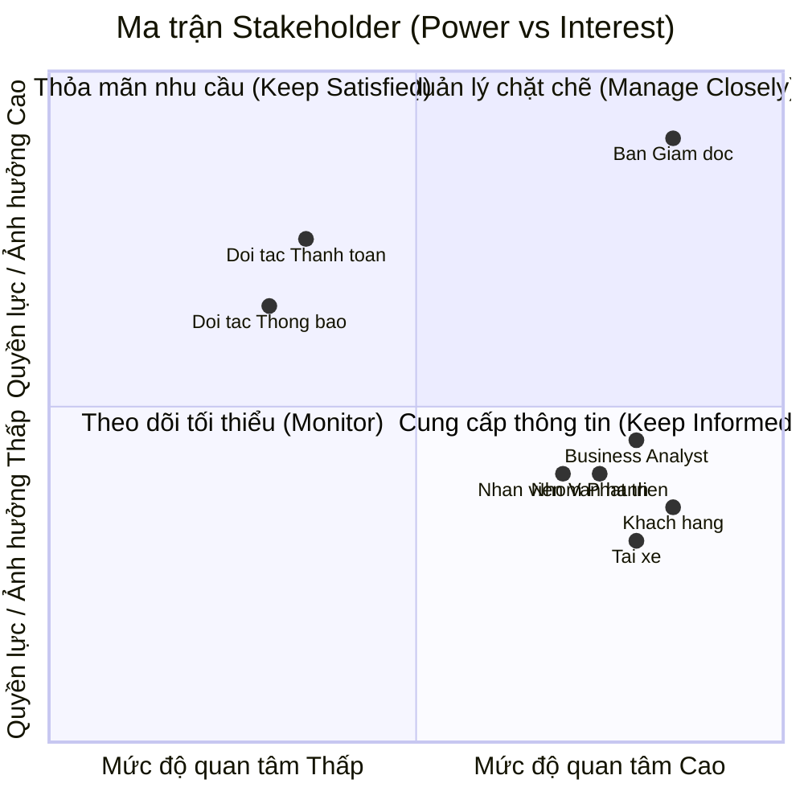
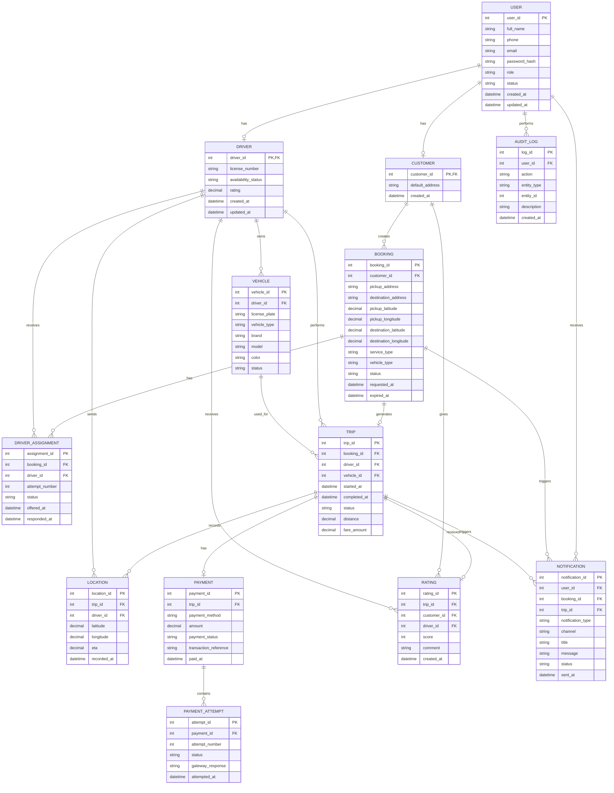
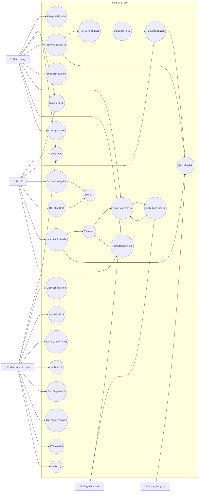

# Software Requirements Specification (SRS) - CAB System

**1. Stakeholder List & Roles (Danh sách & Vai trò Bên liên quan)**

| Phân loại | Bên liên quan (Stakeholder) | Vai trò & Trách nhiệm (Role & Responsibilities) |
| :--- | :--- | :--- |
| **Người dùng trực tiếp (End-users)** | **Khách hàng (Passenger)** | Đăng ký, đặt xe, theo dõi chuyến đi, thanh toán cước phí, nhận thông báo và đánh giá tài xế. |
| | **Tài xế (Driver)** | Quản lý trạng thái hoạt động, tiếp nhận/từ chối yêu cầu, cập nhật trạng thái hành trình thực tế và nhận thanh toán. |
| **Quản lý & Vận hành nội bộ (Internal)**| **Nhân viên vận hành (Operations Staff/Admin)** | Quản lý thông tin (tài xế, khách hàng, phương tiện), giám sát chuyến đi realtime, hỗ trợ xử lý sự cố và tra cứu giao dịch dựa trên phân quyền. |
| | **Ban lãnh đạo / Ban giám đốc (Sponsor/Management)** | Đưa ra định hướng, phê duyệt dự án và sử dụng các báo cáo thống kê (doanh thu, tỷ lệ hoàn thành/hủy, hiệu suất) để ra quyết định kinh doanh. |
| **Nhóm triển khai (Project Team)** | **Business Analyst (BA)** | Phân tích yêu cầu, xác định phạm vi, làm rõ các quy tắc nghiệp vụ/ngoại lệ chưa chốt với khách hàng và hoàn thiện tài liệu SRS. |
| | **Nhóm phát triển (Development Team)** | Thiết kế kiến trúc linh hoạt, lập trình, kiểm thử và triển khai nền tảng CAB trong thời hạn 7 tuần. |
| **Đối tác bên thứ ba (External)**| **Nhà cung cấp thanh toán (Payment Gateway)** | Xử lý giao dịch điện tử an toàn bên ngoài hệ thống CAB, trả về kết quả thanh toán để hệ thống cập nhật. |
| | **Nhà cung cấp dịch vụ thông báo (Notification Provider)**| Nền tảng trung gian hỗ trợ đẩy thông báo (Push Notification, SMS, Email) trạng thái chuyến đi và giao dịch đến người dùng. |
## 2. Stakeholder Matrix (Ma trận Bên liên quan)


---


## 3. Business Goals (Mục tiêu Kinh doanh)

* **BG01:** Tự động hóa quy trình phân công tài xế và tối ưu hóa vận hành nhằm giảm thiểu sự can thiệp thủ công, sẵn sàng mở rộng quy mô hệ thống phục vụ lượng lớn khách hàng và tài xế trong tương lai.
* **BG0c:** Nâng cao doanh thu, tỷ lệ hoàn thành chuyến đi và giảm tỷ lệ hủy chuyến thông qua việc tối ưu cơ chế đề xuất, ghép nối tài xế gần nhất theo thời gian thực.
* **BG03:** Tăng cường trải nghiệm và độ hài lòng của khách hàng bằng việc minh bạch hóa thông tin trạng thái chuyến đi, vị trí tài xế, thời gian dự kiến đến và đa dạng hóa phương thức thanh toán an toàn.
* **BG04:** Tăng hiệu quả hoạt động và thu nhập cho tài xế nhờ cơ chế thông báo nhận chuyến chủ động, minh bạch tiến trình chuyến đi và quy trình hỗ trợ vận hành rõ ràng.
* * **BG05:** Nâng cao năng lực quản trị, hỗ trợ và xử lý sự cố kịp thời thông qua hệ thống theo dõi trực quan, phân quyền chặt chẽ và công cụ báo cáo hoạt động chuyên sâu.
* **BG06:** Xây dựng kiến trúc nền tảng ổn định, bảo mật cao, có khả năng mở rộng độc lập và linh hoạt tích hợp/bổ sung các loại hình dịch vụ, đối tác thanh toán hay thông báo mới trong tương lai mà không ảnh hưởng tới hệ thống đang chạy.

---

## 4. Minimum Viable Product (MVP) Modules

1. **Module Quản lý Tài khoản & Định danh (Account & Auth Module):** Đăng ký, đăng nhập, quản lý hồ sơ (Khách hàng, Tài xế) và phân quyền quản trị (Nhân viên vận hành).
2. **Module Đặt xe & Phân công (Booking & Matching Module):** Tạo chuyến, định vị thời gian thực, thuật toán tự động ghép nối/tìm tài xế gần nhất và xử lý chuyển tiếp khi từ chối.
3. **Module Quản lý Tiến trình Chuyến đi (Trip Management Module):** Cập nhật/theo dõi trạng thái chuyến đi theo thời gian thực (ETA, vị trí), lịch sử chuyến và đánh giá tài xế.
4. **Module Tính cước & Thanh toán (Pricing & Payment Module):** Tính tiền tự động, hỗ trợ tiền mặt và tích hợp Payment Gateway bên ngoài xử lý thanh toán điện tử.
5. **Module Thông báo (Notification Module):** Gửi thông báo tức thì cho Khách hàng/Tài xế theo từng sự kiện của chuyến đi.
6. **Module Vận hành & Báo cáo (Admin & Analytics Module):** Giao diện quản trị theo dõi chuyến đi, hỗ trợ xử lý sự cố và xuất báo cáo doanh thu, hiệu suất cho Ban giám đốc.
   
## 5. Business Requirements – CAB System MVP (Yêu cầu nghiệp vụ)
Dưới đây là bảng **Business Requirements (BR)** chi tiết gồm 17 yêu cầu đã được chuyển sang định dạng bảng Markdown:

| ID | Tên Yêu cầu | Mô tả Chi tiết |
| --- | --- | --- |
| **BR01** | Đăng ký & Quản lý Khách hàng | Hệ thống hỗ trợ Khách hàng đăng ký tài khoản, đăng nhập, cập nhật thông tin cá nhân và xem lịch sử các chuyến đi đã thực hiện. |
| **BR02** | Đăng ký & Quản lý Tài xế | Hệ thống hỗ trợ Tài xế đăng ký tài khoản (hoặc được tạo bởi Nhân viên vận hành), cập nhật hồ sơ, thông tin phương tiện và bật/tắt trạng thái sẵn sàng làm việc.|
| **BR03** | Tạo yêu cầu Đặt xe | Hệ thống cho phép Khách hàng nhập điểm đón, điểm đến, lựa chọn loại dịch vụ/loại xe và gửi yêu cầu đặt xe.|
| **BR04** | Định vị & Đề xuất Tài xế | Hệ thống ghi nhận vị trí GPS theo thời gian thực của Tài xế để tìm kiếm và đề xuất chuyến đi dựa trên độ gần và trạng thái sẵn sàng.|
| **BR05** | Tự động Chuyển tiếp Điều phối | Hệ thống hỗ trợ chuyển tiếp tìm kiếm Tài xế tiếp theo nếu Tài xế được đề xuất ban đầu từ chối hoặc không phản hồi, đảm bảo không yêu cầu Khách hàng đặt lại chuyến.|
| **BR06** | Thông báo Không tìm thấy Tài xế | Hệ thống thông báo rõ ràng cho Khách hàng trong trường hợp không tìm được Tài xế phù hợp.|
| **BR07** | Tiếp nhận Chuyến đi | Hệ thống hỗ trợ Tài xế nhận thông báo và lựa chọn chấp nhận hoặc từ chối yêu cầu chuyến đi.|
| **BR08** | Cập nhật Tiến trình Chuyến đi | Hệ thống cho phép Tài xế cập nhật liên tục tiến trình chuyến đi (*Đã đến điểm đón*, *Đã đón khách*, *Đang di chuyển*, *Hoàn thành*).|
| **BR09** | Theo dõi Real-time & ETA | Hệ thống hiển thị thời gian dự kiến đến (ETA), vị trí Tài xế và trạng thái chuyến đi theo thời gian thực cho Khách hàng theo dõi.|
| **BR10** | Tự động Tính cước | Hệ thống tự động tính toán số tiền cước sau khi chuyến đi hoàn thành dựa trên loại dịch vụ và thông tin chuyến đi.|
| **BR11** | Tích hợp Thanh toán | Hệ thống hỗ trợ thanh toán bằng tiền mặt và tích hợp với cổng thanh toán điện tử bên ngoài (Payment Gateway), đảm bảo không lưu thông tin thẻ/tài khoản nhạy cảm trên hệ thống CAB.|
| **BR12** | Xử lý Lỗi Thanh toán | Hệ thống hỗ trợ xử lý lại giao dịch và thông báo cho Khách hàng khi thanh toán điện tử bị thất bại.|
| **BR13** | Thông báo Tức thời Đa kênh | Hệ thống tự động gửi thông báo (Push/SMS) cho Khách hàng và Tài xế tại các mốc: tiếp nhận chuyến, tài xế nhận chuyến, tài xế tới điểm đón, chuyến hoàn thành và kết quả thanh toán.|
| **BR14** | Giám sát & Hỗ trợ Vận hành | Hệ thống cung cấp giao diện quản trị cho Nhân viên vận hành để giám sát danh sách chuyến đi đang diễn ra, kiểm tra trạng thái Tài xế, tra cứu lịch sử giao dịch và can thiệp xử lý chuyến lỗi.|
| **BR15** | Phân quyền Quản trị | Hệ thống áp dụng cơ chế phân quyền truy cập chặt chẽ để hạn chế Nhân viên vận hành thông thường thực hiện các thao tác quản trị nhạy cảm.|
| **BR16** | Báo cáo Thống kê Quản trị | Hệ thống cung cấp báo cáo thống kê cho Ban Giám đốc về tổng số chuyến, doanh thu, tỷ lệ hoàn thành/hủy chuyến và hiệu quả hoạt động của Tài xế.|
| **BR17** | Đánh giá Dịch vụ | Hệ thống cho phép Khách hàng thực hiện đánh giá (rating/comment) chất lượng Tài xế sau khi hoàn thành chuyến đi.|

## 6. Business Process Modeling (Mô hình hóa Quy trình Nghiệp vụ)

### 6.1. Luồng Đặt xe & Điều phối Tự động


### 6.2. Quy trình Thực hiện Chuyến đi & Thanh toán

# 7. Functional Requirements (Yêu cầu Chức năng)

## 7.1. Module Quản lý Tài khoản & Định danh

### FR01 – Đăng ký tài khoản Khách hàng
- Hệ thống cho phép Khách hàng tạo tài khoản bằng các thông tin cần thiết.
- Hệ thống kiểm tra tính hợp lệ và tính duy nhất của thông tin đăng ký.
- Hệ thống thông báo kết quả đăng ký cho Khách hàng.

### FR02 – Đăng nhập và Đăng xuất
- Hệ thống cho phép Khách hàng, Tài xế và Nhân viên vận hành đăng nhập.
- Hệ thống xác thực thông tin đăng nhập trước khi cấp quyền truy cập.
- Hệ thống cho phép người dùng đăng xuất khỏi tài khoản.

### FR03 – Quản lý hồ sơ Khách hàng
- Khách hàng có thể xem và cập nhật thông tin cá nhân.
- Hệ thống lưu trữ thông tin hồ sơ của Khách hàng.
- Khách hàng có thể xem lịch sử các chuyến đi đã thực hiện.

### FR04 – Quản lý hồ sơ Tài xế
- Tài xế có thể xem và cập nhật thông tin cá nhân theo quyền được cấp.
- Nhân viên vận hành có thể tạo và cập nhật hồ sơ Tài xế.
- Hệ thống lưu trữ thông tin phương tiện của Tài xế.

### FR05 – Quản lý trạng thái Tài xế
- Tài xế có thể bật/tắt trạng thái sẵn sàng nhận chuyến.
- Hệ thống cập nhật trạng thái Tài xế theo thời gian thực.
- Chỉ Tài xế đang ở trạng thái sẵn sàng mới được đưa vào quá trình điều phối.

---

## 7.2. Module Đặt xe & Phân công

### FR06 – Tạo yêu cầu đặt xe
- Khách hàng nhập điểm đón và điểm đến.
- Khách hàng lựa chọn loại dịch vụ/loại xe.
- Hệ thống kiểm tra thông tin trước khi tạo yêu cầu.
- Hệ thống tạo yêu cầu đặt xe và chuyển sang quá trình tìm Tài xế.

### FR07 – Xác định vị trí Khách hàng
- Hệ thống xác định hoặc tiếp nhận vị trí điểm đón do Khách hàng cung cấp.
- Hệ thống sử dụng vị trí điểm đón để phục vụ quá trình tìm kiếm Tài xế.

### FR08 – Tìm kiếm Tài xế phù hợp
- Hệ thống tìm các Tài xế đang sẵn sàng nhận chuyến.
- Hệ thống xác định Tài xế dựa trên vị trí và các tiêu chí vận hành được cấu hình.
- Hệ thống ưu tiên Tài xế phù hợp và ở vị trí thuận lợi.

### FR09 – Gửi yêu cầu nhận chuyến
- Hệ thống gửi thông tin yêu cầu chuyến đi đến Tài xế được lựa chọn.
- Hệ thống hiển thị thời gian phản hồi cho Tài xế.
- Tài xế có thể chấp nhận hoặc từ chối yêu cầu.

### FR10 – Tự động chuyển tiếp yêu cầu
- Nếu Tài xế từ chối yêu cầu, hệ thống tìm Tài xế phù hợp tiếp theo.
- Nếu Tài xế không phản hồi trong thời gian quy định, hệ thống tự động chuyển yêu cầu.
- Khách hàng không cần tạo lại yêu cầu đặt xe.

### FR11 – Xử lý trường hợp không tìm thấy Tài xế
- Hệ thống xác định khi không còn Tài xế phù hợp.
- Hệ thống thông báo cho Khách hàng rằng chưa tìm được Tài xế.
- Hệ thống cập nhật trạng thái yêu cầu đặt xe tương ứng.

---

## 7.3. Module Quản lý Tiến trình Chuyến đi

### FR12 – Xác nhận chuyến đi
- Khi Tài xế chấp nhận yêu cầu, hệ thống xác nhận chuyến đi.
- Hệ thống cung cấp thông tin Tài xế và phương tiện cho Khách hàng.
- Hệ thống cập nhật trạng thái chuyến đi.

### FR13 – Cập nhật trạng thái chuyến đi
- Tài xế có thể cập nhật các trạng thái:
  - Đã đến điểm đón.
  - Đã đón khách.
  - Đang di chuyển.
  - Hoàn thành.
- Hệ thống kiểm tra trạng thái hiện tại trước khi cho phép chuyển trạng thái.
- Hệ thống lưu lại lịch sử thay đổi trạng thái.

### FR14 – Theo dõi vị trí Tài xế
- Tài xế gửi vị trí GPS trong quá trình thực hiện chuyến đi.
- Hệ thống cập nhật vị trí Tài xế theo thời gian thực.
- Khách hàng có thể xem vị trí hiện tại của Tài xế.

### FR15 – Tính toán và hiển thị ETA
- Hệ thống tính toán thời gian dự kiến Tài xế đến điểm đón hoặc điểm đến.
- Hệ thống cập nhật ETA khi vị trí Tài xế thay đổi.
- Khách hàng có thể theo dõi ETA trong quá trình thực hiện chuyến đi.

### FR16 – Quản lý lịch sử chuyến đi
- Hệ thống lưu thông tin các chuyến đi đã hoàn thành.
- Khách hàng có thể xem lịch sử chuyến đi của mình.
- Nhân viên vận hành có thể tra cứu thông tin chuyến đi theo quyền được cấp.

---

## 7.4. Module Tính cước & Thanh toán

### FR17 – Tính cước chuyến đi
- Hệ thống tự động tính tổng cước phí khi chuyến đi hoàn thành.
- Cước phí được xác định dựa trên loại dịch vụ và thông tin chuyến đi.
- Hệ thống hiển thị số tiền cần thanh toán cho Khách hàng.

### FR18 – Thanh toán tiền mặt
- Khách hàng có thể lựa chọn thanh toán bằng tiền mặt.
- Khách hàng thanh toán trực tiếp cho Tài xế.
- Tài xế xác nhận đã nhận tiền.
- Hệ thống ghi nhận trạng thái thanh toán.

### FR19 – Thanh toán điện tử
- Hệ thống chuyển yêu cầu thanh toán đến Cổng thanh toán bên ngoài.
- Hệ thống tiếp nhận kết quả giao dịch từ Cổng thanh toán.
- Hệ thống cập nhật trạng thái thanh toán theo kết quả giao dịch.
- Hệ thống không lưu trữ thông tin thẻ hoặc thông tin tài khoản thanh toán nhạy cảm.

### FR20 – Xử lý thanh toán thất bại
- Hệ thống thông báo cho Khách hàng khi giao dịch thanh toán thất bại.
- Hệ thống cho phép thực hiện lại giao dịch theo chính sách nghiệp vụ.
- Hệ thống ghi nhận kết quả của từng lần thanh toán.

### FR21 – Ghi nhận giao dịch
- Hệ thống lưu thông tin giao dịch và trạng thái thanh toán.
- Nhân viên vận hành có thể tra cứu lịch sử giao dịch theo quyền được cấp.
- Hệ thống liên kết giao dịch với chuyến đi tương ứng.

---

## 7.5. Module Thông báo

### FR22 – Gửi thông báo sự kiện chuyến đi
Hệ thống gửi thông báo đến Khách hàng tại các sự kiện:
- Đặt xe thành công.
- Tài xế được phân công.
- Tài xế đã đến điểm đón.
- Chuyến đi bắt đầu.
- Chuyến đi hoàn thành.

### FR23 – Gửi thông báo cho Tài xế
Hệ thống gửi thông báo đến Tài xế khi:
- Có yêu cầu chuyến đi mới.
- Yêu cầu chuyến đi bị thay đổi.
- Chuyến đi bị hủy hoặc có sự kiện liên quan.

### FR24 – Thông báo kết quả thanh toán
- Hệ thống thông báo kết quả thanh toán cho Khách hàng.
- Hệ thống thông báo khi giao dịch thành công hoặc thất bại.
- Hệ thống hỗ trợ mở rộng thêm các kênh thông báo trong tương lai.

---

## 7.6. Module Vận hành & Quản trị

### FR25 – Giám sát chuyến đi
- Nhân viên vận hành có thể xem danh sách các chuyến đang diễn ra.
- Hệ thống hiển thị trạng thái hiện tại của từng chuyến.
- Nhân viên vận hành có thể tra cứu thông tin cần thiết để hỗ trợ xử lý sự cố.

### FR26 – Theo dõi trạng thái Tài xế
- Nhân viên vận hành có thể xem trạng thái hoạt động của Tài xế.
- Hệ thống hiển thị Tài xế đang sẵn sàng, đang nhận chuyến hoặc đang thực hiện chuyến.
- Nhân viên vận hành có thể tra cứu thông tin phương tiện theo quyền được cấp.

### FR27 – Hỗ trợ xử lý chuyến lỗi
- Nhân viên vận hành có thể tra cứu các chuyến gặp sự cố.
- Hệ thống cung cấp thông tin liên quan đến chuyến đi và giao dịch.
- Nhân viên vận hành có thể thực hiện các thao tác hỗ trợ theo quyền được cấp.
- Các thao tác can thiệp phải được ghi nhận vào nhật ký hệ thống.

### FR28 – Quản lý người dùng và dữ liệu
- Nhân viên vận hành có quyền quản lý dữ liệu Khách hàng, Tài xế, phương tiện và chuyến đi theo phạm vi được phân quyền.
- Hệ thống kiểm soát quyền trước khi thực hiện các thao tác quản trị.

---

## 7.7. Module Phân quyền & Bảo mật

### FR29 – Phân quyền người dùng
- Hệ thống phân quyền theo vai trò người dùng.
- Các vai trò chính gồm:
  - Khách hàng.
  - Tài xế.
  - Nhân viên vận hành.
- Hệ thống chỉ cho phép người dùng thực hiện chức năng phù hợp với quyền được cấp.

### FR30 – Kiểm soát truy cập dữ liệu
- Hệ thống kiểm tra quyền truy cập trước khi cho phép xem hoặc chỉnh sửa dữ liệu.
- Dữ liệu cá nhân, phương tiện, vị trí và giao dịch phải được bảo vệ.
- Các thao tác quản trị nhạy cảm chỉ được thực hiện bởi người có quyền phù hợp.

### FR31 – Ghi nhật ký hoạt động
- Hệ thống ghi nhận các thao tác quan trọng của người dùng.
- Nhật ký bao gồm người thực hiện, thời điểm và hành động.
- Nhật ký được sử dụng để hỗ trợ kiểm tra và xử lý sự cố.

---

## 7.8. Module Đánh giá & Phản hồi

### FR32 – Đánh giá Tài xế
- Sau khi chuyến đi hoàn thành, Khách hàng có thể đánh giá Tài xế.
- Khách hàng có thể gửi điểm đánh giá và nhận xét.
- Hệ thống lưu đánh giá gắn với chuyến đi tương ứng.

### FR33 – Quản lý phản hồi
- Hệ thống cho phép Nhân viên vận hành tra cứu các đánh giá và phản hồi.
- Thông tin phản hồi được sử dụng để hỗ trợ đánh giá chất lượng dịch vụ.

---

## 7.9. Module Báo cáo & Thống kê

### FR34 – Báo cáo hoạt động
Hệ thống cung cấp các chỉ số:
- Tổng số chuyến đi.
- Doanh thu.
- Tỷ lệ hoàn thành chuyến.
- Tỷ lệ hủy chuyến.
- Hiệu quả hoạt động của Tài xế.

### FR35 – Tra cứu và lọc báo cáo
- Người có quyền quản trị có thể tra cứu báo cáo theo khoảng thời gian.
- Hệ thống hỗ trợ lọc dữ liệu theo các tiêu chí phù hợp.
- Kết quả báo cáo được trình bày dưới dạng dễ theo dõi.

---

## 7.10. Mapping Business Requirements và Functional Requirements

| Business Requirement | Functional Requirements |
|---|---|
| BR01 – Đăng ký & Quản lý Khách hàng | FR01, FR02, FR03 |
| BR02 – Đăng ký & Quản lý Tài xế | FR02, FR04, FR05 |
| BR03 – Tạo yêu cầu Đặt xe | FR06, FR07 |
| BR04 – Định vị & Đề xuất Tài xế | FR08, FR14 |
| BR05 – Tự động Chuyển tiếp Điều phối | FR09, FR10 |
| BR06 – Không tìm thấy Tài xế | FR11 |
| BR07 – Tiếp nhận Chuyến đi | FR09, FR12 |
| BR08 – Cập nhật Tiến trình | FR13 |
| BR09 – Theo dõi Real-time & ETA | FR14, FR15 |
| BR10 – Tự động Tính cước | FR17 |
| BR11 – Tích hợp Thanh toán | FR18, FR19 |
| BR12 – Xử lý Lỗi Thanh toán | FR20, FR21 |
| BR13 – Thông báo Tức thời | FR22, FR23, FR24 |
| BR14 – Giám sát & Hỗ trợ Vận hành | FR25, FR26, FR27 |
| BR15 – Phân quyền Quản trị | FR28, FR29, FR30 |
| BR16 – Báo cáo Thống kê | FR34, FR35 |
| BR17 – Đánh giá Dịch vụ | FR32, FR33 |

# 8. Business Rules (Quy tắc Nghiệp vụ)

## 8.1. Quy tắc Quản lý Tài khoản

| ID | Business Rule | Mô tả |
|---|---|---|
| **BRULE01** | Tài khoản duy nhất | Mỗi tài khoản người dùng phải được định danh duy nhất trong hệ thống. |
| **BRULE02** | Phân loại tài khoản | Mỗi tài khoản phải thuộc một vai trò: Khách hàng, Tài xế hoặc Nhân viên vận hành. |
| **BRULE03** | Kiểm soát quyền truy cập | Người dùng chỉ được thực hiện các chức năng phù hợp với vai trò và quyền được cấp. |
| **BRULE04** | Trạng thái Tài xế | Tài xế chỉ được nhận chuyến khi đang ở trạng thái sẵn sàng và không thực hiện chuyến khác. |
| **BRULE05** | Thông tin Tài xế | Tài xế phải có thông tin hồ sơ và phương tiện hợp lệ trước khi được phép nhận chuyến. |

---

## 8.2. Quy tắc Đặt xe & Điều phối

| ID | Business Rule | Mô tả |
|---|---|---|
| **BRULE06** | Thông tin đặt xe bắt buộc | Một yêu cầu đặt xe phải có điểm đón, điểm đến và loại dịch vụ/loại xe. |
| **BRULE07** | Tìm Tài xế phù hợp | Hệ thống chỉ đề xuất các Tài xế đang sẵn sàng và đáp ứng điều kiện của chuyến đi. |
| **BRULE08** | Ưu tiên Tài xế | Tài xế phù hợp có vị trí thuận lợi/gần điểm đón được ưu tiên trong quá trình điều phối. |
| **BRULE09** | Một chuyến – một Tài xế | Một yêu cầu đặt xe chỉ được gán cho tối đa một Tài xế tại một thời điểm. |
| **BRULE10** | Không trùng chuyến | Tài xế đang thực hiện hoặc đã nhận một chuyến chưa hoàn thành không được nhận thêm chuyến mới. |
| **BRULE11** | Từ chối chuyến | Khi Tài xế từ chối yêu cầu, hệ thống phải tiếp tục tìm Tài xế phù hợp khác. |
| **BRULE12** | Hết thời gian phản hồi | Nếu Tài xế không phản hồi trong thời gian quy định, yêu cầu được xem như không được chấp nhận và chuyển sang Tài xế tiếp theo. |
| **BRULE13** | Không tìm thấy Tài xế | Khi không còn Tài xế phù hợp, hệ thống phải thông báo cho Khách hàng và cập nhật trạng thái yêu cầu. |
| **BRULE14** | Không đặt lại chuyến | Khách hàng không phải tạo lại yêu cầu khi hệ thống tự động chuyển sang Tài xế khác. |

---

## 8.3. Quy tắc Thực hiện Chuyến đi

| ID | Business Rule | Mô tả |
|---|---|---|
| **BRULE15** | Thứ tự trạng thái | Trạng thái chuyến đi phải được cập nhật theo trình tự nghiệp vụ hợp lệ. |
| **BRULE16** | Trạng thái Đã đến | Tài xế chỉ được chuyển sang trạng thái "Đã đến điểm đón" sau khi đã nhận chuyến. |
| **BRULE17** | Trạng thái Đã đón khách | Tài xế chỉ được chuyển sang "Đã đón khách" sau khi đã đến điểm đón. |
| **BRULE18** | Trạng thái Đang di chuyển | Chuyến đi chỉ được chuyển sang "Đang di chuyển" sau khi Tài xế đã đón khách. |
| **BRULE19** | Hoàn thành chuyến | Chuyến đi chỉ được chuyển sang "Hoàn thành" khi Tài xế kết thúc hành trình. |
| **BRULE20** | Theo dõi vị trí | Trong thời gian chuyến đi đang diễn ra, hệ thống phải cập nhật vị trí Tài xế để phục vụ theo dõi và tính ETA. |
| **BRULE21** | Lưu lịch sử trạng thái | Mọi thay đổi trạng thái quan trọng của chuyến đi phải được ghi nhận để phục vụ tra cứu và kiểm soát. |

---

## 8.4. Quy tắc Tính cước

| ID | Business Rule | Mô tả |
|---|---|---|
| **BRULE22** | Tính cước tự động | Cước phí phải được hệ thống tự động tính dựa trên loại dịch vụ và thông tin chuyến đi. |
| **BRULE23** | Thời điểm tính cước | Tổng cước phí được xác định khi chuyến đi hoàn thành. |
| **BRULE24** | Minh bạch cước phí | Khách hàng phải được thông báo số tiền cần thanh toán trước khi thực hiện thanh toán. |
| **BRULE25** | Không tự ý thay đổi cước | Cước phí đã được xác định không được thay đổi trái với quy tắc nghiệp vụ hoặc quyền được cấp. |

---

## 8.5. Quy tắc Thanh toán

| ID | Business Rule | Mô tả |
|---|---|---|
| **BRULE26** | Phương thức thanh toán | Khách hàng được lựa chọn thanh toán bằng tiền mặt hoặc thanh toán điện tử nếu phương thức đó khả dụng. |
| **BRULE27** | Thanh toán điện tử | Giao dịch điện tử phải được xử lý thông qua Cổng thanh toán bên ngoài. |
| **BRULE28** | Không lưu dữ liệu nhạy cảm | CAB không được lưu trữ trực tiếp thông tin thẻ hoặc thông tin tài khoản thanh toán nhạy cảm của Khách hàng. |
| **BRULE29** | Xác nhận thanh toán | Chỉ ghi nhận giao dịch điện tử là thành công khi nhận được kết quả thành công từ Cổng thanh toán. |
| **BRULE30** | Thanh toán thất bại | Khi thanh toán điện tử thất bại, hệ thống phải thông báo cho Khách hàng và cho phép thực hiện lại theo chính sách nghiệp vụ. |
| **BRULE31** | Ghi nhận tiền mặt | Thanh toán tiền mặt chỉ được ghi nhận hoàn tất khi Tài xế xác nhận đã nhận tiền. |
| **BRULE32** | Liên kết giao dịch | Mỗi giao dịch thanh toán phải được liên kết với chuyến đi tương ứng để phục vụ tra cứu và đối soát. |

---

## 8.6. Quy tắc Thông báo

| ID | Business Rule | Mô tả |
|---|---|---|
| **BRULE33** | Thông báo theo sự kiện | Hệ thống phải gửi thông báo khi xảy ra các sự kiện quan trọng của chuyến đi. |
| **BRULE34** | Thông báo cho Khách hàng | Khách hàng phải nhận được thông báo về việc nhận chuyến, Tài xế đến điểm đón, hoàn thành chuyến và kết quả thanh toán. |
| **BRULE35** | Thông báo cho Tài xế | Tài xế phải nhận được thông báo khi có yêu cầu chuyến mới hoặc thay đổi liên quan đến chuyến đi. |
| **BRULE36** | Khả năng mở rộng kênh | Kiến trúc thông báo phải cho phép bổ sung kênh mới mà không cần thay đổi toàn bộ hệ thống. |

---

## 8.7. Quy tắc Đánh giá & Phản hồi

| ID | Business Rule | Mô tả |
|---|---|---|
| **BRULE37** | Chỉ đánh giá sau chuyến | Khách hàng chỉ được đánh giá sau khi chuyến đi đã hoàn thành. |
| **BRULE38** | Đánh giá thuộc chuyến đi | Mỗi đánh giá phải được liên kết với chuyến đi cụ thể và Tài xế tương ứng. |
| **BRULE39** | Không đánh giá trước khi hoàn thành | Hệ thống không cho phép gửi đánh giá cho chuyến chưa hoàn thành. |

---

## 8.8. Quy tắc Vận hành & Quản trị

| ID | Business Rule | Mô tả |
|---|---|---|
| **BRULE40** | Phân quyền vận hành | Nhân viên vận hành chỉ được thực hiện các thao tác nằm trong phạm vi quyền được cấp. |
| **BRULE41** | Thao tác nhạy cảm | Các thao tác quản trị hoặc can thiệp dữ liệu nhạy cảm phải được giới hạn cho người có quyền phù hợp. |
| **BRULE42** | Theo dõi chuyến đang diễn ra | Nhân viên vận hành được phép theo dõi các chuyến đang thực hiện theo phạm vi nghiệp vụ. |
| **BRULE43** | Tra cứu giao dịch | Nhân viên vận hành có thể tra cứu lịch sử giao dịch để hỗ trợ xử lý sự cố và đối soát. |
| **BRULE44** | Ghi nhận can thiệp | Mọi thao tác can thiệp quan trọng của Nhân viên vận hành phải được ghi nhận vào nhật ký hệ thống. |

---

## 8.9. Quy tắc Báo cáo & Thống kê

| ID | Business Rule | Mô tả |
|---|---|---|
| **BRULE45** | Dữ liệu báo cáo | Báo cáo phải được tổng hợp từ dữ liệu chuyến đi, thanh toán và hoạt động Tài xế đã được ghi nhận trên hệ thống. |
| **BRULE46** | Chỉ số vận hành | Hệ thống phải hỗ trợ thống kê tổng số chuyến, doanh thu, tỷ lệ hoàn thành và tỷ lệ hủy chuyến. |
| **BRULE47** | Hiệu suất Tài xế | Hệ thống phải cung cấp dữ liệu phục vụ đánh giá hiệu quả hoạt động của Tài xế. |
| **BRULE48** | Phân quyền báo cáo | Chỉ người dùng có quyền phù hợp mới được xem các báo cáo quản trị và dữ liệu doanh thu. |

---

## 8.10. Quy tắc Bảo mật & Dữ liệu

| ID | Business Rule | Mô tả |
|---|---|---|
| **BRULE49** | Xác thực người dùng | Người dùng phải được xác thực trước khi truy cập các chức năng yêu cầu đăng nhập. |
| **BRULE50** | Bảo vệ dữ liệu cá nhân | Thông tin cá nhân, thông tin phương tiện và dữ liệu vị trí phải được bảo vệ khỏi truy cập trái phép. |
| **BRULE51** | Bảo vệ dữ liệu giao dịch | Thông tin liên quan đến giao dịch phải được kiểm soát quyền truy cập và bảo vệ phù hợp. |
| **BRULE52** | Nhật ký hệ thống | Các hoạt động quan trọng liên quan đến tài khoản, chuyến đi, thanh toán và quản trị phải được ghi nhận để phục vụ kiểm tra. |
| **BRULE53** | Tính toàn vẹn dữ liệu | Hệ thống phải đảm bảo dữ liệu chuyến đi và giao dịch không bị tạo trùng hoặc cập nhật sai trạng thái. |

---

## 8.11. Quy tắc Ngoại lệ & Khả năng mở rộng

| ID | Business Rule | Mô tả |
|---|---|---|
| **BRULE54** | Lỗi thanh toán độc lập | Lỗi từ Cổng thanh toán không được làm gián đoạn toàn bộ quy trình đặt và quản lý chuyến đi. |
| **BRULE55** | Lỗi thông báo độc lập | Lỗi dịch vụ thông báo không được làm mất dữ liệu hoặc làm dừng quy trình đặt xe. |
| **BRULE56** | Mở rộng dịch vụ | Hệ thống phải cho phép bổ sung loại hình dịch vụ mới mà không phải xây dựng lại toàn bộ hệ thống. |
| **BRULE57** | Mở rộng thanh toán | Hệ thống phải cho phép tích hợp thêm phương thức hoặc đối tác thanh toán mới. |
| **BRULE58** | Mở rộng thông báo | Hệ thống phải cho phép bổ sung nhà cung cấp/kênh thông báo mới mà không ảnh hưởng lớn đến các module khác. |
# 9. Non-Functional Requirements (Yêu cầu Phi chức năng)

## 9.1. Hiệu năng (Performance)

| ID | Yêu cầu | Mô tả |
|---|---|---|
| **NFR01** | Thời gian phản hồi | Hệ thống phải phản hồi các thao tác thông thường của người dùng trong thời gian phù hợp, mục tiêu không quá **3 giây** trong điều kiện tải bình thường. |
| **NFR02** | Xử lý đặt xe | Hệ thống phải tiếp nhận và xử lý yêu cầu đặt xe nhanh chóng, không gây cảm giác chờ đợi kéo dài cho Khách hàng. |
| **NFR03** | Cập nhật vị trí | Vị trí GPS của Tài xế phải được cập nhật gần thời gian thực để đảm bảo thông tin hiển thị và ETA có độ chính xác phù hợp. |
| **NFR04** | Xử lý đồng thời | Hệ thống phải có khả năng xử lý nhiều Khách hàng và Tài xế hoạt động đồng thời mà không làm suy giảm nghiêm trọng hiệu năng. |

---

## 9.2. Khả dụng & Độ tin cậy (Availability & Reliability)

| ID | Yêu cầu | Mô tả |
|---|---|---|
| **NFR05** | Tính sẵn sàng | Hệ thống phải duy trì hoạt động ổn định trong thời gian phục vụ Khách hàng và Tài xế. |
| **NFR06** | Hoạt động trong giờ cao điểm | Hệ thống phải có khả năng duy trì các chức năng đặt xe, điều phối và theo dõi chuyến trong thời gian nhu cầu tăng cao. |
| **NFR07** | Cô lập lỗi | Lỗi của Cổng thanh toán hoặc dịch vụ thông báo không được làm sập hoặc dừng toàn bộ hệ thống đặt xe. |
| **NFR08** | Khôi phục lỗi | Khi xảy ra lỗi tạm thời, hệ thống phải có khả năng khôi phục và tiếp tục xử lý mà hạn chế tối đa việc mất dữ liệu. |
| **NFR09** | Tính toàn vẹn dữ liệu | Hệ thống phải đảm bảo dữ liệu chuyến đi, trạng thái và giao dịch không bị mất hoặc ghi nhận sai trong quá trình xử lý. |

---

## 9.3. Bảo mật (Security)

| ID | Yêu cầu | Mô tả |
|---|---|---|
| **NFR10** | Xác thực | Các chức năng yêu cầu quyền truy cập phải yêu cầu người dùng đăng nhập và xác thực hợp lệ. |
| **NFR11** | Phân quyền | Hệ thống phải kiểm soát quyền truy cập dựa trên vai trò của người dùng. |
| **NFR12** | Bảo vệ dữ liệu cá nhân | Thông tin cá nhân của Khách hàng và Tài xế phải được bảo vệ khỏi truy cập hoặc sử dụng trái phép. |
| **NFR13** | Bảo vệ dữ liệu vị trí | Dữ liệu vị trí của Tài xế phải được giới hạn quyền truy cập và chỉ sử dụng cho các mục đích nghiệp vụ phù hợp. |
| **NFR14** | Bảo vệ dữ liệu thanh toán | CAB không được lưu trữ trực tiếp thông tin thẻ hoặc thông tin tài khoản thanh toán nhạy cảm. |
| **NFR15** | Nhật ký kiểm toán | Các thao tác quan trọng như đăng nhập, thay đổi dữ liệu, thanh toán và can thiệp của Nhân viên vận hành phải được ghi nhận. |
| **NFR16** | Bảo mật truyền thông | Dữ liệu trao đổi giữa ứng dụng và hệ thống phải được truyền qua kết nối an toàn. |

---

## 9.4. Khả năng mở rộng (Scalability)

| ID | Yêu cầu | Mô tả |
|---|---|---|
| **NFR17** | Mở rộng người dùng | Hệ thống phải có khả năng mở rộng để phục vụ số lượng Khách hàng và Tài xế tăng lên trong tương lai. |
| **NFR18** | Mở rộng tải | Hệ thống phải cho phép tăng tài nguyên xử lý khi lượng yêu cầu đặt xe tăng cao. |
| **NFR19** | Mở rộng độc lập | Các thành phần như Đặt xe, Điều phối, Thanh toán và Thông báo nên có khả năng mở rộng độc lập. |
| **NFR20** | Mở rộng chức năng | Việc bổ sung chức năng mới không được yêu cầu xây dựng lại toàn bộ hệ thống hiện tại. |

---

## 9.5. Khả năng bảo trì (Maintainability)

| ID | Yêu cầu | Mô tả |
|---|---|---|
| **NFR21** | Kiến trúc module | Hệ thống phải được thiết kế theo các module có trách nhiệm rõ ràng và hạn chế phụ thuộc chặt chẽ giữa các module. |
| **NFR22** | Dễ bảo trì | Mã nguồn và cấu hình hệ thống phải được tổ chức rõ ràng để Dev/QA có thể dễ dàng sửa lỗi và nâng cấp. |
| **NFR23** | Triển khai độc lập | Có khả năng triển khai hoặc cập nhật một chức năng mới mà hạn chế ảnh hưởng đến các chức năng đang hoạt động. |
| **NFR24** | Logging | Hệ thống phải cung cấp log đủ thông tin để hỗ trợ phát hiện, phân tích và xử lý lỗi. |

---

## 9.6. Khả năng mở rộng tích hợp (Integration)

| ID | Yêu cầu | Mô tả |
|---|---|---|
| **NFR25** | Tích hợp Payment Gateway | Hệ thống phải hỗ trợ kết nối với Cổng thanh toán bên ngoài thông qua giao diện tích hợp phù hợp. |
| **NFR26** | Tích hợp Notification Provider | Hệ thống phải có khả năng tích hợp với các nhà cung cấp Push/SMS khác nhau. |
| **NFR27** | Thay thế đối tác | Việc thay đổi nhà cung cấp thanh toán hoặc thông báo không được yêu cầu thay đổi lớn đối với các module nghiệp vụ cốt lõi. |
| **NFR28** | Khả năng tương tác | Các thành phần của hệ thống phải trao đổi dữ liệu theo giao diện và định dạng được chuẩn hóa. |

---

## 9.7. Khả năng sử dụng (Usability)

| ID | Yêu cầu | Mô tả |
|---|---|---|
| **NFR29** | Giao diện dễ sử dụng | Giao diện dành cho Khách hàng và Tài xế phải đơn giản, trực quan và dễ thao tác. |
| **NFR30** | Hiển thị trạng thái | Trạng thái chuyến đi, thông tin Tài xế, ETA và kết quả thanh toán phải được hiển thị rõ ràng. |
| **NFR31** | Thông báo lỗi | Khi xảy ra lỗi, hệ thống phải hiển thị thông báo dễ hiểu và hướng dẫn người dùng xử lý khi có thể. |
| **NFR32** | Tương thích thiết bị | Giao diện người dùng phải phù hợp với các thiết bị và kích thước màn hình được hệ thống hỗ trợ. |

---

## 9.8. Khả năng kiểm thử (Testability)

| ID | Yêu cầu | Mô tả |
|---|---|---|
| **NFR33** | Kiểm thử chức năng | Các chức năng chính phải có khả năng được kiểm thử độc lập. |
| **NFR34** | Kiểm thử tích hợp | Các kết nối với Payment Gateway và Notification Provider phải có khả năng kiểm thử mà không ảnh hưởng đến dữ liệu thật. |
| **NFR35** | Theo dõi lỗi | Hệ thống phải cung cấp log và thông tin lỗi cần thiết để QA xác định nguyên nhân sự cố. |

---

## 9.9. Sao lưu & Khôi phục dữ liệu (Backup & Recovery)

| ID | Yêu cầu | Mô tả |
|---|---|---|
| **NFR36** | Sao lưu dữ liệu | Dữ liệu quan trọng của hệ thống phải được sao lưu theo chính sách vận hành. |
| **NFR37** | Khôi phục dữ liệu | Hệ thống phải có khả năng khôi phục dữ liệu khi xảy ra sự cố hệ thống hoặc mất dữ liệu. |
| **NFR38** | Không mất dữ liệu giao dịch | Dữ liệu giao dịch và thông tin chuyến đi đã xác nhận phải được bảo vệ khỏi mất mát ngoài ý muốn. |

---

## 9.10. Khả năng triển khai (Deployability)

| ID | Yêu cầu | Mô tả |
|---|---|---|
| **NFR39** | Triển khai độc lập | Hệ thống phải có khả năng triển khai trên môi trường phát triển, kiểm thử và production. |
| **NFR40** | Cập nhật hệ thống | Việc triển khai phiên bản mới phải hạn chế tối đa thời gian hệ thống không khả dụng. |
| **NFR41** | Cấu hình môi trường | Các thông tin cấu hình theo từng môi trường phải được quản lý tách biệt với mã nguồn nghiệp vụ. |

---

## 9.11. Tổng hợp Non-Functional Requirements

| Nhóm | Các NFR |
|---|---|
| **Performance** | NFR01 – NFR04 |
| **Availability & Reliability** | NFR05 – NFR09 |
| **Security** | NFR10 – NFR16 |
| **Scalability** | NFR17 – NFR20 |
| **Maintainability** | NFR21 – NFR24 |
| **Integration** | NFR25 – NFR28 |
| **Usability** | NFR29 – NFR32 |
| **Testability** | NFR33 – NFR35 |
| **Backup & Recovery** | NFR36 – NFR38 |
| **Deployability** | NFR39 – NFR41 |
## 10. Entity Relationship Diagram (Mô hình Dữ liệu ERD)

### 10.1. ERD tổng thể



### 10.2. Mô tả các Entity chính

| Entity | Mục đích | Quan hệ chính |
|---|---|---|
| **USER** | Lưu thông tin tài khoản và xác định vai trò người dùng | Liên kết Customer/Driver, Notification, AuditLog |
| **CUSTOMER** | Lưu thông tin nghiệp vụ của Khách hàng | Tạo Booking, thực hiện Rating |
| **DRIVER** | Lưu thông tin nghiệp vụ của Tài xế và trạng thái sẵn sàng | Có Vehicle, nhận Assignment, thực hiện Trip |
| **VEHICLE** | Quản lý phương tiện của Tài xế | Thuộc Driver, được sử dụng trong Trip |
| **BOOKING** | Lưu yêu cầu đặt xe của Khách hàng | Thuộc Customer, có Assignment và có thể tạo Trip |
| **DRIVER_ASSIGNMENT** | Theo dõi quá trình hệ thống đề xuất chuyến cho từng Tài xế | Liên kết Booking và Driver |
| **TRIP** | Lưu thông tin chuyến đi thực tế | Liên kết Booking, Driver và Vehicle |
| **LOCATION** | Lưu vị trí GPS và ETA của Tài xế trong chuyến đi | Thuộc Trip và Driver |
| **PAYMENT** | Lưu thông tin thanh toán của chuyến đi | Thuộc Trip, có PaymentAttempt |
| **PAYMENT_ATTEMPT** | Lưu từng lần thử thanh toán điện tử | Thuộc Payment |
| **RATING** | Lưu đánh giá và nhận xét của Khách hàng | Liên kết Customer, Driver và Trip |
| **NOTIFICATION** | Lưu thông báo gửi đến người dùng | Liên kết User, Booking và Trip |
| **AUDIT_LOG** | Lưu lịch sử các thao tác quan trọng | Liên kết User |

### 10.3. Các quan hệ nghiệp vụ chính

#### 1. Customer – Booking
- Một **Customer** có thể tạo nhiều **Booking**.
- Một **Booking** chỉ thuộc về một **Customer**.

**Cardinality:** `CUSTOMER 1 — N BOOKING`

#### 2. Booking – Driver Assignment
- Một **Booking** có thể được gửi lần lượt cho nhiều **Driver**.
- Mỗi **Driver Assignment** đại diện cho một lần hệ thống đề xuất chuyến cho một Tài xế.
- `attempt_number` dùng để xác định thứ tự điều phối.

**Cardinality:** `BOOKING 1 — N DRIVER_ASSIGNMENT`

#### 3. Driver – Driver Assignment
- Một **Driver** có thể nhận nhiều yêu cầu theo thời gian.
- Một **Driver Assignment** chỉ liên kết với một **Driver**.

**Cardinality:** `DRIVER 1 — N DRIVER_ASSIGNMENT`

#### 4. Booking – Trip
- Một **Booking** có thể tạo tối đa một **Trip**.
- Trip được tạo khi một Tài xế chấp nhận Booking.

**Cardinality:** `BOOKING 1 — 0..1 TRIP`

#### 5. Driver – Vehicle
- Một **Driver** có thể có một hoặc nhiều **Vehicle** được quản lý trên hệ thống.
- Mỗi **Vehicle** thuộc về một **Driver**.

**Cardinality:** `DRIVER 1 — N VEHICLE`

#### 6. Driver – Trip
- Một **Driver** có thể thực hiện nhiều **Trip** theo thời gian.
- Mỗi **Trip** chỉ có một **Driver** thực hiện.

**Cardinality:** `DRIVER 1 — N TRIP`

#### 7. Trip – Location
- Một **Trip** có nhiều bản ghi vị trí GPS.
- Các bản ghi được lưu theo thời gian để phục vụ theo dõi hành trình và tính ETA.

**Cardinality:** `TRIP 1 — N LOCATION`

#### 8. Trip – Payment
- Một **Trip** có tối đa một **Payment**.
- Payment có thể được thực hiện bằng tiền mặt hoặc thanh toán điện tử.

**Cardinality:** `TRIP 1 — 0..1 PAYMENT`

#### 9. Payment – Payment Attempt
- Một **Payment** có thể có nhiều lần thử thanh toán.
- Điều này hỗ trợ nghiệp vụ thanh toán thất bại và thực hiện lại giao dịch.

**Cardinality:** `PAYMENT 1 — N PAYMENT_ATTEMPT`

#### 10. Trip – Rating
- Một **Trip** có thể có tối đa một **Rating** từ Khách hàng.
- Rating chỉ được tạo sau khi Trip hoàn thành.

**Cardinality:** `TRIP 1 — 0..1 RATING`

### 10.4. Trạng thái chính

#### Booking Status

```text
PENDING
   ↓
SEARCHING_DRIVER
   ↓
DRIVER_ASSIGNED
   ↓
CONFIRMED
   ↓
COMPLETED / CANCELLED
```

#### Driver Assignment Status

```text
OFFERED
   ├── ACCEPTED
   ├── REJECTED
   └── EXPIRED
```

#### Trip Status

```text
ASSIGNED
   ↓
DRIVER_ARRIVED
   ↓
PICKED_UP
   ↓
IN_PROGRESS
   ↓
COMPLETED
```

#### Payment Status

```text
PENDING
   ├── SUCCESS
   └── FAILED
          ↓
       RETRY
          ↓
       SUCCESS
```

### 10.5. Quy tắc toàn vẹn dữ liệu

| ID | Quy tắc |
|---|---|
| **DR01** | Mỗi User phải có một `user_id` duy nhất. |
| **DR02** | Email và số điện thoại của User phải được kiểm soát tính duy nhất theo chính sách hệ thống. |
| **DR03** | Customer và Driver phải tham chiếu đến một User hợp lệ. |
| **DR04** | Một Booking phải thuộc về đúng một Customer. |
| **DR05** | Một Driver Assignment phải tham chiếu đến Booking và Driver tồn tại. |
| **DR06** | Một Booking chỉ được tạo tối đa một Trip thực tế. |
| **DR07** | Driver không được thực hiện đồng thời nhiều Trip đang hoạt động. |
| **DR08** | Một Trip chỉ được có tối đa một Payment chính. |
| **DR09** | Payment Attempt phải thuộc về một Payment tồn tại. |
| **DR10** | Rating chỉ được tạo cho Trip đã hoàn thành. |
| **DR11** | Rating phải thuộc về đúng Customer và Driver của Trip tương ứng. |
| **DR12** | Điểm Rating phải nằm trong khoảng giá trị được hệ thống quy định. |
| **DR13** | Location phải thuộc về Trip hợp lệ và được ghi nhận theo thời gian. |
| **DR14** | Các thao tác quản trị quan trọng phải được ghi nhận trong Audit Log. |

# 11. Use Case Diagram (Mô hình Use Case)

## 11.1. Actors

| Actor | Mô tả |
|---|---|
| **Khách hàng** | Người sử dụng dịch vụ để đăng ký, đặt xe, theo dõi chuyến, thanh toán và đánh giá. |
| **Tài xế** | Người nhận và thực hiện chuyến đi, cập nhật trạng thái và vị trí. |
| **Nhân viên vận hành** | Người giám sát, hỗ trợ xử lý sự cố và quản lý hoạt động của hệ thống. |
| **Cổng thanh toán** | Hệ thống bên ngoài xử lý các giao dịch thanh toán điện tử. |
| **Dịch vụ thông báo** | Hệ thống bên ngoài hỗ trợ gửi Push/SMS đến người dùng. |

---

## 11.2. Danh sách Use Case

### Nhóm 1 – Quản lý tài khoản

| ID | Use Case | Actor chính |
|---|---|---|
| **UC01** | Đăng ký tài khoản | Khách hàng |
| **UC02** | Đăng nhập | Khách hàng, Tài xế, Nhân viên vận hành |
| **UC03** | Đăng xuất | Khách hàng, Tài xế, Nhân viên vận hành |
| **UC04** | Quản lý hồ sơ cá nhân | Khách hàng, Tài xế |
| **UC05** | Quản lý hồ sơ Tài xế | Nhân viên vận hành |
| **UC06** | Quản lý phương tiện | Tài xế, Nhân viên vận hành |
| **UC07** | Quản lý trạng thái sẵn sàng | Tài xế |

---

### Nhóm 2 – Đặt xe & Điều phối

| ID | Use Case | Actor chính |
|---|---|---|
| **UC08** | Tạo yêu cầu đặt xe | Khách hàng |
| **UC09** | Tìm kiếm Tài xế phù hợp | Hệ thống |
| **UC10** | Gửi yêu cầu nhận chuyến | Hệ thống |
| **UC11** | Tiếp nhận chuyến đi | Tài xế |
| **UC12** | Tự động chuyển tiếp Tài xế | Hệ thống |
| **UC13** | Xử lý không tìm thấy Tài xế | Hệ thống |
| **UC14** | Xác nhận chuyến đi | Hệ thống |

---

### Nhóm 3 – Thực hiện & Theo dõi chuyến đi

| ID | Use Case | Actor chính |
|---|---|---|
| **UC15** | Cập nhật trạng thái chuyến đi | Tài xế |
| **UC16** | Cập nhật vị trí GPS | Tài xế |
| **UC17** | Theo dõi chuyến đi | Khách hàng |
| **UC18** | Tính toán ETA | Hệ thống |
| **UC19** | Hoàn thành chuyến đi | Tài xế |
| **UC20** | Xem lịch sử chuyến đi | Khách hàng |

---

### Nhóm 4 – Tính cước & Thanh toán

| ID | Use Case | Actor chính |
|---|---|---|
| **UC21** | Tính cước chuyến đi | Hệ thống |
| **UC22** | Thanh toán tiền mặt | Khách hàng, Tài xế |
| **UC23** | Thanh toán điện tử | Khách hàng, Cổng thanh toán |
| **UC24** | Xử lý thanh toán thất bại | Khách hàng, Cổng thanh toán |
| **UC25** | Tra cứu giao dịch | Nhân viên vận hành |

---

### Nhóm 5 – Thông báo

| ID | Use Case | Actor chính |
|---|---|---|
| **UC26** | Gửi thông báo cho Khách hàng | Hệ thống, Dịch vụ thông báo |
| **UC27** | Gửi thông báo cho Tài xế | Hệ thống, Dịch vụ thông báo |
| **UC28** | Gửi kết quả thanh toán | Hệ thống, Dịch vụ thông báo |

---

### Nhóm 6 – Đánh giá & Phản hồi

| ID | Use Case | Actor chính |
|---|---|---|
| **UC29** | Đánh giá Tài xế | Khách hàng |
| **UC30** | Xem phản hồi và đánh giá | Nhân viên vận hành |

---

### Nhóm 7 – Vận hành & Quản trị

| ID | Use Case | Actor chính |
|---|---|---|
| **UC31** | Giám sát chuyến đi | Nhân viên vận hành |
| **UC32** | Theo dõi trạng thái Tài xế | Nhân viên vận hành |
| **UC33** | Xử lý chuyến đi gặp sự cố | Nhân viên vận hành |
| **UC34** | Quản lý người dùng | Nhân viên vận hành |
| **UC35** | Phân quyền người dùng | Nhân viên vận hành |
| **UC36** | Xem Audit Log | Nhân viên vận hành |

---

### Nhóm 8 – Báo cáo & Thống kê

| ID | Use Case | Actor chính |
|---|---|---|
| **UC37** | Xem báo cáo hoạt động | Nhân viên vận hành |
| **UC38** | Xem báo cáo doanh thu | Nhân viên vận hành |
| **UC39** | Xem thống kê chuyến đi | Nhân viên vận hành |
| **UC40** | Xem hiệu suất Tài xế | Nhân viên vận hành |

---

## 11.3. Use Case Diagram tổng thể



---

## 11.4. Quan hệ Include / Extend giữa các Use Case

| Use Case chính | Quan hệ | Use Case phụ | Giải thích |
|---|---|---|---|
| **UC08 – Tạo yêu cầu đặt xe** | `<<include>>` | UC09 – Tìm Tài xế phù hợp | Sau khi tạo yêu cầu, hệ thống phải tìm Tài xế. |
| **UC09 – Tìm Tài xế** | `<<include>>` | UC10 – Gửi yêu cầu nhận chuyến | Hệ thống gửi yêu cầu cho Tài xế phù hợp. |
| **UC10 – Gửi yêu cầu nhận chuyến** | `<<extend>>` | UC12 – Chuyển tiếp Tài xế | Chỉ xảy ra khi Tài xế từ chối hoặc hết thời gian phản hồi. |
| **UC11 – Tiếp nhận chuyến** | `<<include>>` | UC14 – Xác nhận chuyến | Khi Tài xế chấp nhận, hệ thống xác nhận chuyến. |
| **UC15 – Cập nhật trạng thái** | `<<include>>` | UC16 – Cập nhật GPS | Trong quá trình thực hiện chuyến, vị trí được cập nhật. |
| **UC17 – Theo dõi chuyến** | `<<include>>` | UC18 – Tính ETA | ETA được sử dụng để hiển thị thời gian dự kiến. |
| **UC19 – Hoàn thành chuyến** | `<<include>>` | UC21 – Tính cước | Khi chuyến hoàn thành, hệ thống tính cước. |
| **UC21 – Tính cước** | `<<include>>` | UC23 – Thanh toán | Sau khi tính cước, Khách hàng thực hiện thanh toán. |
| **UC23 – Thanh toán điện tử** | `<<extend>>` | UC24 – Xử lý thanh toán thất bại | Chỉ xảy ra khi giao dịch điện tử thất bại. |
| **UC19 – Hoàn thành chuyến** | `<<include>>` | UC29 – Đánh giá Tài xế | Sau khi hoàn thành, Khách hàng có thể đánh giá. |

---

## 11.5. Mapping Use Case với Business Requirements

| Business Requirement | Use Case |
|---|---|
| **BR01** – Đăng ký & Quản lý Khách hàng | UC01, UC02, UC03 |
| **BR02** – Đăng ký & Quản lý Tài xế | UC02, UC03, UC05, UC06, UC07 |
| **BR03** – Tạo yêu cầu Đặt xe | UC08 |
| **BR04** – Định vị & Đề xuất Tài xế | UC09, UC10 |
| **BR05** – Tự động Chuyển tiếp Điều phối | UC12 |
| **BR06** – Không tìm thấy Tài xế | UC13 |
| **BR07** – Tiếp nhận Chuyến đi | UC11, UC14 |
| **BR08** – Cập nhật Tiến trình | UC15, UC19 |
| **BR09** – Theo dõi Real-time & ETA | UC16, UC17, UC18 |
| **BR10** – Tự động Tính cước | UC21 |
| **BR11** – Tích hợp Thanh toán | UC22, UC23 |
| **BR12** – Xử lý Lỗi Thanh toán | UC24 |
| **BR13** – Thông báo Tức thời | UC26, UC27, UC28 |
| **BR14** – Giám sát & Hỗ trợ Vận hành | UC31, UC32, UC33 |
| **BR15** – Phân quyền Quản trị | UC35 |
| **BR16** – Báo cáo Thống kê | UC37, UC38, UC39, UC40 |
| **BR17** – Đánh giá Dịch vụ | UC29, UC30 |
# 12. Acceptance Criteria (Tiêu chí Chấp nhận)

## 12.1. Tiêu chí chấp nhận tổng quát

| ID | Acceptance Criteria | Điều kiện chấp nhận |
|---|---|---|
| **AC01** | Hoàn thành chức năng | Tất cả chức năng thuộc phạm vi MVP phải hoạt động đúng theo FR đã xác định. |
| **AC02** | Đáp ứng nghiệp vụ | Hệ thống phải tuân thủ các Business Rules đã được xác định. |
| **AC03** | Tính ổn định | Các lỗi của Payment Gateway hoặc dịch vụ thông báo không được làm dừng chức năng đặt xe cốt lõi. |
| **AC04** | Bảo mật | Người dùng không thể truy cập hoặc thực hiện chức năng ngoài quyền được cấp. |
| **AC05** | Dữ liệu | Dữ liệu người dùng, chuyến đi và giao dịch phải được lưu trữ chính xác và nhất quán. |
| **AC06** | Kiểm thử | Các chức năng chính phải vượt qua các Test Case tương ứng trước khi nghiệm thu. |

---

## 12.2. Acceptance Criteria – Quản lý Tài khoản

### UC01 – Đăng ký tài khoản

| ID | Tiêu chí |
|---|---|
| **AC07** | Khách hàng nhập đầy đủ thông tin hợp lệ thì hệ thống tạo tài khoản thành công. |
| **AC08** | Hệ thống từ chối đăng ký nếu thông tin định danh đã tồn tại. |
| **AC09** | Hệ thống hiển thị thông báo rõ ràng khi thông tin đăng ký không hợp lệ. |
| **AC10** | Sau khi đăng ký thành công, tài khoản có thể sử dụng để đăng nhập. |

### UC02 – Đăng nhập

| ID | Tiêu chí |
|---|---|
| **AC11** | Người dùng nhập đúng thông tin xác thực thì đăng nhập thành công. |
| **AC12** | Người dùng nhập sai thông tin thì hệ thống từ chối đăng nhập và hiển thị thông báo lỗi. |
| **AC13** | Hệ thống xác định đúng vai trò của người dùng sau khi đăng nhập. |

---

## 12.3. Acceptance Criteria – Đặt xe & Điều phối

### UC08 – Tạo yêu cầu đặt xe

| ID | Tiêu chí |
|---|---|
| **AC14** | Khách hàng có thể nhập điểm đón, điểm đến và lựa chọn loại xe/dịch vụ. |
| **AC15** | Hệ thống không cho gửi yêu cầu nếu thiếu thông tin bắt buộc. |
| **AC16** | Yêu cầu hợp lệ được lưu với trạng thái đang tìm Tài xế. |

### UC09 – Tìm Tài xế phù hợp

| ID | Tiêu chí |
|---|---|
| **AC17** | Hệ thống chỉ tìm các Tài xế đang sẵn sàng và phù hợp với yêu cầu. |
| **AC18** | Tài xế có vị trí thuận lợi/gần điểm đón được ưu tiên theo quy tắc điều phối. |
| **AC19** | Hệ thống không đề xuất Tài xế đang thực hiện chuyến khác. |

### UC10 – Gửi yêu cầu nhận chuyến

| ID | Tiêu chí |
|---|---|
| **AC20** | Tài xế phù hợp nhận được thông báo yêu cầu chuyến. |
| **AC21** | Tài xế có thể chấp nhận hoặc từ chối yêu cầu. |
| **AC22** | Hệ thống ghi nhận chính xác kết quả phản hồi của Tài xế. |

### UC12 – Tự động chuyển tiếp Tài xế

| ID | Tiêu chí |
|---|---|
| **AC23** | Khi Tài xế từ chối, hệ thống tự động tìm Tài xế tiếp theo. |
| **AC24** | Khi Tài xế không phản hồi trong thời gian quy định, hệ thống tự động chuyển yêu cầu. |
| **AC25** | Khách hàng không phải tạo lại yêu cầu khi hệ thống chuyển Tài xế. |
| **AC26** | Nếu không còn Tài xế phù hợp, hệ thống thông báo rõ ràng cho Khách hàng. |

---

## 12.4. Acceptance Criteria – Thực hiện Chuyến đi

### UC15 – Cập nhật trạng thái chuyến đi

| ID | Tiêu chí |
|---|---|
| **AC27** | Tài xế có thể cập nhật trạng thái "Đã đến điểm đón". |
| **AC28** | Tài xế chỉ có thể chuyển sang "Đã đón khách" sau khi đã đến điểm đón. |
| **AC29** | Tài xế có thể cập nhật trạng thái "Đang di chuyển" sau khi đón khách. |
| **AC30** | Tài xế có thể cập nhật trạng thái "Hoàn thành" khi kết thúc chuyến. |
| **AC31** | Hệ thống không cho phép chuyển trạng thái trái với trình tự nghiệp vụ. |

### UC16 – Cập nhật GPS

| ID | Tiêu chí |
|---|---|
| **AC32** | Hệ thống tiếp nhận vị trí GPS của Tài xế trong quá trình thực hiện chuyến. |
| **AC33** | Vị trí mới được cập nhật và hiển thị cho Khách hàng theo thời gian thực. |
| **AC34** | Hệ thống không hiển thị dữ liệu vị trí cho người dùng không có quyền. |

### UC17 – Theo dõi chuyến đi

| ID | Tiêu chí |
|---|---|
| **AC35** | Khách hàng có thể xem trạng thái hiện tại của chuyến. |
| **AC36** | Khách hàng có thể xem vị trí Tài xế trên bản đồ. |
| **AC37** | Khách hàng có thể xem ETA được hệ thống tính toán. |

---

## 12.5. Acceptance Criteria – Tính cước & Thanh toán

### UC21 – Tính cước

| ID | Tiêu chí |
|---|---|
| **AC38** | Khi chuyến hoàn thành, hệ thống tự động tính cước. |
| **AC39** | Cước phí được tính dựa trên loại dịch vụ và thông tin chuyến đi. |
| **AC40** | Hệ thống hiển thị số tiền cần thanh toán cho Khách hàng. |

### UC22 – Thanh toán tiền mặt

| ID | Tiêu chí |
|---|---|
| **AC41** | Khách hàng có thể lựa chọn phương thức thanh toán tiền mặt. |
| **AC42** | Tài xế có thể xác nhận đã nhận tiền. |
| **AC43** | Sau khi Tài xế xác nhận, hệ thống cập nhật trạng thái thanh toán thành công. |

### UC23 – Thanh toán điện tử

| ID | Tiêu chí |
|---|---|
| **AC44** | Khách hàng có thể thực hiện thanh toán thông qua Payment Gateway. |
| **AC45** | Hệ thống nhận và xử lý kết quả giao dịch từ Payment Gateway. |
| **AC46** | Khi thanh toán thành công, hệ thống ghi nhận giao dịch thành công. |
| **AC47** | CAB không lưu thông tin thẻ hoặc tài khoản thanh toán nhạy cảm. |

### UC24 – Xử lý thanh toán thất bại

| ID | Tiêu chí |
|---|---|
| **AC48** | Hệ thống thông báo cho Khách hàng khi thanh toán thất bại. |
| **AC49** | Khách hàng có thể thực hiện lại giao dịch theo chính sách hệ thống. |
| **AC50** | Hệ thống ghi nhận từng lần thử thanh toán. |
| **AC51** | Nếu tiếp tục thất bại, hệ thống thông báo giao dịch chưa hoàn tất. |

---

## 12.6. Acceptance Criteria – Thông báo

### UC26/UC27 – Gửi thông báo

| ID | Tiêu chí |
|---|---|
| **AC52** | Khách hàng nhận được thông báo khi đặt xe thành công. |
| **AC53** | Khách hàng nhận được thông tin Tài xế sau khi chuyến được nhận. |
| **AC54** | Khách hàng nhận được thông báo khi Tài xế đến điểm đón. |
| **AC55** | Khách hàng nhận được thông báo khi chuyến hoàn thành. |
| **AC56** | Người dùng nhận được thông báo kết quả thanh toán. |
| **AC57** | Tài xế nhận được thông báo khi có yêu cầu chuyến mới. |
| **AC58** | Lỗi dịch vụ thông báo không làm mất dữ liệu hoặc hủy yêu cầu đặt xe. |

---

## 12.7. Acceptance Criteria – Đánh giá

### UC29 – Đánh giá Tài xế

| ID | Tiêu chí |
|---|---|
| **AC59** | Khách hàng chỉ có thể đánh giá sau khi chuyến hoàn thành. |
| **AC60** | Khách hàng có thể nhập điểm đánh giá và nhận xét. |
| **AC61** | Hệ thống lưu đánh giá gắn với đúng chuyến đi và Tài xế. |
| **AC62** | Hệ thống không cho phép đánh giá một chuyến chưa hoàn thành. |

---

## 12.8. Acceptance Criteria – Vận hành & Quản trị

### UC31 – Giám sát chuyến đi

| ID | Tiêu chí |
|---|---|
| **AC63** | Nhân viên vận hành có thể xem danh sách chuyến đang diễn ra. |
| **AC64** | Hệ thống hiển thị trạng thái hiện tại của từng chuyến. |
| **AC65** | Nhân viên vận hành có thể tra cứu thông tin cần thiết để hỗ trợ xử lý sự cố. |

### UC33 – Xử lý chuyến gặp sự cố

| ID | Tiêu chí |
|---|---|
| **AC66** | Nhân viên vận hành có thể tra cứu chuyến gặp sự cố. |
| **AC67** | Chỉ người có quyền phù hợp mới được thực hiện thao tác can thiệp. |
| **AC68** | Mọi thao tác can thiệp quan trọng được ghi nhận vào Audit Log. |

### UC35 – Phân quyền

| ID | Tiêu chí |
|---|---|
| **AC69** | Người dùng chỉ truy cập được chức năng thuộc quyền của mình. |
| **AC70** | Nhân viên vận hành thông thường không thể thực hiện thao tác quản trị nhạy cảm nếu không được cấp quyền. |
| **AC71** | Hệ thống từ chối truy cập khi người dùng không có quyền phù hợp. |

---

## 12.9. Acceptance Criteria – Báo cáo

### UC37 – Báo cáo & Thống kê

| ID | Tiêu chí |
|---|---|
| **AC72** | Người có quyền có thể xem tổng số chuyến đi. |
| **AC73** | Người có quyền có thể xem doanh thu. |
| **AC74** | Hệ thống cung cấp tỷ lệ hoàn thành và tỷ lệ hủy chuyến. |
| **AC75** | Hệ thống cung cấp dữ liệu đánh giá hiệu quả hoạt động của Tài xế. |
| **AC76** | Báo cáo có thể được lọc theo khoảng thời gian. |

---

## 12.10. Acceptance Criteria – Phi chức năng

| ID | Tiêu chí | Mức chấp nhận |
|---|---|---|
| **AC77** | Hiệu năng | Các thao tác thông thường có thời gian phản hồi mục tiêu không quá **3 giây** trong điều kiện tải bình thường. |
| **AC78** | Tính ổn định | Hệ thống tiếp tục phục vụ chức năng đặt xe khi Payment Gateway hoặc Notification Service gặp lỗi. |
| **AC79** | Bảo mật | Không thể truy cập dữ liệu hoặc chức năng khi không có quyền phù hợp. |
| **AC80** | Tính toàn vẹn | Không tạo trùng Trip hoặc Payment cho cùng một nghiệp vụ ngoài quy tắc cho phép. |
| **AC81** | Khả năng mở rộng | Có thể bổ sung Payment Gateway hoặc Notification Provider mới mà không phải thay đổi toàn bộ hệ thống. |
| **AC82** | Khả năng bảo trì | Các module chính có thể được kiểm thử và cập nhật tương đối độc lập. |

---

## 12.11. Tiêu chí nghiệm thu MVP

Hệ thống CAB MVP được xem là đạt nghiệm thu khi đáp ứng đồng thời các điều kiện:

1. **Đăng ký, đăng nhập và phân quyền** hoạt động đúng.
2. Khách hàng có thể **tạo yêu cầu đặt xe** với đầy đủ thông tin.
3. Hệ thống có thể **tìm và phân công Tài xế** phù hợp.
4. Hệ thống tự động **chuyển tiếp sang Tài xế khác** khi Tài xế từ chối hoặc hết thời gian phản hồi.
5. Khách hàng có thể **theo dõi vị trí, trạng thái và ETA** của chuyến đi.
6. Tài xế có thể cập nhật đầy đủ **tiến trình chuyến đi**.
7. Hệ thống có thể **tính cước và xử lý thanh toán tiền mặt/điện tử**.
8. Hệ thống xử lý được **trường hợp thanh toán thất bại và thử lại**.
9. Hệ thống gửi được **thông báo tại các sự kiện quan trọng**.
10. Khách hàng có thể **đánh giá Tài xế sau chuyến đi**.
11. Nhân viên vận hành có thể **giám sát chuyến, hỗ trợ sự cố và tra cứu giao dịch**.
12. Hệ thống cung cấp **báo cáo cơ bản về chuyến đi, doanh thu và hiệu suất Tài xế**.
13. Các yêu cầu về **bảo mật, phân quyền, tính toàn vẹn dữ liệu và hiệu năng** đạt mức đã quy định.

## 13. Traceability Matrix (Bảng Truy vết Nghiệp vụ & Kỹ thuật)

Bảng truy vết tổng hợp mối quan hệ xuyên suốt từ Mục tiêu Kinh doanh (BG) → Yêu cầu Nghiệp vụ (BR) → Module MVP → Yêu cầu Chức năng (FR) → Use Case (UC) → Tiêu chí Chấp nhận (AC):

| Mã BG | Tên Mục tiêu Kinh doanh | Mã BR | Mã Module | Mã FR | Mã UC | Mã AC |
| :--- | :--- | :--- | :--- | :--- | :--- | :--- |
| **BG01** | Tự động hóa & Mở rộng Vận hành | **BR02** | **MOD02** | **FR02.1** | UC07 | **AC-FR02.1** |
| | | | | **FR02.2** | UC08 | **AC-FR02.2** |
| | | | | **FR02.3** | UC08 | **AC-FR02.3** |
| | | | | **FR02.4** | UC05, UC06 | **AC-FR02.4** |
| **BG02** | Tối ưu Doanh thu & Chuyến đi | **BR03** | **MOD03** | **FR03.1** | UC08 | **AC-FR03.1** |
| | | | | **FR03.2** | UC09 | **AC-FR03.2** |
| | | | | **FR03.3** | UC10 | **AC-FR03.3** |
| | | **BR04** | **MOD03** | **FR03.4** | UC11, UC12 | **AC-FR03.4** |
| | | | | **FR03.5** | UC13 | **AC-FR03.5** |
| **BG03** | Nâng cao Trải nghiệm Khách hàng | **BR01** | **MOD01** | **FR01.1** | UC01 | **AC-FR01.1** |
| | | | | **FR01.2** | UC02 | **AC-FR01.2** |
| | | | | **FR01.3** | UC03, UC04 | **AC-FR01.3** |
| | | **BR03** | **MOD03** | **FR03.1** | UC08 | **AC-FR03.1** |
| | | | | **FR03.2** | UC09 | **AC-FR03.2** |
| | | | | **FR03.3** | UC14 | **AC-FR03.3** |
| | | **BR05** | **MOD05** | **FR05.1** | UC15 | **AC-FR05.1** |
| | | | | **FR05.2** | UC16, UC17 | **AC-FR05.2** |
| | | | | **FR05.3** | UC18 | **AC-FR05.3** |
| **BG04** | Tối ưu Hiệu quả cho Tài xế | **BR02** | **MOD02** | **FR02.1** | UC07 | **AC-FR02.1** |
| | | | | **FR02.3** | UC10, UC11 | **AC-FR02.3** |
| | | **BR04** | **MOD03** | **FR03.2** | UC09 | **AC-FR03.2** |
| | | | | **FR03.3** | UC10, UC11 | **AC-FR03.3** |
| | | **BR06** | **MOD05** | **FR05.1** | UC15 | **AC-FR05.1** |
| | | | | **FR05.2** | UC16 | **AC-FR05.2** |
| **BG05** | Nâng cao Năng lực Quản trị | **BR01** | **MOD01** | **FR01.4** | UC04 | **AC-FR01.4** |
| | | **BR07** | **MOD06** | **FR06.1** | UC31 | **AC-FR06.1** |
| | | | | **FR06.2** | UC32 | **AC-FR06.2** |
| | | | | **FR06.3** | UC33 | **AC-FR06.3** |
| | | | | **FR06.4** | UC34 | **AC-FR06.4** |
| | | **BR08** | **MOD06** | **FR06.5** | UC35 | **AC-FR06.5** |
| | | | | **FR06.6** | UC36 | **AC-FR06.6** |
| **BG06** | Kiến trúc Nền tảng Linh hoạt | **BR01** | **MOD01** | **FR01.1** | UC01 | **AC-FR01.1** |
| | | | | **FR01.2** | UC02 | **AC-FR01.2** |
| | | **BR05** | **MOD05** | **FR05.1** | UC15, UC17 | **AC-FR05.1** |
| | | | | **FR05.2** | UC16, UC18 | **AC-FR05.2** |
| | | **BR06** | **MOD05** | **FR05.3** | UC26, UC27 | **AC-FR05.3** |
| | | | | **FR05.4** | UC28 | **AC-FR05.4** |
